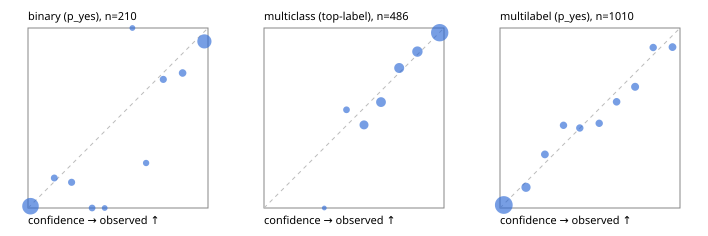

# Evaluation report

- model `Qwen/Qwen3-Reranker-4B` @ `22e683669b` (shared-prefix tree (tree-v1)), adapter/checkpoint `runs/curve/tree_4b_mlp/adapter`, prompt `tree-v1` (bc025ae9f6bc)
- data data/hf.jsonl, data/eval.jsonl; splits ['validation']; n=868; calibration `None`
- cuda / bfloat16; 2026-09-24T04:50:35+0000; wall 76.6s

## Overall

question accuracy 79.6%

**binary**: n 210, positives 79, accuracy 0.929, precision 0.864, recall 0.962, f1 0.910, auroc 0.977, brier 0.063, log_loss 0.210, ece 0.053

**multiclass**: n 486, accuracy 0.846, macro_f1 0.802, log_loss 0.421, brier 0.219, ece_top_label 0.023

**multilabel**: n 172, labels 1010, exact_match 0.494, micro_f1 0.700, macro_f1 0.646, label_auroc 0.932, brier 0.083, log_loss 0.266, ece 0.025

## By family

| family | n | question acc % | details |
|---|---|---|---|
| eval_adversarial | 14 | 100.0 | bin acc 100.0 F1 100.0 AUROC 1.000 ECE 0.143; mc acc 100.0 mF1 100.0 ECE 0.023; ml EM 100.0 µF1 100.0 ECE 0.014 |
| eval_agent_output | 20 | 70.0 | bin acc 83.3 F1 85.7 AUROC 0.806 ECE 0.182; mc acc 60.0 mF1 33.3 ECE 0.439; ml EM 33.3 µF1 0.0 ECE 0.396 |
| eval_evidence | 17 | 94.1 | bin acc 92.9 F1 90.9 AUROC 1.000 ECE 0.057; ml EM 100.0 µF1 100.0 ECE 0.022 |
| eval_multilabel | 12 | 66.7 | bin acc 0.0 F1 0.0 AUROC — ECE 0.796; mc acc 100.0 mF1 100.0 ECE 0.058; ml EM 66.7 µF1 93.6 ECE 0.101 |
| eval_policy | 24 | 58.3 | bin acc 66.7 F1 71.4 AUROC 0.743 ECE 0.344; mc acc 54.5 mF1 37.5 ECE 0.359; ml EM 0.0 µF1 66.7 ECE 0.306 |
| eval_routing | 16 | 87.5 | bin acc 100.0 F1 100.0 AUROC 1.000 ECE 0.108; mc acc 87.5 mF1 88.9 ECE 0.095; ml EM 0.0 µF1 0.0 ECE 0.309 |
| eval_urgency_sentiment | 15 | 93.3 | bin acc 100.0 F1 100.0 AUROC 1.000 ECE 0.061; mc acc 80.0 mF1 66.7 ECE 0.178; ml EM 100.0 µF1 100.0 ECE 0.024 |
| hf_emotions_multilabel | 150 | 46.7 | ml EM 46.7 µF1 66.7 ECE 0.025 |
| hf_intent_banking77 | 150 | 95.3 | mc acc 95.3 mF1 94.5 ECE 0.060 |
| hf_nli | 150 | 95.3 | bin acc 95.3 F1 92.9 AUROC 0.989 ECE 0.067 |
| hf_sentiment_tweets | 150 | 72.0 | mc acc 72.0 mF1 68.1 ECE 0.046 |
| hf_topic_agnews | 150 | 88.7 | mc acc 88.7 mF1 88.9 ECE 0.035 |

## by hard case

| slice | n | question acc % |
|---|---|---|
| (none) | 634 | 79.8 |
| contradiction | 63 | 93.7 |
| distractor | 20 | 85.0 |
| double_negation | 3 | 100.0 |
| evidence_end | 4 | 75.0 |
| evidence_middle | 7 | 100.0 |
| evidence_start | 3 | 66.7 |
| exception | 7 | 100.0 |
| hypothetical | 6 | 100.0 |
| injection | 16 | 75.0 |
| lexical_overlap | 13 | 92.3 |
| long_state | 26 | 76.9 |
| missing_evidence | 59 | 91.5 |
| multi_positive | 40 | 32.5 |
| multi_turn | 21 | 76.2 |
| negation | 9 | 77.8 |
| new_label_names | 5 | 80.0 |
| nota | 4 | 75.0 |
| numeric_reasoning | 13 | 84.6 |
| paraphrase | 10 | 70.0 |
| role_reversal | 7 | 42.9 |
| sarcasm | 5 | 80.0 |
| temporal_reasoning | 15 | 60.0 |
| zero_positive | 7 | 57.1 |

## by state tokens

| slice | n | question acc % |
|---|---|---|
| 00000-00127 | 796 | 79.8 |
| 00128-00511 | 46 | 78.3 |
| 00512-02047 | 26 | 76.9 |

## by candidates

| slice | n | question acc % |
|---|---|---|
| 01 | 210 | 92.9 |
| 03 | 162 | 72.2 |
| 04 | 174 | 86.8 |
| 05 | 13 | 61.5 |
| 06 | 159 | 48.4 |
| 08 | 150 | 95.3 |

## Paraphrase groups

5 groups; same prediction 60.0%; all correct 60.0%

## Multiclass abstention (coverage vs error on accepted)

| abstain_below | coverage % | error % |
|---|---|---|
| 0.0 | 100.0 | 15.4 |
| 0.4 | 99.8 | 15.3 |
| 0.5 | 97.5 | 14.6 |
| 0.6 | 89.5 | 11.0 |
| 0.7 | 79.0 | 7.0 |
| 0.8 | 67.9 | 4.5 |
| 0.9 | 55.3 | 2.6 |

## Reliability: binary

| bin | n | mean confidence | observed frequency |
|---|---|---|---|
| [0.0,0.1) | 102 | 0.014 | 0.010 |
| [0.1,0.2) | 6 | 0.146 | 0.167 |
| [0.2,0.3) | 7 | 0.242 | 0.143 |
| [0.3,0.4) | 5 | 0.356 | 0.000 |
| [0.4,0.5) | 2 | 0.426 | 0.000 |
| [0.5,0.6) | 2 | 0.580 | 1.000 |
| [0.6,0.7) | 4 | 0.656 | 0.250 |
| [0.7,0.8) | 7 | 0.751 | 0.714 |
| [0.8,0.9) | 8 | 0.859 | 0.750 |
| [0.9,1.0] | 67 | 0.980 | 0.925 |

## Reliability: multiclass

| bin | n | mean confidence | observed frequency |
|---|---|---|---|
| [0.3,0.4) | 1 | 0.335 | 0.000 |
| [0.4,0.5) | 11 | 0.458 | 0.545 |
| [0.5,0.6) | 39 | 0.555 | 0.462 |
| [0.6,0.7) | 51 | 0.650 | 0.588 |
| [0.7,0.8) | 54 | 0.751 | 0.778 |
| [0.8,0.9) | 61 | 0.852 | 0.869 |
| [0.9,1.0] | 269 | 0.976 | 0.974 |

## Reliability: multilabel

| bin | n | mean confidence | observed frequency |
|---|---|---|---|
| [0.0,0.1) | 597 | 0.021 | 0.017 |
| [0.1,0.2) | 87 | 0.145 | 0.115 |
| [0.2,0.3) | 47 | 0.249 | 0.298 |
| [0.3,0.4) | 37 | 0.353 | 0.459 |
| [0.4,0.5) | 36 | 0.443 | 0.444 |
| [0.5,0.6) | 34 | 0.551 | 0.471 |
| [0.6,0.7) | 39 | 0.648 | 0.590 |
| [0.7,0.8) | 49 | 0.750 | 0.673 |
| [0.8,0.9) | 37 | 0.851 | 0.892 |
| [0.9,1.0] | 47 | 0.958 | 0.894 |
