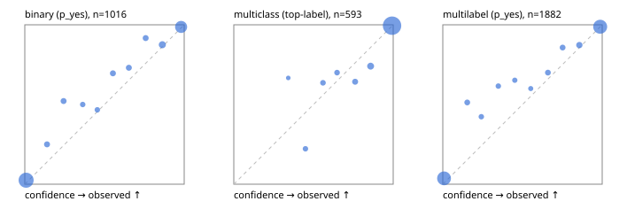

# Evaluation report

- model `Qwen/Qwen3-Reranker-4B` @ `22e683669b` (shared-prefix tree (tree-v1)), adapter/checkpoint `runs/curve/tree_4b_r2b_r64/adapter`, prompt `tree-v1` (bc025ae9f6bc)
- data data/eval2.jsonl; splits ['test']; n=1991; calibration `None`
- cuda / bfloat16; 2026-09-24T09:37:10+0000; wall 230.8s

## Overall

question accuracy 90.3%

**binary**: n 1016, positives 435, accuracy 0.929, precision 0.937, recall 0.894, f1 0.915, auroc 0.981, brier 0.054, log_loss 0.186, ece 0.031

**multiclass**: n 593, accuracy 0.949, macro_f1 0.909, log_loss 0.151, brier 0.078, ece_top_label 0.017

**multilabel**: n 382, labels 1882, exact_match 0.759, micro_f1 0.933, macro_f1 0.880, label_auroc 0.985, brier 0.052, log_loss 0.179, ece 0.033

## By family

| family | n | question acc % | details |
|---|---|---|---|
| e2_hard | 673 | 89.5 | bin acc 92.8 F1 89.9 AUROC 0.970 ECE 0.030; mc acc 95.3 mF1 90.6 ECE 0.020; ml EM 72.0 µF1 92.4 ECE 0.033 |
| e2_simple | 664 | 93.8 | bin acc 95.3 F1 95.6 AUROC 0.991 ECE 0.034; mc acc 97.5 mF1 95.1 ECE 0.024; ml EM 83.3 µF1 96.0 ECE 0.036 |
| e2_very_hard | 654 | 87.5 | bin acc 90.4 F1 86.9 AUROC 0.976 ECE 0.048; mc acc 92.0 mF1 87.0 ECE 0.036; ml EM 73.1 µF1 91.4 ECE 0.045 |

## by hard case

| slice | n | question acc % |
|---|---|---|
| (none) | 569 | 95.3 |
| contradiction | 172 | 95.3 |
| distractor | 474 | 88.6 |
| double_negation | 126 | 88.9 |
| evidence_end | 57 | 94.7 |
| evidence_middle | 114 | 92.1 |
| evidence_start | 17 | 88.2 |
| exception | 213 | 88.3 |
| hypothetical | 128 | 93.8 |
| injection | 151 | 84.1 |
| lexical_overlap | 201 | 95.5 |
| long_state | 191 | 90.6 |
| missing_evidence | 141 | 95.0 |
| multi_positive | 322 | 76.7 |
| multi_turn | 149 | 91.9 |
| negation | 257 | 93.0 |
| nota | 118 | 89.0 |
| numeric_reasoning | 224 | 77.2 |
| paraphrase | 218 | 86.2 |
| role_reversal | 187 | 92.5 |
| sarcasm | 149 | 83.9 |
| temporal_reasoning | 203 | 78.8 |
| zero_positive | 73 | 89.0 |
| zero_positive_distractor | 1 | 100.0 |

## by state tokens

| slice | n | question acc % |
|---|---|---|
| 00000-00127 | 662 | 88.7 |
| 00128-00511 | 477 | 86.8 |
| 00512-02047 | 484 | 94.6 |
| 02048-08191 | 329 | 91.2 |
| 08192+ | 39 | 97.4 |

## by candidates

| slice | n | question acc % |
|---|---|---|
| 01 | 1016 | 92.9 |
| 03 | 128 | 93.0 |
| 04 | 515 | 91.8 |
| 05 | 224 | 77.2 |
| 06 | 86 | 79.1 |
| 07 | 18 | 94.4 |
| 08 | 4 | 75.0 |

## Paraphrase groups

76 groups; same prediction 76.3%; all correct 75.0%

## Multiclass abstention (coverage vs error on accepted)

| abstain_below | coverage % | error % |
|---|---|---|
| 0.0 | 100.0 | 5.1 |
| 0.4 | 99.5 | 4.9 |
| 0.5 | 98.0 | 3.8 |
| 0.6 | 96.1 | 3.2 |
| 0.7 | 94.4 | 2.7 |
| 0.8 | 92.1 | 1.8 |
| 0.9 | 87.5 | 0.6 |

## Reliability: binary

| bin | n | mean confidence | observed frequency |
|---|---|---|---|
| [0.0,0.1) | 523 | 0.008 | 0.025 |
| [0.1,0.2) | 24 | 0.139 | 0.250 |
| [0.2,0.3) | 23 | 0.244 | 0.522 |
| [0.3,0.4) | 16 | 0.363 | 0.500 |
| [0.4,0.5) | 15 | 0.455 | 0.467 |
| [0.5,0.6) | 23 | 0.553 | 0.696 |
| [0.6,0.7) | 26 | 0.653 | 0.731 |
| [0.7,0.8) | 24 | 0.758 | 0.917 |
| [0.8,0.9) | 48 | 0.863 | 0.875 |
| [0.9,1.0] | 294 | 0.981 | 0.986 |

## Reliability: multiclass

| bin | n | mean confidence | observed frequency |
|---|---|---|---|
| [0.3,0.4) | 3 | 0.342 | 0.667 |
| [0.4,0.5) | 9 | 0.449 | 0.222 |
| [0.5,0.6) | 11 | 0.560 | 0.636 |
| [0.6,0.7) | 10 | 0.648 | 0.700 |
| [0.7,0.8) | 14 | 0.761 | 0.643 |
| [0.8,0.9) | 27 | 0.858 | 0.741 |
| [0.9,1.0] | 519 | 0.993 | 0.994 |

## Reliability: multilabel

| bin | n | mean confidence | observed frequency |
|---|---|---|---|
| [0.0,0.1) | 790 | 0.008 | 0.037 |
| [0.1,0.2) | 39 | 0.153 | 0.513 |
| [0.2,0.3) | 26 | 0.242 | 0.423 |
| [0.3,0.4) | 26 | 0.348 | 0.615 |
| [0.4,0.5) | 23 | 0.452 | 0.652 |
| [0.5,0.6) | 20 | 0.551 | 0.600 |
| [0.6,0.7) | 40 | 0.659 | 0.700 |
| [0.7,0.8) | 42 | 0.751 | 0.857 |
| [0.8,0.9) | 63 | 0.857 | 0.873 |
| [0.9,1.0] | 813 | 0.987 | 0.988 |
