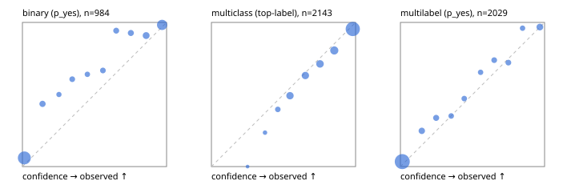

# Evaluation report

- model `Qwen/Qwen3-Reranker-4B` @ `22e683669b` (shared-prefix tree (tree-v1)), adapter/checkpoint `runs/curve/tree_4b_r2b_r64/adapter`, prompt `tree-v1` (bc025ae9f6bc)
- data data/hf.jsonl, data/eval.jsonl; splits ['test']; n=3471; calibration `None`
- cuda / bfloat16; 2026-09-24T09:33:11+0000; wall 200.2s

## Overall

question accuracy 81.2%

**binary**: n 984, positives 475, accuracy 0.878, precision 0.936, recall 0.802, f1 0.864, auroc 0.962, brier 0.091, log_loss 0.304, ece 0.082

**multiclass**: n 2143, accuracy 0.825, macro_f1 0.869, log_loss 0.506, brier 0.253, ece_top_label 0.034

**multilabel**: n 344, labels 2029, exact_match 0.544, micro_f1 0.744, macro_f1 0.795, label_auroc 0.945, brier 0.076, log_loss 0.252, ece 0.033

## By family

| family | n | question acc % | details |
|---|---|---|---|
| eval_adversarial | 27 | 100.0 | bin acc 100.0 F1 100.0 AUROC 1.000 ECE 0.019; mc acc 100.0 mF1 100.0 ECE 0.001; ml EM 100.0 µF1 100.0 ECE 0.013 |
| eval_agent_output | 26 | 57.7 | bin acc 85.7 F1 85.7 AUROC 0.918 ECE 0.126; mc acc 14.3 mF1 5.6 ECE 0.685; ml EM 40.0 µF1 80.0 ECE 0.159 |
| eval_evidence | 17 | 94.1 | bin acc 100.0 F1 100.0 AUROC 1.000 ECE 0.033; ml EM 50.0 µF1 66.7 ECE 0.151 |
| eval_multilabel | 32 | 90.6 | bin acc 100.0 F1 100.0 AUROC 1.000 ECE 0.031; mc acc 100.0 mF1 100.0 ECE 0.379; ml EM 87.5 µF1 96.9 ECE 0.028 |
| eval_policy | 22 | 59.1 | bin acc 61.5 F1 61.5 AUROC 0.714 ECE 0.293; mc acc 40.0 mF1 25.0 ECE 0.360; ml EM 75.0 µF1 88.9 ECE 0.191 |
| eval_routing | 25 | 84.0 | bin acc 90.0 F1 88.9 AUROC 0.958 ECE 0.105; mc acc 84.6 mF1 81.8 ECE 0.042; ml EM 50.0 µF1 80.0 ECE 0.103 |
| eval_urgency_sentiment | 22 | 90.9 | bin acc 80.0 F1 83.3 AUROC 0.958 ECE 0.135; mc acc 100.0 mF1 100.0 ECE 0.044; ml EM 100.0 µF1 100.0 ECE 0.011 |
| heldout_boolq | 300 | 81.3 | bin acc 81.3 F1 82.9 AUROC 0.931 ECE 0.126 |
| heldout_emotion_multiclass | 300 | 56.0 | mc acc 56.0 mF1 44.4 ECE 0.213 |
| heldout_intent_clinc | 300 | 90.0 | mc acc 90.0 mF1 91.5 ECE 0.018 |
| heldout_question_type_trec | 300 | 83.3 | mc acc 83.3 mF1 84.0 ECE 0.086 |
| heldout_sentiment_sst2 | 300 | 86.7 | bin acc 86.7 F1 84.8 AUROC 0.974 ECE 0.133 |
| heldout_topic_dbpedia | 300 | 96.0 | mc acc 96.0 mF1 95.6 ECE 0.014 |
| hf_emotions_multilabel | 300 | 50.7 | ml EM 50.7 µF1 69.2 ECE 0.036 |
| hf_intent_banking77 | 300 | 96.3 | mc acc 96.3 mF1 95.7 ECE 0.022 |
| hf_nli | 300 | 95.3 | bin acc 95.3 F1 93.5 AUROC 0.987 ECE 0.038 |
| hf_sentiment_tweets | 300 | 67.0 | mc acc 67.0 mF1 67.0 ECE 0.043 |
| hf_topic_agnews | 300 | 89.7 | mc acc 89.7 mF1 89.7 ECE 0.036 |

## by hard case

| slice | n | question acc % |
|---|---|---|
| (none) | 3042 | 80.8 |
| contradiction | 107 | 99.1 |
| distractor | 33 | 75.8 |
| double_negation | 6 | 100.0 |
| evidence_end | 13 | 84.6 |
| evidence_middle | 11 | 90.9 |
| evidence_start | 9 | 100.0 |
| exception | 7 | 28.6 |
| hypothetical | 7 | 100.0 |
| injection | 10 | 90.0 |
| lexical_overlap | 20 | 95.0 |
| long_state | 50 | 80.0 |
| missing_evidence | 104 | 94.2 |
| multi_positive | 81 | 44.4 |
| multi_turn | 9 | 77.8 |
| negation | 30 | 96.7 |
| new_label_names | 3 | 33.3 |
| nota | 46 | 97.8 |
| numeric_reasoning | 16 | 56.2 |
| paraphrase | 22 | 77.3 |
| role_reversal | 15 | 80.0 |
| sarcasm | 12 | 91.7 |
| temporal_reasoning | 29 | 55.2 |
| zero_positive | 6 | 100.0 |

## by state tokens

| slice | n | question acc % |
|---|---|---|
| 00000-00127 | 3211 | 81.1 |
| 00128-00511 | 208 | 82.2 |
| 00512-02047 | 52 | 80.8 |

## by candidates

| slice | n | question acc % |
|---|---|---|
| 01 | 984 | 87.8 |
| 03 | 310 | 68.1 |
| 04 | 333 | 88.3 |
| 05 | 22 | 72.7 |
| 06 | 1218 | 71.4 |
| 07 | 49 | 100.0 |
| 08 | 555 | 92.6 |

## Paraphrase groups

11 groups; same prediction 72.7%; all correct 72.7%

## Multiclass abstention (coverage vs error on accepted)

| abstain_below | coverage % | error % |
|---|---|---|
| 0.0 | 100.0 | 17.5 |
| 0.4 | 99.1 | 17.0 |
| 0.5 | 96.2 | 15.7 |
| 0.6 | 87.6 | 12.2 |
| 0.7 | 79.1 | 9.6 |
| 0.8 | 69.9 | 7.1 |
| 0.9 | 58.1 | 4.6 |

## Reliability: binary

| bin | n | mean confidence | observed frequency |
|---|---|---|---|
| [0.0,0.1) | 451 | 0.013 | 0.060 |
| [0.1,0.2) | 46 | 0.139 | 0.435 |
| [0.2,0.3) | 22 | 0.253 | 0.500 |
| [0.3,0.4) | 33 | 0.346 | 0.606 |
| [0.4,0.5) | 25 | 0.450 | 0.640 |
| [0.5,0.6) | 33 | 0.559 | 0.667 |
| [0.6,0.7) | 35 | 0.651 | 0.943 |
| [0.7,0.8) | 41 | 0.752 | 0.927 |
| [0.8,0.9) | 66 | 0.858 | 0.909 |
| [0.9,1.0] | 232 | 0.969 | 0.983 |

## Reliability: multiclass

| bin | n | mean confidence | observed frequency |
|---|---|---|---|
| [0.2,0.3) | 2 | 0.250 | 0.000 |
| [0.3,0.4) | 17 | 0.372 | 0.235 |
| [0.4,0.5) | 63 | 0.460 | 0.397 |
| [0.5,0.6) | 183 | 0.545 | 0.492 |
| [0.6,0.7) | 182 | 0.651 | 0.632 |
| [0.7,0.8) | 198 | 0.753 | 0.712 |
| [0.8,0.9) | 252 | 0.852 | 0.806 |
| [0.9,1.0] | 1246 | 0.981 | 0.954 |

## Reliability: multilabel

| bin | n | mean confidence | observed frequency |
|---|---|---|---|
| [0.0,0.1) | 1384 | 0.013 | 0.035 |
| [0.1,0.2) | 105 | 0.148 | 0.248 |
| [0.2,0.3) | 77 | 0.248 | 0.338 |
| [0.3,0.4) | 57 | 0.352 | 0.351 |
| [0.4,0.5) | 53 | 0.443 | 0.472 |
| [0.5,0.6) | 52 | 0.556 | 0.654 |
| [0.6,0.7) | 65 | 0.651 | 0.738 |
| [0.7,0.8) | 61 | 0.749 | 0.721 |
| [0.8,0.9) | 50 | 0.847 | 0.960 |
| [0.9,1.0] | 125 | 0.967 | 0.968 |
