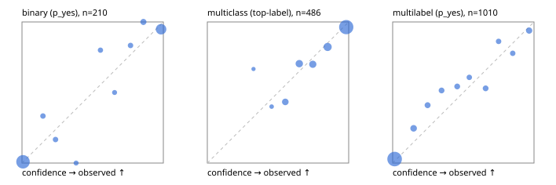

# Evaluation report

- model `Qwen/Qwen3-Reranker-4B` @ `22e683669b` (shared-prefix tree (tree-v1)), adapter/checkpoint `runs/curve/tree_4b_r2b_r64/adapter`, prompt `tree-v1` (bc025ae9f6bc)
- data data/hf.jsonl, data/eval.jsonl; splits ['validation']; n=868; calibration `None`
- cuda / bfloat16; 2026-09-24T09:29:41+0000; wall 52.0s

## Overall

question accuracy 79.8%

**binary**: n 210, positives 79, accuracy 0.948, precision 0.915, recall 0.949, f1 0.932, auroc 0.983, brier 0.048, log_loss 0.160, ece 0.042

**multiclass**: n 486, accuracy 0.860, macro_f1 0.861, log_loss 0.417, brier 0.204, ece_top_label 0.034

**multilabel**: n 172, labels 1010, exact_match 0.442, micro_f1 0.667, macro_f1 0.639, label_auroc 0.934, brier 0.085, log_loss 0.273, ece 0.043

## By family

| family | n | question acc % | details |
|---|---|---|---|
| eval_adversarial | 14 | 100.0 | bin acc 100.0 F1 100.0 AUROC 1.000 ECE 0.034; mc acc 100.0 mF1 100.0 ECE 0.008; ml EM 100.0 µF1 100.0 ECE 0.003 |
| eval_agent_output | 20 | 70.0 | bin acc 83.3 F1 85.7 AUROC 0.889 ECE 0.169; mc acc 60.0 mF1 33.3 ECE 0.418; ml EM 33.3 µF1 0.0 ECE 0.260 |
| eval_evidence | 17 | 100.0 | bin acc 100.0 F1 100.0 AUROC 1.000 ECE 0.004; ml EM 100.0 µF1 100.0 ECE 0.012 |
| eval_multilabel | 12 | 75.0 | bin acc 0.0 F1 0.0 AUROC — ECE 0.951; mc acc 100.0 mF1 100.0 ECE 0.020; ml EM 77.8 µF1 95.7 ECE 0.048 |
| eval_policy | 24 | 79.2 | bin acc 83.3 F1 83.3 AUROC 0.829 ECE 0.302; mc acc 81.8 mF1 69.2 ECE 0.209; ml EM 0.0 µF1 50.0 ECE 0.460 |
| eval_routing | 16 | 93.8 | bin acc 100.0 F1 100.0 AUROC 1.000 ECE 0.069; mc acc 100.0 mF1 100.0 ECE 0.033; ml EM 0.0 µF1 0.0 ECE 0.248 |
| eval_urgency_sentiment | 15 | 93.3 | bin acc 100.0 F1 100.0 AUROC 1.000 ECE 0.033; mc acc 80.0 mF1 66.7 ECE 0.120; ml EM 100.0 µF1 100.0 ECE 0.003 |
| hf_emotions_multilabel | 150 | 40.0 | ml EM 40.0 µF1 61.9 ECE 0.045 |
| hf_intent_banking77 | 150 | 97.3 | mc acc 97.3 mF1 94.9 ECE 0.020 |
| hf_nli | 150 | 96.0 | bin acc 96.0 F1 93.8 AUROC 0.990 ECE 0.040 |
| hf_sentiment_tweets | 150 | 72.7 | mc acc 72.7 mF1 69.1 ECE 0.039 |
| hf_topic_agnews | 150 | 88.0 | mc acc 88.0 mF1 88.3 ECE 0.056 |

## by hard case

| slice | n | question acc % |
|---|---|---|
| (none) | 634 | 78.9 |
| contradiction | 63 | 98.4 |
| distractor | 20 | 90.0 |
| double_negation | 3 | 100.0 |
| evidence_end | 4 | 100.0 |
| evidence_middle | 7 | 85.7 |
| evidence_start | 3 | 66.7 |
| exception | 7 | 100.0 |
| hypothetical | 6 | 100.0 |
| injection | 16 | 81.2 |
| lexical_overlap | 13 | 100.0 |
| long_state | 26 | 80.8 |
| missing_evidence | 59 | 94.9 |
| multi_positive | 40 | 30.0 |
| multi_turn | 21 | 81.0 |
| negation | 9 | 88.9 |
| new_label_names | 5 | 60.0 |
| nota | 4 | 100.0 |
| numeric_reasoning | 13 | 84.6 |
| paraphrase | 10 | 70.0 |
| role_reversal | 7 | 71.4 |
| sarcasm | 5 | 80.0 |
| temporal_reasoning | 15 | 73.3 |
| zero_positive | 7 | 71.4 |

## by state tokens

| slice | n | question acc % |
|---|---|---|
| 00000-00127 | 796 | 79.4 |
| 00128-00511 | 46 | 87.0 |
| 00512-02047 | 26 | 80.8 |

## by candidates

| slice | n | question acc % |
|---|---|---|
| 01 | 210 | 94.8 |
| 03 | 162 | 74.1 |
| 04 | 174 | 86.8 |
| 05 | 13 | 76.9 |
| 06 | 159 | 42.1 |
| 08 | 150 | 97.3 |

## Paraphrase groups

5 groups; same prediction 60.0%; all correct 60.0%

## Multiclass abstention (coverage vs error on accepted)

| abstain_below | coverage % | error % |
|---|---|---|
| 0.0 | 100.0 | 14.0 |
| 0.4 | 99.4 | 13.9 |
| 0.5 | 98.4 | 13.4 |
| 0.6 | 92.2 | 10.5 |
| 0.7 | 83.1 | 8.4 |
| 0.8 | 74.9 | 6.0 |
| 0.9 | 62.1 | 3.6 |

## Reliability: binary

| bin | n | mean confidence | observed frequency |
|---|---|---|---|
| [0.0,0.1) | 112 | 0.007 | 0.009 |
| [0.1,0.2) | 6 | 0.148 | 0.333 |
| [0.2,0.3) | 6 | 0.237 | 0.167 |
| [0.3,0.4) | 4 | 0.383 | 0.000 |
| [0.5,0.6) | 5 | 0.555 | 0.800 |
| [0.6,0.7) | 4 | 0.655 | 0.500 |
| [0.7,0.8) | 6 | 0.768 | 0.833 |
| [0.8,0.9) | 9 | 0.859 | 1.000 |
| [0.9,1.0] | 58 | 0.984 | 0.948 |

## Reliability: multiclass

| bin | n | mean confidence | observed frequency |
|---|---|---|---|
| [0.3,0.4) | 3 | 0.327 | 0.667 |
| [0.4,0.5) | 5 | 0.455 | 0.400 |
| [0.5,0.6) | 30 | 0.551 | 0.433 |
| [0.6,0.7) | 44 | 0.651 | 0.705 |
| [0.7,0.8) | 40 | 0.746 | 0.700 |
| [0.8,0.9) | 62 | 0.851 | 0.823 |
| [0.9,1.0] | 302 | 0.983 | 0.964 |

## Reliability: multilabel

| bin | n | mean confidence | observed frequency |
|---|---|---|---|
| [0.0,0.1) | 673 | 0.014 | 0.028 |
| [0.1,0.2) | 61 | 0.148 | 0.246 |
| [0.2,0.3) | 39 | 0.247 | 0.410 |
| [0.3,0.4) | 35 | 0.346 | 0.514 |
| [0.4,0.5) | 35 | 0.457 | 0.543 |
| [0.5,0.6) | 28 | 0.542 | 0.607 |
| [0.6,0.7) | 34 | 0.658 | 0.529 |
| [0.7,0.8) | 29 | 0.749 | 0.862 |
| [0.8,0.9) | 27 | 0.849 | 0.778 |
| [0.9,1.0] | 49 | 0.966 | 0.939 |
