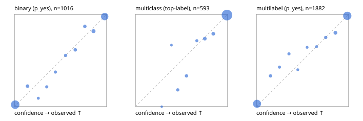

# Evaluation report

- model `Qwen/Qwen3-Reranker-4B` @ `22e683669b` (shared-prefix tree (tree-v1)), adapter/checkpoint `runs/curve/tree_4b_r2b_r64_mlp/adapter`, prompt `tree-v1` (bc025ae9f6bc)
- data data/eval2.jsonl; splits ['test']; n=1991; calibration `None`
- cuda / bfloat16; 2026-09-24T10:09:45+0000; wall 294.4s

## Overall

question accuracy 91.3%

**binary**: n 1016, positives 435, accuracy 0.937, precision 0.917, recall 0.938, f1 0.927, auroc 0.982, brier 0.049, log_loss 0.172, ece 0.020

**multiclass**: n 593, accuracy 0.943, macro_f1 0.899, log_loss 0.152, brier 0.076, ece_top_label 0.015

**multilabel**: n 382, labels 1882, exact_match 0.804, micro_f1 0.943, macro_f1 0.897, label_auroc 0.986, brier 0.047, log_loss 0.165, ece 0.022

## By family

| family | n | question acc % | details |
|---|---|---|---|
| e2_hard | 673 | 89.6 | bin acc 92.8 F1 90.2 AUROC 0.975 ECE 0.046; mc acc 92.7 mF1 86.5 ECE 0.031; ml EM 76.5 µF1 93.0 ECE 0.032 |
| e2_simple | 664 | 94.7 | bin acc 95.9 F1 96.3 AUROC 0.990 ECE 0.017; mc acc 97.5 mF1 94.7 ECE 0.015; ml EM 86.7 µF1 96.6 ECE 0.027 |
| e2_very_hard | 654 | 89.6 | bin acc 92.3 F1 90.0 AUROC 0.975 ECE 0.027; mc acc 92.5 mF1 88.9 ECE 0.029; ml EM 78.5 µF1 93.2 ECE 0.032 |

## by hard case

| slice | n | question acc % |
|---|---|---|
| (none) | 569 | 95.8 |
| contradiction | 172 | 93.6 |
| distractor | 474 | 89.5 |
| double_negation | 126 | 91.3 |
| evidence_end | 57 | 94.7 |
| evidence_middle | 114 | 94.7 |
| evidence_start | 17 | 94.1 |
| exception | 213 | 89.2 |
| hypothetical | 128 | 91.4 |
| injection | 151 | 86.1 |
| lexical_overlap | 201 | 95.5 |
| long_state | 191 | 92.1 |
| missing_evidence | 141 | 94.3 |
| multi_positive | 322 | 81.7 |
| multi_turn | 149 | 90.6 |
| negation | 257 | 93.8 |
| nota | 118 | 88.1 |
| numeric_reasoning | 224 | 82.1 |
| paraphrase | 218 | 88.1 |
| role_reversal | 187 | 93.0 |
| sarcasm | 149 | 87.2 |
| temporal_reasoning | 203 | 80.8 |
| zero_positive | 73 | 89.0 |
| zero_positive_distractor | 1 | 100.0 |

## by state tokens

| slice | n | question acc % |
|---|---|---|
| 00000-00127 | 662 | 90.5 |
| 00128-00511 | 477 | 87.4 |
| 00512-02047 | 484 | 94.4 |
| 02048-08191 | 329 | 93.6 |
| 08192+ | 39 | 94.9 |

## by candidates

| slice | n | question acc % |
|---|---|---|
| 01 | 1016 | 93.7 |
| 03 | 128 | 91.4 |
| 04 | 515 | 93.0 |
| 05 | 224 | 79.9 |
| 06 | 86 | 83.7 |
| 07 | 18 | 88.9 |
| 08 | 4 | 75.0 |

## Paraphrase groups

76 groups; same prediction 77.6%; all correct 77.6%

## Multiclass abstention (coverage vs error on accepted)

| abstain_below | coverage % | error % |
|---|---|---|
| 0.0 | 100.0 | 5.7 |
| 0.4 | 99.3 | 5.4 |
| 0.5 | 97.5 | 4.0 |
| 0.6 | 95.4 | 2.7 |
| 0.7 | 94.3 | 2.3 |
| 0.8 | 91.1 | 1.5 |
| 0.9 | 87.9 | 0.8 |

## Reliability: binary

| bin | n | mean confidence | observed frequency |
|---|---|---|---|
| [0.0,0.1) | 503 | 0.009 | 0.022 |
| [0.1,0.2) | 27 | 0.143 | 0.222 |
| [0.2,0.3) | 11 | 0.260 | 0.091 |
| [0.3,0.4) | 14 | 0.351 | 0.214 |
| [0.4,0.5) | 16 | 0.445 | 0.375 |
| [0.5,0.6) | 18 | 0.555 | 0.556 |
| [0.6,0.7) | 26 | 0.660 | 0.615 |
| [0.7,0.8) | 23 | 0.764 | 0.870 |
| [0.8,0.9) | 44 | 0.858 | 0.818 |
| [0.9,1.0] | 334 | 0.979 | 0.976 |

## Reliability: multiclass

| bin | n | mean confidence | observed frequency |
|---|---|---|---|
| [0.2,0.3) | 1 | 0.285 | 0.000 |
| [0.3,0.4) | 3 | 0.391 | 0.667 |
| [0.4,0.5) | 11 | 0.459 | 0.182 |
| [0.5,0.6) | 12 | 0.554 | 0.333 |
| [0.6,0.7) | 7 | 0.666 | 0.714 |
| [0.7,0.8) | 19 | 0.753 | 0.737 |
| [0.8,0.9) | 19 | 0.844 | 0.789 |
| [0.9,1.0] | 521 | 0.993 | 0.992 |

## Reliability: multilabel

| bin | n | mean confidence | observed frequency |
|---|---|---|---|
| [0.0,0.1) | 774 | 0.007 | 0.031 |
| [0.1,0.2) | 39 | 0.153 | 0.333 |
| [0.2,0.3) | 21 | 0.251 | 0.429 |
| [0.3,0.4) | 28 | 0.353 | 0.571 |
| [0.4,0.5) | 15 | 0.449 | 0.400 |
| [0.5,0.6) | 14 | 0.550 | 0.643 |
| [0.6,0.7) | 20 | 0.652 | 0.650 |
| [0.7,0.8) | 36 | 0.752 | 0.750 |
| [0.8,0.9) | 65 | 0.857 | 0.800 |
| [0.9,1.0] | 870 | 0.985 | 0.984 |
