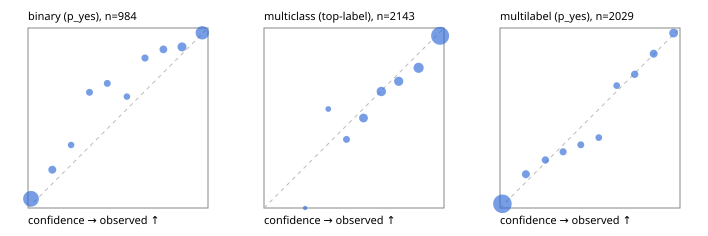

# Evaluation report

- model `Qwen/Qwen3-Reranker-4B` @ `22e683669b` (shared-prefix tree (tree-v1)), adapter/checkpoint `runs/curve/tree_4b_r2b_r64_mlp/adapter`, prompt `tree-v1` (bc025ae9f6bc)
- data data/hf.jsonl, data/eval.jsonl; splits ['test']; n=3471; calibration `None`
- cuda / bfloat16; 2026-09-24T10:04:41+0000; wall 261.3s

## Overall

question accuracy 82.4%

**binary**: n 984, positives 475, accuracy 0.890, precision 0.924, recall 0.842, f1 0.881, auroc 0.962, brier 0.079, log_loss 0.272, ece 0.053

**multiclass**: n 2143, accuracy 0.835, macro_f1 0.881, log_loss 0.476, brier 0.242, ece_top_label 0.034

**multilabel**: n 344, labels 2029, exact_match 0.570, micro_f1 0.777, macro_f1 0.826, label_auroc 0.954, brier 0.068, log_loss 0.224, ece 0.018

## By family

| family | n | question acc % | details |
|---|---|---|---|
| eval_adversarial | 27 | 96.3 | bin acc 93.3 F1 90.9 AUROC 1.000 ECE 0.058; mc acc 100.0 mF1 100.0 ECE 0.003; ml EM 100.0 µF1 100.0 ECE 0.011 |
| eval_agent_output | 26 | 57.7 | bin acc 85.7 F1 85.7 AUROC 0.959 ECE 0.126; mc acc 14.3 mF1 6.2 ECE 0.694; ml EM 40.0 µF1 80.0 ECE 0.112 |
| eval_evidence | 17 | 88.2 | bin acc 93.3 F1 90.9 AUROC 1.000 ECE 0.042; ml EM 50.0 µF1 66.7 ECE 0.232 |
| eval_multilabel | 32 | 96.9 | bin acc 100.0 F1 100.0 AUROC 1.000 ECE 0.010; mc acc 100.0 mF1 100.0 ECE 0.245; ml EM 95.8 µF1 99.0 ECE 0.022 |
| eval_policy | 22 | 68.2 | bin acc 76.9 F1 76.9 AUROC 0.738 ECE 0.325; mc acc 40.0 mF1 25.0 ECE 0.313; ml EM 75.0 µF1 88.9 ECE 0.167 |
| eval_routing | 25 | 84.0 | bin acc 90.0 F1 88.9 AUROC 1.000 ECE 0.084; mc acc 84.6 mF1 81.8 ECE 0.094; ml EM 50.0 µF1 80.0 ECE 0.110 |
| eval_urgency_sentiment | 22 | 95.5 | bin acc 90.0 F1 92.3 AUROC 0.958 ECE 0.154; mc acc 100.0 mF1 100.0 ECE 0.073; ml EM 100.0 µF1 100.0 ECE 0.008 |
| heldout_boolq | 300 | 82.7 | bin acc 82.7 F1 84.7 AUROC 0.928 ECE 0.093 |
| heldout_emotion_multiclass | 300 | 55.3 | mc acc 55.3 mF1 46.2 ECE 0.216 |
| heldout_intent_clinc | 300 | 91.0 | mc acc 91.0 mF1 93.6 ECE 0.031 |
| heldout_question_type_trec | 300 | 88.0 | mc acc 88.0 mF1 87.1 ECE 0.096 |
| heldout_sentiment_sst2 | 300 | 89.0 | bin acc 89.0 F1 87.9 AUROC 0.973 ECE 0.100 |
| heldout_topic_dbpedia | 300 | 96.3 | mc acc 96.3 mF1 95.9 ECE 0.011 |
| hf_emotions_multilabel | 300 | 53.0 | ml EM 53.0 µF1 73.4 ECE 0.019 |
| hf_intent_banking77 | 300 | 96.3 | mc acc 96.3 mF1 94.9 ECE 0.011 |
| hf_nli | 300 | 95.3 | bin acc 95.3 F1 93.6 AUROC 0.987 ECE 0.023 |
| hf_sentiment_tweets | 300 | 70.0 | mc acc 70.0 mF1 70.0 ECE 0.071 |
| hf_topic_agnews | 300 | 88.7 | mc acc 88.7 mF1 88.7 ECE 0.045 |

## by hard case

| slice | n | question acc % |
|---|---|---|
| (none) | 3042 | 82.1 |
| contradiction | 107 | 99.1 |
| distractor | 33 | 75.8 |
| double_negation | 6 | 100.0 |
| evidence_end | 13 | 84.6 |
| evidence_middle | 11 | 90.9 |
| evidence_start | 9 | 100.0 |
| exception | 7 | 28.6 |
| hypothetical | 7 | 100.0 |
| injection | 10 | 90.0 |
| lexical_overlap | 20 | 95.0 |
| long_state | 50 | 82.0 |
| missing_evidence | 104 | 92.3 |
| multi_positive | 81 | 50.6 |
| multi_turn | 9 | 88.9 |
| negation | 30 | 100.0 |
| new_label_names | 3 | 33.3 |
| nota | 46 | 97.8 |
| numeric_reasoning | 16 | 56.2 |
| paraphrase | 22 | 81.8 |
| role_reversal | 15 | 93.3 |
| sarcasm | 12 | 100.0 |
| temporal_reasoning | 29 | 62.1 |
| zero_positive | 6 | 100.0 |

## by state tokens

| slice | n | question acc % |
|---|---|---|
| 00000-00127 | 3211 | 82.2 |
| 00128-00511 | 208 | 85.6 |
| 00512-02047 | 52 | 82.7 |

## by candidates

| slice | n | question acc % |
|---|---|---|
| 01 | 984 | 89.0 |
| 03 | 310 | 71.0 |
| 04 | 333 | 87.4 |
| 05 | 22 | 72.7 |
| 06 | 1218 | 73.2 |
| 07 | 49 | 100.0 |
| 08 | 555 | 93.2 |

## Paraphrase groups

11 groups; same prediction 81.8%; all correct 81.8%

## Multiclass abstention (coverage vs error on accepted)

| abstain_below | coverage % | error % |
|---|---|---|
| 0.0 | 100.0 | 16.5 |
| 0.4 | 99.0 | 16.2 |
| 0.5 | 96.1 | 14.8 |
| 0.6 | 89.2 | 12.1 |
| 0.7 | 80.4 | 9.6 |
| 0.8 | 72.1 | 7.2 |
| 0.9 | 60.3 | 4.3 |

## Reliability: binary

| bin | n | mean confidence | observed frequency |
|---|---|---|---|
| [0.0,0.1) | 430 | 0.016 | 0.051 |
| [0.1,0.2) | 47 | 0.135 | 0.213 |
| [0.2,0.3) | 20 | 0.240 | 0.350 |
| [0.3,0.4) | 28 | 0.342 | 0.643 |
| [0.4,0.5) | 26 | 0.441 | 0.692 |
| [0.5,0.6) | 21 | 0.550 | 0.619 |
| [0.6,0.7) | 30 | 0.650 | 0.833 |
| [0.7,0.8) | 42 | 0.752 | 0.881 |
| [0.8,0.9) | 76 | 0.855 | 0.895 |
| [0.9,1.0] | 264 | 0.969 | 0.973 |

## Reliability: multiclass

| bin | n | mean confidence | observed frequency |
|---|---|---|---|
| [0.2,0.3) | 1 | 0.229 | 0.000 |
| [0.3,0.4) | 20 | 0.357 | 0.550 |
| [0.4,0.5) | 63 | 0.458 | 0.381 |
| [0.5,0.6) | 148 | 0.553 | 0.500 |
| [0.6,0.7) | 187 | 0.651 | 0.647 |
| [0.7,0.8) | 179 | 0.749 | 0.704 |
| [0.8,0.9) | 253 | 0.859 | 0.779 |
| [0.9,1.0] | 1292 | 0.978 | 0.957 |

## Reliability: multilabel

| bin | n | mean confidence | observed frequency |
|---|---|---|---|
| [0.0,0.1) | 1325 | 0.013 | 0.023 |
| [0.1,0.2) | 96 | 0.144 | 0.188 |
| [0.2,0.3) | 75 | 0.252 | 0.267 |
| [0.3,0.4) | 64 | 0.350 | 0.312 |
| [0.4,0.5) | 57 | 0.449 | 0.351 |
| [0.5,0.6) | 46 | 0.549 | 0.391 |
| [0.6,0.7) | 50 | 0.648 | 0.680 |
| [0.7,0.8) | 70 | 0.748 | 0.743 |
| [0.8,0.9) | 105 | 0.854 | 0.857 |
| [0.9,1.0] | 141 | 0.964 | 0.972 |
