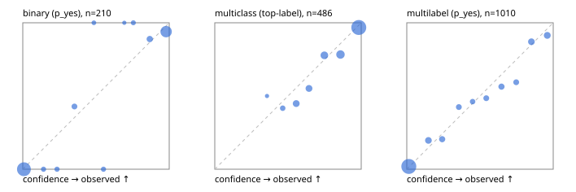

# Evaluation report

- model `Qwen/Qwen3-Reranker-4B` @ `22e683669b` (shared-prefix tree (tree-v1)), adapter/checkpoint `runs/curve/tree_4b_r2b_r64_mlp/adapter`, prompt `tree-v1` (bc025ae9f6bc)
- data data/hf.jsonl, data/eval.jsonl; splits ['validation']; n=868; calibration `None`
- cuda / bfloat16; 2026-09-24T10:00:09+0000; wall 66.7s

## Overall

question accuracy 80.8%

**binary**: n 210, positives 79, accuracy 0.933, precision 0.892, recall 0.937, f1 0.914, auroc 0.987, brier 0.041, log_loss 0.141, ece 0.048

**multiclass**: n 486, accuracy 0.856, macro_f1 0.874, log_loss 0.401, brier 0.205, ece_top_label 0.036

**multilabel**: n 172, labels 1010, exact_match 0.517, micro_f1 0.730, macro_f1 0.650, label_auroc 0.942, brier 0.078, log_loss 0.248, ece 0.023

## By family

| family | n | question acc % | details |
|---|---|---|---|
| eval_adversarial | 14 | 100.0 | bin acc 100.0 F1 100.0 AUROC 1.000 ECE 0.059; mc acc 100.0 mF1 100.0 ECE 0.008; ml EM 100.0 µF1 100.0 ECE 0.004 |
| eval_agent_output | 20 | 70.0 | bin acc 83.3 F1 85.7 AUROC 0.889 ECE 0.106; mc acc 60.0 mF1 33.3 ECE 0.374; ml EM 33.3 µF1 0.0 ECE 0.354 |
| eval_evidence | 17 | 100.0 | bin acc 100.0 F1 100.0 AUROC 1.000 ECE 0.013; ml EM 100.0 µF1 100.0 ECE 0.016 |
| eval_multilabel | 12 | 83.3 | bin acc 100.0 F1 0.0 AUROC — ECE 0.371; mc acc 100.0 mF1 100.0 ECE 0.016; ml EM 77.8 µF1 95.7 ECE 0.070 |
| eval_policy | 24 | 70.8 | bin acc 75.0 F1 76.9 AUROC 0.914 ECE 0.197; mc acc 72.7 mF1 57.1 ECE 0.191; ml EM 0.0 µF1 50.0 ECE 0.443 |
| eval_routing | 16 | 87.5 | bin acc 100.0 F1 100.0 AUROC 1.000 ECE 0.038; mc acc 87.5 mF1 88.9 ECE 0.071; ml EM 0.0 µF1 0.0 ECE 0.225 |
| eval_urgency_sentiment | 15 | 100.0 | bin acc 100.0 F1 100.0 AUROC 1.000 ECE 0.021; mc acc 100.0 mF1 100.0 ECE 0.018; ml EM 100.0 µF1 100.0 ECE 0.007 |
| hf_emotions_multilabel | 150 | 48.7 | ml EM 48.7 µF1 70.4 ECE 0.023 |
| hf_intent_banking77 | 150 | 98.0 | mc acc 98.0 mF1 98.2 ECE 0.015 |
| hf_nli | 150 | 94.0 | bin acc 94.0 F1 90.7 AUROC 0.990 ECE 0.047 |
| hf_sentiment_tweets | 150 | 71.3 | mc acc 71.3 mF1 67.2 ECE 0.081 |
| hf_topic_agnews | 150 | 88.0 | mc acc 88.0 mF1 88.2 ECE 0.060 |

## by hard case

| slice | n | question acc % |
|---|---|---|
| (none) | 634 | 80.1 |
| contradiction | 63 | 96.8 |
| distractor | 20 | 95.0 |
| double_negation | 3 | 100.0 |
| evidence_end | 4 | 100.0 |
| evidence_middle | 7 | 100.0 |
| evidence_start | 3 | 66.7 |
| exception | 7 | 100.0 |
| hypothetical | 6 | 100.0 |
| injection | 16 | 75.0 |
| lexical_overlap | 13 | 92.3 |
| long_state | 26 | 84.6 |
| missing_evidence | 59 | 91.5 |
| multi_positive | 40 | 37.5 |
| multi_turn | 21 | 90.5 |
| negation | 9 | 77.8 |
| new_label_names | 5 | 60.0 |
| nota | 4 | 75.0 |
| numeric_reasoning | 13 | 76.9 |
| paraphrase | 10 | 60.0 |
| role_reversal | 7 | 85.7 |
| sarcasm | 5 | 80.0 |
| temporal_reasoning | 15 | 66.7 |
| zero_positive | 7 | 71.4 |

## by state tokens

| slice | n | question acc % |
|---|---|---|
| 00000-00127 | 796 | 80.4 |
| 00128-00511 | 46 | 84.8 |
| 00512-02047 | 26 | 84.6 |

## by candidates

| slice | n | question acc % |
|---|---|---|
| 01 | 210 | 93.3 |
| 03 | 162 | 72.2 |
| 04 | 174 | 86.8 |
| 05 | 13 | 76.9 |
| 06 | 159 | 50.3 |
| 08 | 150 | 98.0 |

## Paraphrase groups

5 groups; same prediction 60.0%; all correct 40.0%

## Multiclass abstention (coverage vs error on accepted)

| abstain_below | coverage % | error % |
|---|---|---|
| 0.0 | 100.0 | 14.4 |
| 0.4 | 99.6 | 14.3 |
| 0.5 | 97.1 | 13.1 |
| 0.6 | 91.2 | 10.4 |
| 0.7 | 85.2 | 8.0 |
| 0.8 | 75.9 | 6.2 |
| 0.9 | 63.6 | 3.2 |

## Reliability: binary

| bin | n | mean confidence | observed frequency |
|---|---|---|---|
| [0.0,0.1) | 110 | 0.008 | 0.000 |
| [0.1,0.2) | 4 | 0.142 | 0.000 |
| [0.2,0.3) | 4 | 0.234 | 0.000 |
| [0.3,0.4) | 7 | 0.353 | 0.429 |
| [0.4,0.5) | 2 | 0.485 | 1.000 |
| [0.5,0.6) | 4 | 0.551 | 0.000 |
| [0.6,0.7) | 1 | 0.693 | 1.000 |
| [0.7,0.8) | 3 | 0.755 | 1.000 |
| [0.8,0.9) | 9 | 0.867 | 0.889 |
| [0.9,1.0] | 66 | 0.979 | 0.939 |

## Reliability: multiclass

| bin | n | mean confidence | observed frequency |
|---|---|---|---|
| [0.3,0.4) | 2 | 0.357 | 0.500 |
| [0.4,0.5) | 12 | 0.464 | 0.417 |
| [0.5,0.6) | 29 | 0.556 | 0.448 |
| [0.6,0.7) | 29 | 0.643 | 0.552 |
| [0.7,0.8) | 45 | 0.749 | 0.778 |
| [0.8,0.9) | 60 | 0.858 | 0.783 |
| [0.9,1.0] | 309 | 0.983 | 0.968 |

## Reliability: multilabel

| bin | n | mean confidence | observed frequency |
|---|---|---|---|
| [0.0,0.1) | 640 | 0.014 | 0.019 |
| [0.1,0.2) | 56 | 0.148 | 0.196 |
| [0.2,0.3) | 39 | 0.242 | 0.205 |
| [0.3,0.4) | 33 | 0.355 | 0.424 |
| [0.4,0.5) | 26 | 0.449 | 0.462 |
| [0.5,0.6) | 33 | 0.543 | 0.485 |
| [0.6,0.7) | 39 | 0.646 | 0.564 |
| [0.7,0.8) | 32 | 0.747 | 0.594 |
| [0.8,0.9) | 54 | 0.851 | 0.870 |
| [0.9,1.0] | 58 | 0.959 | 0.914 |
