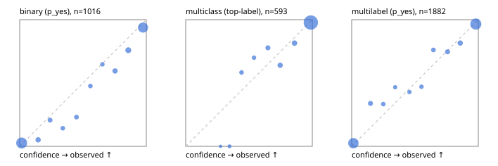

# Evaluation report

- model `Qwen/Qwen3-Reranker-4B` @ `22e683669b` (shared-prefix tree (tree-v1)), adapter/checkpoint `runs/curve/tree_4b_r64/adapter`, prompt `tree-v1` (bc025ae9f6bc)
- data data/eval2.jsonl; splits ['test']; n=1991; calibration `None`
- cuda / bfloat16; 2026-09-24T07:04:08+0000; wall 243.9s

## Overall

question accuracy 87.2%

**binary**: n 1016, positives 435, accuracy 0.905, precision 0.855, recall 0.936, f1 0.894, auroc 0.964, brier 0.075, log_loss 0.254, ece 0.044

**multiclass**: n 593, accuracy 0.927, macro_f1 0.873, log_loss 0.231, brier 0.114, ece_top_label 0.028

**multilabel**: n 382, labels 1882, exact_match 0.699, micro_f1 0.920, macro_f1 0.857, label_auroc 0.973, brier 0.065, log_loss 0.217, ece 0.027

## By family

| family | n | question acc % | details |
|---|---|---|---|
| e2_hard | 673 | 85.3 | bin acc 88.2 F1 84.9 AUROC 0.950 ECE 0.059; mc acc 90.7 mF1 83.2 ECE 0.046; ml EM 69.7 µF1 90.7 ECE 0.039 |
| e2_simple | 664 | 94.4 | bin acc 96.5 F1 96.8 AUROC 0.986 ECE 0.028; mc acc 98.0 mF1 95.7 ECE 0.019; ml EM 82.5 µF1 95.5 ECE 0.040 |
| e2_very_hard | 654 | 81.8 | bin acc 86.4 F1 83.3 AUROC 0.940 ECE 0.074; mc acc 89.5 mF1 83.1 ECE 0.055; ml EM 58.5 µF1 90.0 ECE 0.037 |

## by hard case

| slice | n | question acc % |
|---|---|---|
| (none) | 569 | 95.8 |
| contradiction | 172 | 85.5 |
| distractor | 474 | 84.4 |
| double_negation | 126 | 87.3 |
| evidence_end | 57 | 84.2 |
| evidence_middle | 114 | 90.4 |
| evidence_start | 17 | 76.5 |
| exception | 213 | 80.3 |
| hypothetical | 128 | 89.1 |
| injection | 151 | 74.2 |
| lexical_overlap | 201 | 90.5 |
| long_state | 191 | 84.3 |
| missing_evidence | 141 | 92.9 |
| multi_positive | 322 | 73.3 |
| multi_turn | 149 | 84.6 |
| negation | 257 | 87.2 |
| nota | 118 | 82.2 |
| numeric_reasoning | 224 | 71.9 |
| paraphrase | 218 | 83.0 |
| role_reversal | 187 | 85.0 |
| sarcasm | 149 | 75.2 |
| temporal_reasoning | 203 | 71.9 |
| zero_positive | 73 | 79.5 |
| zero_positive_distractor | 1 | 100.0 |

## by state tokens

| slice | n | question acc % |
|---|---|---|
| 00000-00127 | 662 | 86.7 |
| 00128-00511 | 477 | 83.4 |
| 00512-02047 | 484 | 91.5 |
| 02048-08191 | 329 | 87.2 |
| 08192+ | 39 | 87.2 |

## by candidates

| slice | n | question acc % |
|---|---|---|
| 01 | 1016 | 90.5 |
| 03 | 128 | 87.5 |
| 04 | 515 | 88.9 |
| 05 | 224 | 75.0 |
| 06 | 86 | 75.6 |
| 07 | 18 | 66.7 |
| 08 | 4 | 50.0 |

## Paraphrase groups

76 groups; same prediction 73.7%; all correct 72.4%

## Multiclass abstention (coverage vs error on accepted)

| abstain_below | coverage % | error % |
|---|---|---|
| 0.0 | 100.0 | 7.3 |
| 0.4 | 99.0 | 6.3 |
| 0.5 | 97.0 | 5.6 |
| 0.6 | 95.3 | 5.1 |
| 0.7 | 92.2 | 4.6 |
| 0.8 | 88.0 | 3.1 |
| 0.9 | 83.5 | 2.2 |

## Reliability: binary

| bin | n | mean confidence | observed frequency |
|---|---|---|---|
| [0.0,0.1) | 425 | 0.016 | 0.026 |
| [0.1,0.2) | 39 | 0.146 | 0.051 |
| [0.2,0.3) | 29 | 0.240 | 0.207 |
| [0.3,0.4) | 21 | 0.341 | 0.143 |
| [0.4,0.5) | 26 | 0.448 | 0.231 |
| [0.5,0.6) | 21 | 0.558 | 0.476 |
| [0.6,0.7) | 17 | 0.654 | 0.647 |
| [0.7,0.8) | 42 | 0.753 | 0.595 |
| [0.8,0.9) | 58 | 0.858 | 0.759 |
| [0.9,1.0] | 338 | 0.974 | 0.938 |

## Reliability: multiclass

| bin | n | mean confidence | observed frequency |
|---|---|---|---|
| [0.2,0.3) | 1 | 0.275 | 0.000 |
| [0.3,0.4) | 5 | 0.346 | 0.000 |
| [0.4,0.5) | 12 | 0.441 | 0.583 |
| [0.5,0.6) | 10 | 0.540 | 0.700 |
| [0.6,0.7) | 18 | 0.650 | 0.778 |
| [0.7,0.8) | 25 | 0.746 | 0.640 |
| [0.8,0.9) | 27 | 0.860 | 0.815 |
| [0.9,1.0] | 495 | 0.988 | 0.978 |

## Reliability: multilabel

| bin | n | mean confidence | observed frequency |
|---|---|---|---|
| [0.0,0.1) | 688 | 0.013 | 0.025 |
| [0.1,0.2) | 62 | 0.148 | 0.339 |
| [0.2,0.3) | 39 | 0.249 | 0.333 |
| [0.3,0.4) | 30 | 0.343 | 0.467 |
| [0.4,0.5) | 28 | 0.456 | 0.429 |
| [0.5,0.6) | 34 | 0.551 | 0.471 |
| [0.6,0.7) | 46 | 0.646 | 0.761 |
| [0.7,0.8) | 63 | 0.757 | 0.746 |
| [0.8,0.9) | 76 | 0.857 | 0.816 |
| [0.9,1.0] | 816 | 0.981 | 0.966 |
