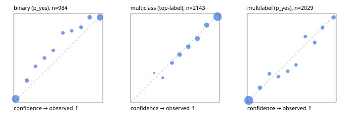

# Evaluation report

- model `Qwen/Qwen3-Reranker-4B` @ `22e683669b` (shared-prefix tree (tree-v1)), adapter/checkpoint `runs/curve/tree_4b_r64/adapter`, prompt `tree-v1` (bc025ae9f6bc)
- data data/hf.jsonl, data/eval.jsonl; splits ['test']; n=3471; calibration `None`
- cuda / bfloat16; 2026-09-24T04:44:26+0000; wall 200.3s

## Overall

question accuracy 81.5%

**binary**: n 984, positives 475, accuracy 0.885, precision 0.923, recall 0.832, f1 0.875, auroc 0.956, brier 0.087, log_loss 0.285, ece 0.057

**multiclass**: n 2143, accuracy 0.830, macro_f1 0.887, log_loss 0.474, brier 0.242, ece_top_label 0.016

**multilabel**: n 344, labels 2029, exact_match 0.523, micro_f1 0.753, macro_f1 0.732, label_auroc 0.943, brier 0.076, log_loss 0.246, ece 0.022

## By family

| family | n | question acc % | details |
|---|---|---|---|
| eval_adversarial | 27 | 96.3 | bin acc 100.0 F1 100.0 AUROC 1.000 ECE 0.064; mc acc 100.0 mF1 100.0 ECE 0.007; ml EM 80.0 µF1 94.7 ECE 0.064 |
| eval_agent_output | 26 | 50.0 | bin acc 78.6 F1 80.0 AUROC 0.837 ECE 0.194; mc acc 14.3 mF1 6.2 ECE 0.704; ml EM 20.0 µF1 75.0 ECE 0.189 |
| eval_evidence | 17 | 88.2 | bin acc 100.0 F1 100.0 AUROC 1.000 ECE 0.037; ml EM 0.0 µF1 57.1 ECE 0.331 |
| eval_multilabel | 32 | 81.2 | bin acc 100.0 F1 100.0 AUROC 1.000 ECE 0.076; mc acc 100.0 mF1 100.0 ECE 0.153; ml EM 75.0 µF1 93.2 ECE 0.042 |
| eval_policy | 22 | 54.5 | bin acc 53.8 F1 62.5 AUROC 0.643 ECE 0.346; mc acc 60.0 mF1 42.9 ECE 0.484; ml EM 50.0 µF1 76.2 ECE 0.300 |
| eval_routing | 25 | 84.0 | bin acc 90.0 F1 88.9 AUROC 0.917 ECE 0.112; mc acc 84.6 mF1 75.0 ECE 0.107; ml EM 50.0 µF1 80.0 ECE 0.114 |
| eval_urgency_sentiment | 22 | 90.9 | bin acc 80.0 F1 83.3 AUROC 0.958 ECE 0.162; mc acc 100.0 mF1 100.0 ECE 0.113; ml EM 100.0 µF1 100.0 ECE 0.022 |
| heldout_boolq | 300 | 84.0 | bin acc 84.0 F1 85.9 AUROC 0.931 ECE 0.074 |
| heldout_emotion_multiclass | 300 | 55.3 | mc acc 55.3 mF1 42.9 ECE 0.187 |
| heldout_intent_clinc | 300 | 93.0 | mc acc 93.0 mF1 94.2 ECE 0.050 |
| heldout_question_type_trec | 300 | 82.0 | mc acc 82.0 mF1 83.2 ECE 0.081 |
| heldout_sentiment_sst2 | 300 | 87.0 | bin acc 87.0 F1 85.3 AUROC 0.973 ECE 0.127 |
| heldout_topic_dbpedia | 300 | 96.0 | mc acc 96.0 mF1 95.6 ECE 0.011 |
| hf_emotions_multilabel | 300 | 50.7 | ml EM 50.7 µF1 71.8 ECE 0.022 |
| hf_intent_banking77 | 300 | 96.0 | mc acc 96.0 mF1 95.2 ECE 0.032 |
| hf_nli | 300 | 95.3 | bin acc 95.3 F1 93.6 AUROC 0.984 ECE 0.037 |
| hf_sentiment_tweets | 300 | 69.7 | mc acc 69.7 mF1 69.6 ECE 0.036 |
| hf_topic_agnews | 300 | 90.0 | mc acc 90.0 mF1 90.1 ECE 0.027 |

## by hard case

| slice | n | question acc % |
|---|---|---|
| (none) | 3042 | 81.5 |
| contradiction | 107 | 100.0 |
| distractor | 33 | 60.6 |
| double_negation | 6 | 83.3 |
| evidence_end | 13 | 92.3 |
| evidence_middle | 11 | 81.8 |
| evidence_start | 9 | 88.9 |
| exception | 7 | 14.3 |
| hypothetical | 7 | 100.0 |
| injection | 10 | 70.0 |
| lexical_overlap | 20 | 85.0 |
| long_state | 50 | 76.0 |
| missing_evidence | 104 | 92.3 |
| multi_positive | 81 | 40.7 |
| multi_turn | 9 | 77.8 |
| negation | 30 | 86.7 |
| new_label_names | 3 | 33.3 |
| nota | 46 | 95.7 |
| numeric_reasoning | 16 | 50.0 |
| paraphrase | 22 | 81.8 |
| role_reversal | 15 | 73.3 |
| sarcasm | 12 | 91.7 |
| temporal_reasoning | 29 | 55.2 |
| zero_positive | 6 | 66.7 |

## by state tokens

| slice | n | question acc % |
|---|---|---|
| 00000-00127 | 3211 | 81.6 |
| 00128-00511 | 208 | 81.7 |
| 00512-02047 | 52 | 76.9 |

## by candidates

| slice | n | question acc % |
|---|---|---|
| 01 | 984 | 88.5 |
| 03 | 310 | 70.3 |
| 04 | 333 | 88.3 |
| 05 | 22 | 54.5 |
| 06 | 1218 | 70.9 |
| 07 | 49 | 98.0 |
| 08 | 555 | 94.2 |

## Paraphrase groups

11 groups; same prediction 72.7%; all correct 81.8%

## Multiclass abstention (coverage vs error on accepted)

| abstain_below | coverage % | error % |
|---|---|---|
| 0.0 | 100.0 | 17.0 |
| 0.4 | 98.5 | 16.2 |
| 0.5 | 94.3 | 14.4 |
| 0.6 | 85.9 | 11.3 |
| 0.7 | 77.5 | 8.5 |
| 0.8 | 65.7 | 5.0 |
| 0.9 | 53.7 | 3.2 |

## Reliability: binary

| bin | n | mean confidence | observed frequency |
|---|---|---|---|
| [0.0,0.1) | 390 | 0.020 | 0.038 |
| [0.1,0.2) | 69 | 0.146 | 0.246 |
| [0.2,0.3) | 32 | 0.244 | 0.406 |
| [0.3,0.4) | 36 | 0.344 | 0.500 |
| [0.4,0.5) | 29 | 0.443 | 0.586 |
| [0.5,0.6) | 37 | 0.551 | 0.784 |
| [0.6,0.7) | 26 | 0.650 | 0.808 |
| [0.7,0.8) | 46 | 0.755 | 0.848 |
| [0.8,0.9) | 75 | 0.852 | 0.960 |
| [0.9,1.0] | 244 | 0.968 | 0.959 |

## Reliability: multiclass

| bin | n | mean confidence | observed frequency |
|---|---|---|---|
| [0.2,0.3) | 3 | 0.266 | 0.333 |
| [0.3,0.4) | 29 | 0.363 | 0.276 |
| [0.4,0.5) | 90 | 0.466 | 0.444 |
| [0.5,0.6) | 180 | 0.551 | 0.539 |
| [0.6,0.7) | 180 | 0.649 | 0.628 |
| [0.7,0.8) | 253 | 0.752 | 0.719 |
| [0.8,0.9) | 257 | 0.855 | 0.872 |
| [0.9,1.0] | 1151 | 0.978 | 0.968 |

## Reliability: multilabel

| bin | n | mean confidence | observed frequency |
|---|---|---|---|
| [0.0,0.1) | 1263 | 0.018 | 0.021 |
| [0.1,0.2) | 128 | 0.143 | 0.164 |
| [0.2,0.3) | 84 | 0.250 | 0.321 |
| [0.3,0.4) | 76 | 0.351 | 0.289 |
| [0.4,0.5) | 57 | 0.456 | 0.351 |
| [0.5,0.6) | 57 | 0.548 | 0.421 |
| [0.6,0.7) | 66 | 0.653 | 0.742 |
| [0.7,0.8) | 86 | 0.759 | 0.674 |
| [0.8,0.9) | 90 | 0.847 | 0.844 |
| [0.9,1.0] | 122 | 0.971 | 0.959 |
