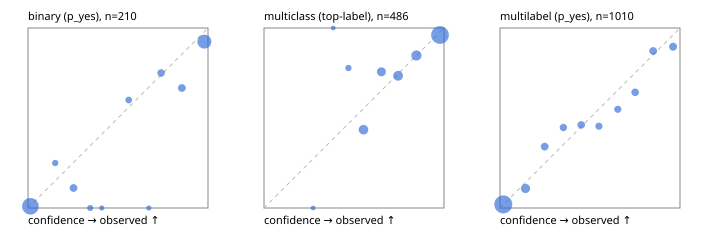

# Evaluation report

- model `Qwen/Qwen3-Reranker-4B` @ `22e683669b` (shared-prefix tree (tree-v1)), adapter/checkpoint `runs/curve/tree_4b_r64/adapter`, prompt `tree-v1` (bc025ae9f6bc)
- data data/hf.jsonl, data/eval.jsonl; splits ['validation']; n=868; calibration `None`
- cuda / bfloat16; 2026-09-24T04:40:57+0000; wall 60.9s

## Overall

question accuracy 79.7%

**binary**: n 210, positives 79, accuracy 0.924, precision 0.854, recall 0.962, f1 0.905, auroc 0.979, brier 0.062, log_loss 0.200, ece 0.047

**multiclass**: n 486, accuracy 0.854, macro_f1 0.819, log_loss 0.426, brier 0.218, ece_top_label 0.037

**multilabel**: n 172, labels 1010, exact_match 0.483, micro_f1 0.689, macro_f1 0.620, label_auroc 0.931, brier 0.084, log_loss 0.268, ece 0.027

## By family

| family | n | question acc % | details |
|---|---|---|---|
| eval_adversarial | 14 | 92.9 | bin acc 85.7 F1 90.9 AUROC 1.000 ECE 0.151; mc acc 100.0 mF1 100.0 ECE 0.025; ml EM 100.0 µF1 100.0 ECE 0.010 |
| eval_agent_output | 20 | 70.0 | bin acc 83.3 F1 85.7 AUROC 0.889 ECE 0.178; mc acc 60.0 mF1 33.3 ECE 0.437; ml EM 33.3 µF1 0.0 ECE 0.372 |
| eval_evidence | 17 | 94.1 | bin acc 92.9 F1 90.9 AUROC 1.000 ECE 0.064; ml EM 100.0 µF1 100.0 ECE 0.029 |
| eval_multilabel | 12 | 58.3 | bin acc 0.0 F1 0.0 AUROC — ECE 0.855; mc acc 100.0 mF1 100.0 ECE 0.032; ml EM 55.6 µF1 91.7 ECE 0.092 |
| eval_policy | 24 | 58.3 | bin acc 66.7 F1 71.4 AUROC 0.714 ECE 0.312; mc acc 54.5 mF1 37.5 ECE 0.345; ml EM 0.0 µF1 50.0 ECE 0.434 |
| eval_routing | 16 | 93.8 | bin acc 100.0 F1 100.0 AUROC 1.000 ECE 0.123; mc acc 100.0 mF1 100.0 ECE 0.075; ml EM 0.0 µF1 0.0 ECE 0.329 |
| eval_urgency_sentiment | 15 | 100.0 | bin acc 100.0 F1 100.0 AUROC 1.000 ECE 0.072; mc acc 100.0 mF1 100.0 ECE 0.123; ml EM 100.0 µF1 100.0 ECE 0.021 |
| hf_emotions_multilabel | 150 | 46.0 | ml EM 46.0 µF1 65.7 ECE 0.027 |
| hf_intent_banking77 | 150 | 94.7 | mc acc 94.7 mF1 93.7 ECE 0.038 |
| hf_nli | 150 | 95.3 | bin acc 95.3 F1 92.9 AUROC 0.990 ECE 0.049 |
| hf_sentiment_tweets | 150 | 74.0 | mc acc 74.0 mF1 70.4 ECE 0.095 |
| hf_topic_agnews | 150 | 88.7 | mc acc 88.7 mF1 88.9 ECE 0.041 |

## by hard case

| slice | n | question acc % |
|---|---|---|
| (none) | 634 | 80.3 |
| contradiction | 63 | 93.7 |
| distractor | 20 | 85.0 |
| double_negation | 3 | 100.0 |
| evidence_end | 4 | 75.0 |
| evidence_middle | 7 | 100.0 |
| evidence_start | 3 | 66.7 |
| exception | 7 | 100.0 |
| hypothetical | 6 | 83.3 |
| injection | 16 | 75.0 |
| lexical_overlap | 13 | 92.3 |
| long_state | 26 | 73.1 |
| missing_evidence | 59 | 91.5 |
| multi_positive | 40 | 25.0 |
| multi_turn | 21 | 66.7 |
| negation | 9 | 66.7 |
| new_label_names | 5 | 80.0 |
| nota | 4 | 100.0 |
| numeric_reasoning | 13 | 84.6 |
| paraphrase | 10 | 70.0 |
| role_reversal | 7 | 28.6 |
| sarcasm | 5 | 80.0 |
| temporal_reasoning | 15 | 60.0 |
| zero_positive | 7 | 57.1 |

## by state tokens

| slice | n | question acc % |
|---|---|---|
| 00000-00127 | 796 | 80.0 |
| 00128-00511 | 46 | 78.3 |
| 00512-02047 | 26 | 73.1 |

## by candidates

| slice | n | question acc % |
|---|---|---|
| 01 | 210 | 92.4 |
| 03 | 162 | 74.7 |
| 04 | 174 | 87.4 |
| 05 | 13 | 61.5 |
| 06 | 159 | 47.2 |
| 08 | 150 | 94.7 |

## Paraphrase groups

5 groups; same prediction 60.0%; all correct 60.0%

## Multiclass abstention (coverage vs error on accepted)

| abstain_below | coverage % | error % |
|---|---|---|
| 0.0 | 100.0 | 14.6 |
| 0.4 | 99.6 | 14.5 |
| 0.5 | 97.7 | 14.3 |
| 0.6 | 88.3 | 9.8 |
| 0.7 | 80.7 | 8.4 |
| 0.8 | 70.6 | 5.8 |
| 0.9 | 58.4 | 3.9 |

## Reliability: binary

| bin | n | mean confidence | observed frequency |
|---|---|---|---|
| [0.0,0.1) | 104 | 0.013 | 0.010 |
| [0.1,0.2) | 4 | 0.151 | 0.250 |
| [0.2,0.3) | 9 | 0.253 | 0.111 |
| [0.3,0.4) | 3 | 0.346 | 0.000 |
| [0.4,0.5) | 1 | 0.410 | 0.000 |
| [0.5,0.6) | 5 | 0.559 | 0.600 |
| [0.6,0.7) | 1 | 0.671 | 0.000 |
| [0.7,0.8) | 8 | 0.739 | 0.750 |
| [0.8,0.9) | 9 | 0.855 | 0.667 |
| [0.9,1.0] | 66 | 0.980 | 0.924 |

## Reliability: multiclass

| bin | n | mean confidence | observed frequency |
|---|---|---|---|
| [0.2,0.3) | 1 | 0.273 | 0.000 |
| [0.3,0.4) | 1 | 0.385 | 1.000 |
| [0.4,0.5) | 9 | 0.469 | 0.778 |
| [0.5,0.6) | 46 | 0.553 | 0.435 |
| [0.6,0.7) | 37 | 0.652 | 0.757 |
| [0.7,0.8) | 49 | 0.745 | 0.735 |
| [0.8,0.9) | 59 | 0.847 | 0.847 |
| [0.9,1.0] | 284 | 0.978 | 0.961 |

## Reliability: multilabel

| bin | n | mean confidence | observed frequency |
|---|---|---|---|
| [0.0,0.1) | 605 | 0.018 | 0.020 |
| [0.1,0.2) | 83 | 0.142 | 0.108 |
| [0.2,0.3) | 44 | 0.248 | 0.341 |
| [0.3,0.4) | 38 | 0.352 | 0.447 |
| [0.4,0.5) | 39 | 0.451 | 0.462 |
| [0.5,0.6) | 33 | 0.549 | 0.455 |
| [0.6,0.7) | 31 | 0.655 | 0.548 |
| [0.7,0.8) | 42 | 0.751 | 0.643 |
| [0.8,0.9) | 47 | 0.851 | 0.872 |
| [0.9,1.0] | 48 | 0.962 | 0.896 |
