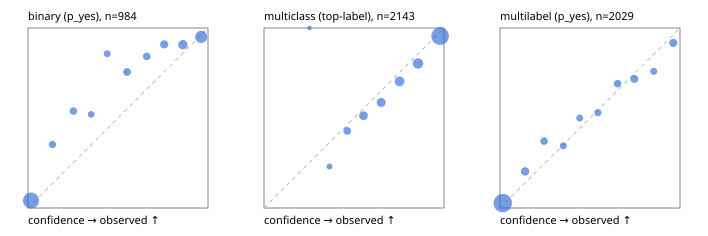

# Evaluation report

- model `Qwen/Qwen3-Reranker-4B` @ `22e683669b` (stock reranker pairs), adapter/checkpoint `runs/curve/vol100_e2/adapter`, prompt `answer-v1` (724795e9b666)
- data data/hf.jsonl, data/eval.jsonl; splits ['test']; n=3471; calibration `None`
- cuda / bfloat16; 2026-09-24T02:18:45+0000; wall 414.1s

## Overall

question accuracy 79.8%

**binary**: n 984, positives 475, accuracy 0.870, precision 0.906, recall 0.815, f1 0.858, auroc 0.951, brier 0.095, log_loss 0.313, ece 0.077

**multiclass**: n 2143, accuracy 0.819, macro_f1 0.868, log_loss 0.538, brier 0.264, ece_top_label 0.036

**multilabel**: n 344, labels 2029, exact_match 0.462, micro_f1 0.714, macro_f1 0.691, label_auroc 0.930, brier 0.085, log_loss 0.277, ece 0.026

## By family

| family | n | question acc % | details |
|---|---|---|---|
| eval_adversarial | 27 | 81.5 | bin acc 86.7 F1 85.7 AUROC 0.963 ECE 0.138; mc acc 100.0 mF1 100.0 ECE 0.031; ml EM 40.0 µF1 73.7 ECE 0.164 |
| eval_agent_output | 26 | 50.0 | bin acc 85.7 F1 87.5 AUROC 0.816 ECE 0.211; mc acc 14.3 mF1 6.2 ECE 0.614; ml EM 0.0 µF1 70.6 ECE 0.204 |
| eval_evidence | 17 | 88.2 | bin acc 100.0 F1 100.0 AUROC 1.000 ECE 0.037; ml EM 0.0 µF1 57.1 ECE 0.253 |
| eval_multilabel | 32 | 65.6 | bin acc 100.0 F1 100.0 AUROC 1.000 ECE 0.038; mc acc 0.0 mF1 0.0 ECE 0.583; ml EM 58.3 µF1 89.9 ECE 0.062 |
| eval_policy | 22 | 45.5 | bin acc 53.8 F1 57.1 AUROC 0.643 ECE 0.401; mc acc 40.0 mF1 23.8 ECE 0.460; ml EM 25.0 µF1 80.0 ECE 0.262 |
| eval_routing | 25 | 84.0 | bin acc 100.0 F1 100.0 AUROC 1.000 ECE 0.026; mc acc 76.9 mF1 66.7 ECE 0.124; ml EM 50.0 µF1 80.0 ECE 0.124 |
| eval_urgency_sentiment | 22 | 77.3 | bin acc 80.0 F1 83.3 AUROC 0.875 ECE 0.210; mc acc 80.0 mF1 81.0 ECE 0.237; ml EM 50.0 µF1 90.9 ECE 0.110 |
| heldout_boolq | 300 | 82.7 | bin acc 82.7 F1 85.6 AUROC 0.910 ECE 0.061 |
| heldout_emotion_multiclass | 300 | 56.7 | mc acc 56.7 mF1 49.0 ECE 0.169 |
| heldout_intent_clinc | 300 | 92.7 | mc acc 92.7 mF1 93.4 ECE 0.052 |
| heldout_question_type_trec | 300 | 77.0 | mc acc 77.0 mF1 77.4 ECE 0.063 |
| heldout_sentiment_sst2 | 300 | 86.3 | bin acc 86.3 F1 84.3 AUROC 0.988 ECE 0.152 |
| heldout_topic_dbpedia | 300 | 96.0 | mc acc 96.0 mF1 95.5 ECE 0.012 |
| hf_emotions_multilabel | 300 | 46.7 | ml EM 46.7 µF1 67.9 ECE 0.026 |
| hf_intent_banking77 | 300 | 96.7 | mc acc 96.7 mF1 95.8 ECE 0.028 |
| hf_nli | 300 | 92.3 | bin acc 92.3 F1 88.6 AUROC 0.977 ECE 0.064 |
| hf_sentiment_tweets | 300 | 68.0 | mc acc 68.0 mF1 68.4 ECE 0.061 |
| hf_topic_agnews | 300 | 88.7 | mc acc 88.7 mF1 88.7 ECE 0.043 |

## by hard case

| slice | n | question acc % |
|---|---|---|
| (none) | 3042 | 80.0 |
| contradiction | 107 | 99.1 |
| distractor | 33 | 57.6 |
| double_negation | 6 | 66.7 |
| evidence_end | 13 | 76.9 |
| evidence_middle | 11 | 54.5 |
| evidence_start | 9 | 77.8 |
| exception | 7 | 14.3 |
| hypothetical | 7 | 71.4 |
| injection | 10 | 70.0 |
| lexical_overlap | 20 | 70.0 |
| long_state | 50 | 62.0 |
| missing_evidence | 104 | 96.2 |
| multi_positive | 81 | 25.9 |
| multi_turn | 9 | 88.9 |
| negation | 30 | 76.7 |
| new_label_names | 3 | 33.3 |
| nota | 46 | 97.8 |
| numeric_reasoning | 16 | 56.2 |
| paraphrase | 22 | 54.5 |
| role_reversal | 15 | 60.0 |
| sarcasm | 12 | 58.3 |
| temporal_reasoning | 29 | 37.9 |
| zero_positive | 6 | 16.7 |

## by state tokens

| slice | n | question acc % |
|---|---|---|
| 00000-00127 | 3211 | 80.1 |
| 00128-00511 | 208 | 80.3 |
| 00512-02047 | 52 | 61.5 |

## by candidates

| slice | n | question acc % |
|---|---|---|
| 01 | 984 | 87.0 |
| 03 | 310 | 68.7 |
| 04 | 333 | 86.2 |
| 05 | 22 | 31.8 |
| 06 | 1218 | 68.8 |
| 07 | 49 | 93.9 |
| 08 | 555 | 94.2 |

## Paraphrase groups

11 groups; same prediction 54.5%; all correct 45.5%

## Multiclass abstention (coverage vs error on accepted)

| abstain_below | coverage % | error % |
|---|---|---|
| 0.0 | 100.0 | 18.1 |
| 0.4 | 98.7 | 17.4 |
| 0.5 | 94.5 | 15.6 |
| 0.6 | 87.3 | 12.9 |
| 0.7 | 79.7 | 10.2 |
| 0.8 | 69.5 | 7.3 |
| 0.9 | 56.7 | 4.5 |

## Reliability: binary

| bin | n | mean confidence | observed frequency |
|---|---|---|---|
| [0.0,0.1) | 431 | 0.017 | 0.042 |
| [0.1,0.2) | 34 | 0.136 | 0.353 |
| [0.2,0.3) | 39 | 0.253 | 0.538 |
| [0.3,0.4) | 25 | 0.351 | 0.520 |
| [0.4,0.5) | 28 | 0.440 | 0.857 |
| [0.5,0.6) | 45 | 0.550 | 0.756 |
| [0.6,0.7) | 38 | 0.660 | 0.842 |
| [0.7,0.8) | 55 | 0.757 | 0.909 |
| [0.8,0.9) | 86 | 0.860 | 0.907 |
| [0.9,1.0] | 203 | 0.962 | 0.951 |

## Reliability: multiclass

| bin | n | mean confidence | observed frequency |
|---|---|---|---|
| [0.2,0.3) | 1 | 0.253 | 1.000 |
| [0.3,0.4) | 26 | 0.364 | 0.231 |
| [0.4,0.5) | 91 | 0.462 | 0.429 |
| [0.5,0.6) | 154 | 0.553 | 0.513 |
| [0.6,0.7) | 162 | 0.651 | 0.586 |
| [0.7,0.8) | 219 | 0.754 | 0.703 |
| [0.8,0.9) | 274 | 0.856 | 0.803 |
| [0.9,1.0] | 1216 | 0.978 | 0.955 |

## Reliability: multilabel

| bin | n | mean confidence | observed frequency |
|---|---|---|---|
| [0.0,0.1) | 1311 | 0.016 | 0.027 |
| [0.1,0.2) | 118 | 0.140 | 0.203 |
| [0.2,0.3) | 78 | 0.245 | 0.372 |
| [0.3,0.4) | 55 | 0.352 | 0.345 |
| [0.4,0.5) | 56 | 0.443 | 0.500 |
| [0.5,0.6) | 68 | 0.544 | 0.529 |
| [0.6,0.7) | 81 | 0.653 | 0.691 |
| [0.7,0.8) | 99 | 0.746 | 0.717 |
| [0.8,0.9) | 54 | 0.854 | 0.759 |
| [0.9,1.0] | 109 | 0.963 | 0.917 |
