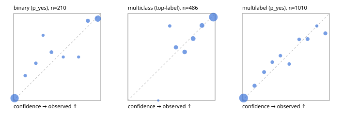

# Evaluation report

- model `Qwen/Qwen3-Reranker-4B` @ `22e683669b` (stock reranker pairs), adapter/checkpoint `runs/curve/vol100_e2/adapter`, prompt `answer-v1` (724795e9b666)
- data data/hf.jsonl, data/eval.jsonl; splits ['validation']; n=868; calibration `None`
- cuda / bfloat16; 2026-09-24T02:11:43+0000; wall 106.4s

## Overall

question accuracy 78.0%

**binary**: n 210, positives 79, accuracy 0.886, precision 0.887, recall 0.797, f1 0.840, auroc 0.963, brier 0.077, log_loss 0.255, ece 0.048

**multiclass**: n 486, accuracy 0.856, macro_f1 0.796, log_loss 0.428, brier 0.224, ece_top_label 0.042

**multilabel**: n 172, labels 1010, exact_match 0.436, micro_f1 0.667, macro_f1 0.578, label_auroc 0.918, brier 0.094, log_loss 0.303, ece 0.037

## By family

| family | n | question acc % | details |
|---|---|---|---|
| eval_adversarial | 14 | 85.7 | bin acc 71.4 F1 80.0 AUROC 0.900 ECE 0.200; mc acc 100.0 mF1 100.0 ECE 0.112; ml EM 100.0 µF1 100.0 ECE 0.012 |
| eval_agent_output | 20 | 70.0 | bin acc 83.3 F1 83.3 AUROC 0.889 ECE 0.195; mc acc 60.0 mF1 33.3 ECE 0.061; ml EM 33.3 µF1 0.0 ECE 0.296 |
| eval_evidence | 17 | 94.1 | bin acc 92.9 F1 90.9 AUROC 1.000 ECE 0.089; ml EM 100.0 µF1 100.0 ECE 0.032 |
| eval_multilabel | 12 | 33.3 | bin acc 0.0 F1 0.0 AUROC — ECE 0.915; mc acc 100.0 mF1 100.0 ECE 0.000; ml EM 22.2 µF1 80.8 ECE 0.150 |
| eval_policy | 24 | 37.5 | bin acc 41.7 F1 36.4 AUROC 0.543 ECE 0.420; mc acc 36.4 mF1 23.5 ECE 0.472; ml EM 0.0 µF1 80.0 ECE 0.309 |
| eval_routing | 16 | 93.8 | bin acc 100.0 F1 100.0 AUROC 1.000 ECE 0.107; mc acc 100.0 mF1 100.0 ECE 0.033; ml EM 0.0 µF1 0.0 ECE 0.176 |
| eval_urgency_sentiment | 15 | 80.0 | bin acc 100.0 F1 100.0 AUROC 1.000 ECE 0.049; mc acc 80.0 mF1 66.7 ECE 0.145; ml EM 33.3 µF1 33.3 ECE 0.287 |
| hf_emotions_multilabel | 150 | 44.0 | ml EM 44.0 µF1 64.4 ECE 0.034 |
| hf_intent_banking77 | 150 | 96.7 | mc acc 96.7 mF1 95.7 ECE 0.033 |
| hf_nli | 150 | 92.7 | bin acc 92.7 F1 87.4 AUROC 0.983 ECE 0.057 |
| hf_sentiment_tweets | 150 | 75.3 | mc acc 75.3 mF1 70.1 ECE 0.077 |
| hf_topic_agnews | 150 | 88.0 | mc acc 88.0 mF1 88.1 ECE 0.044 |

## by hard case

| slice | n | question acc % |
|---|---|---|
| (none) | 634 | 79.2 |
| contradiction | 63 | 96.8 |
| distractor | 20 | 70.0 |
| double_negation | 3 | 100.0 |
| evidence_end | 4 | 25.0 |
| evidence_middle | 7 | 85.7 |
| evidence_start | 3 | 100.0 |
| exception | 7 | 57.1 |
| hypothetical | 6 | 83.3 |
| injection | 16 | 81.2 |
| lexical_overlap | 13 | 84.6 |
| long_state | 26 | 61.5 |
| missing_evidence | 59 | 94.9 |
| multi_positive | 40 | 17.5 |
| multi_turn | 21 | 71.4 |
| negation | 9 | 55.6 |
| new_label_names | 5 | 40.0 |
| nota | 4 | 75.0 |
| numeric_reasoning | 13 | 61.5 |
| paraphrase | 10 | 40.0 |
| role_reversal | 7 | 42.9 |
| sarcasm | 5 | 60.0 |
| temporal_reasoning | 15 | 26.7 |
| zero_positive | 7 | 57.1 |

## by state tokens

| slice | n | question acc % |
|---|---|---|
| 00000-00127 | 796 | 78.8 |
| 00128-00511 | 46 | 73.9 |
| 00512-02047 | 26 | 61.5 |

## by candidates

| slice | n | question acc % |
|---|---|---|
| 01 | 210 | 88.6 |
| 03 | 162 | 74.1 |
| 04 | 174 | 85.6 |
| 05 | 13 | 69.2 |
| 06 | 159 | 42.8 |
| 08 | 150 | 96.7 |

## Paraphrase groups

5 groups; same prediction 60.0%; all correct 40.0%

## Multiclass abstention (coverage vs error on accepted)

| abstain_below | coverage % | error % |
|---|---|---|
| 0.0 | 100.0 | 14.4 |
| 0.4 | 99.8 | 14.2 |
| 0.5 | 96.9 | 14.2 |
| 0.6 | 89.5 | 12.2 |
| 0.7 | 80.7 | 8.7 |
| 0.8 | 70.0 | 5.6 |
| 0.9 | 59.5 | 4.2 |

## Reliability: binary

| bin | n | mean confidence | observed frequency |
|---|---|---|---|
| [0.0,0.1) | 112 | 0.012 | 0.027 |
| [0.1,0.2) | 7 | 0.133 | 0.286 |
| [0.2,0.3) | 7 | 0.255 | 0.429 |
| [0.3,0.4) | 4 | 0.338 | 0.750 |
| [0.4,0.5) | 9 | 0.435 | 0.556 |
| [0.5,0.6) | 4 | 0.570 | 0.500 |
| [0.7,0.8) | 4 | 0.746 | 0.500 |
| [0.8,0.9) | 12 | 0.852 | 0.917 |
| [0.9,1.0] | 51 | 0.966 | 0.941 |

## Reliability: multiclass

| bin | n | mean confidence | observed frequency |
|---|---|---|---|
| [0.3,0.4) | 1 | 0.348 | 0.000 |
| [0.4,0.5) | 14 | 0.480 | 0.857 |
| [0.5,0.6) | 36 | 0.551 | 0.611 |
| [0.6,0.7) | 43 | 0.651 | 0.558 |
| [0.7,0.8) | 52 | 0.749 | 0.712 |
| [0.8,0.9) | 51 | 0.850 | 0.863 |
| [0.9,1.0] | 289 | 0.980 | 0.958 |

## Reliability: multilabel

| bin | n | mean confidence | observed frequency |
|---|---|---|---|
| [0.0,0.1) | 635 | 0.016 | 0.028 |
| [0.1,0.2) | 59 | 0.141 | 0.169 |
| [0.2,0.3) | 52 | 0.251 | 0.327 |
| [0.3,0.4) | 34 | 0.345 | 0.441 |
| [0.4,0.5) | 33 | 0.438 | 0.515 |
| [0.5,0.6) | 31 | 0.539 | 0.419 |
| [0.6,0.7) | 37 | 0.653 | 0.703 |
| [0.7,0.8) | 51 | 0.750 | 0.706 |
| [0.8,0.9) | 21 | 0.856 | 0.857 |
| [0.9,1.0] | 57 | 0.953 | 0.772 |
