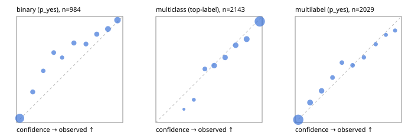

# Evaluation report

- model `Qwen/Qwen3-Reranker-4B` @ `22e683669b` (stock reranker pairs), adapter/checkpoint `runs/curve/vol25_e1/adapter`, prompt `answer-v1` (724795e9b666)
- data data/hf.jsonl, data/eval.jsonl; splits ['test']; n=3471; calibration `None`
- cuda / bfloat16; 2026-09-23T23:47:38+0000; wall 413.9s

## Overall

question accuracy 77.0%

**binary**: n 984, positives 475, accuracy 0.838, precision 0.866, recall 0.787, f1 0.825, auroc 0.930, brier 0.114, log_loss 0.356, ece 0.070

**multiclass**: n 2143, accuracy 0.808, macro_f1 0.855, log_loss 0.549, brier 0.278, ece_top_label 0.033

**multilabel**: n 344, labels 2029, exact_match 0.334, micro_f1 0.593, macro_f1 0.647, label_auroc 0.899, brier 0.102, log_loss 0.321, ece 0.024

## By family

| family | n | question acc % | details |
|---|---|---|---|
| eval_adversarial | 27 | 81.5 | bin acc 86.7 F1 85.7 AUROC 0.963 ECE 0.193; mc acc 100.0 mF1 100.0 ECE 0.151; ml EM 40.0 µF1 63.2 ECE 0.208 |
| eval_agent_output | 26 | 50.0 | bin acc 64.3 F1 61.5 AUROC 0.735 ECE 0.308; mc acc 28.6 mF1 18.8 ECE 0.412; ml EM 40.0 µF1 71.4 ECE 0.163 |
| eval_evidence | 17 | 94.1 | bin acc 100.0 F1 100.0 AUROC 1.000 ECE 0.061; ml EM 50.0 µF1 66.7 ECE 0.257 |
| eval_multilabel | 32 | 71.9 | bin acc 100.0 F1 100.0 AUROC 1.000 ECE 0.105; mc acc 0.0 mF1 0.0 ECE 0.558; ml EM 66.7 µF1 89.8 ECE 0.073 |
| eval_policy | 22 | 50.0 | bin acc 53.8 F1 57.1 AUROC 0.619 ECE 0.373; mc acc 40.0 mF1 23.8 ECE 0.250; ml EM 50.0 µF1 84.2 ECE 0.229 |
| eval_routing | 25 | 92.0 | bin acc 100.0 F1 100.0 AUROC 1.000 ECE 0.086; mc acc 92.3 mF1 87.9 ECE 0.118; ml EM 50.0 µF1 80.0 ECE 0.130 |
| eval_urgency_sentiment | 22 | 68.2 | bin acc 70.0 F1 72.7 AUROC 0.833 ECE 0.309; mc acc 70.0 mF1 58.3 ECE 0.217; ml EM 50.0 µF1 83.3 ECE 0.216 |
| heldout_boolq | 300 | 79.0 | bin acc 79.0 F1 81.8 AUROC 0.882 ECE 0.081 |
| heldout_emotion_multiclass | 300 | 57.7 | mc acc 57.7 mF1 45.4 ECE 0.122 |
| heldout_intent_clinc | 300 | 88.3 | mc acc 88.3 mF1 90.7 ECE 0.041 |
| heldout_question_type_trec | 300 | 77.0 | mc acc 77.0 mF1 76.3 ECE 0.064 |
| heldout_sentiment_sst2 | 300 | 85.0 | bin acc 85.0 F1 82.5 AUROC 0.987 ECE 0.191 |
| heldout_topic_dbpedia | 300 | 95.7 | mc acc 95.7 mF1 95.3 ECE 0.015 |
| hf_emotions_multilabel | 300 | 30.0 | ml EM 30.0 µF1 52.3 ECE 0.024 |
| hf_intent_banking77 | 300 | 95.0 | mc acc 95.0 mF1 94.0 ECE 0.025 |
| hf_nli | 300 | 88.3 | bin acc 88.3 F1 84.6 AUROC 0.956 ECE 0.047 |
| hf_sentiment_tweets | 300 | 66.7 | mc acc 66.7 mF1 67.0 ECE 0.054 |
| hf_topic_agnews | 300 | 87.0 | mc acc 87.0 mF1 87.0 ECE 0.063 |

## by hard case

| slice | n | question acc % |
|---|---|---|
| (none) | 3042 | 77.2 |
| contradiction | 107 | 98.1 |
| distractor | 33 | 72.7 |
| double_negation | 6 | 83.3 |
| evidence_end | 13 | 76.9 |
| evidence_middle | 11 | 72.7 |
| evidence_start | 9 | 66.7 |
| exception | 7 | 14.3 |
| hypothetical | 7 | 85.7 |
| injection | 10 | 70.0 |
| lexical_overlap | 20 | 75.0 |
| long_state | 50 | 68.0 |
| missing_evidence | 104 | 78.8 |
| multi_positive | 81 | 28.4 |
| multi_turn | 9 | 88.9 |
| negation | 30 | 76.7 |
| new_label_names | 3 | 33.3 |
| nota | 46 | 95.7 |
| numeric_reasoning | 16 | 68.8 |
| paraphrase | 22 | 68.2 |
| role_reversal | 15 | 60.0 |
| sarcasm | 12 | 66.7 |
| temporal_reasoning | 29 | 48.3 |
| zero_positive | 6 | 83.3 |

## by state tokens

| slice | n | question acc % |
|---|---|---|
| 00000-00127 | 3211 | 77.0 |
| 00128-00511 | 208 | 77.9 |
| 00512-02047 | 52 | 69.2 |

## by candidates

| slice | n | question acc % |
|---|---|---|
| 01 | 984 | 83.8 |
| 03 | 310 | 67.4 |
| 04 | 333 | 85.0 |
| 05 | 22 | 50.0 |
| 06 | 1218 | 65.0 |
| 07 | 49 | 93.9 |
| 08 | 555 | 91.2 |

## Paraphrase groups

11 groups; same prediction 54.5%; all correct 54.5%

## Multiclass abstention (coverage vs error on accepted)

| abstain_below | coverage % | error % |
|---|---|---|
| 0.0 | 100.0 | 19.2 |
| 0.4 | 97.7 | 17.7 |
| 0.5 | 92.8 | 16.0 |
| 0.6 | 83.8 | 12.8 |
| 0.7 | 75.4 | 9.9 |
| 0.8 | 66.3 | 7.5 |
| 0.9 | 54.9 | 4.7 |

## Reliability: binary

| bin | n | mean confidence | observed frequency |
|---|---|---|---|
| [0.0,0.1) | 376 | 0.030 | 0.040 |
| [0.1,0.2) | 59 | 0.152 | 0.288 |
| [0.2,0.3) | 39 | 0.252 | 0.487 |
| [0.3,0.4) | 47 | 0.350 | 0.660 |
| [0.4,0.5) | 31 | 0.429 | 0.613 |
| [0.5,0.6) | 64 | 0.540 | 0.750 |
| [0.6,0.7) | 54 | 0.653 | 0.741 |
| [0.7,0.8) | 66 | 0.755 | 0.833 |
| [0.8,0.9) | 102 | 0.860 | 0.882 |
| [0.9,1.0] | 146 | 0.950 | 0.966 |

## Reliability: multiclass

| bin | n | mean confidence | observed frequency |
|---|---|---|---|
| [0.2,0.3) | 8 | 0.264 | 0.125 |
| [0.3,0.4) | 42 | 0.357 | 0.214 |
| [0.4,0.5) | 105 | 0.461 | 0.505 |
| [0.5,0.6) | 192 | 0.549 | 0.536 |
| [0.6,0.7) | 181 | 0.651 | 0.613 |
| [0.7,0.8) | 195 | 0.751 | 0.728 |
| [0.8,0.9) | 244 | 0.855 | 0.787 |
| [0.9,1.0] | 1176 | 0.978 | 0.953 |

## Reliability: multilabel

| bin | n | mean confidence | observed frequency |
|---|---|---|---|
| [0.0,0.1) | 1138 | 0.029 | 0.026 |
| [0.1,0.2) | 207 | 0.140 | 0.188 |
| [0.2,0.3) | 164 | 0.249 | 0.299 |
| [0.3,0.4) | 99 | 0.351 | 0.424 |
| [0.4,0.5) | 92 | 0.439 | 0.565 |
| [0.5,0.6) | 89 | 0.540 | 0.539 |
| [0.6,0.7) | 70 | 0.646 | 0.614 |
| [0.7,0.8) | 65 | 0.758 | 0.738 |
| [0.8,0.9) | 52 | 0.853 | 0.827 |
| [0.9,1.0] | 53 | 0.940 | 0.868 |
