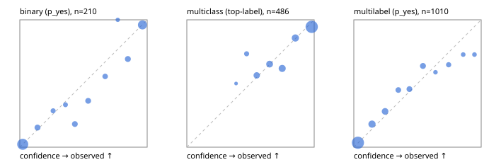

# Evaluation report

- model `Qwen/Qwen3-Reranker-4B` @ `22e683669b` (stock reranker pairs), adapter/checkpoint `runs/curve/vol25_e1/adapter`, prompt `answer-v1` (724795e9b666)
- data data/hf.jsonl, data/eval.jsonl; splits ['validation']; n=868; calibration `None`
- cuda / bfloat16; 2026-09-23T23:40:36+0000; wall 120.1s

## Overall

question accuracy 73.8%

**binary**: n 210, positives 79, accuracy 0.871, precision 0.802, recall 0.873, f1 0.836, auroc 0.947, brier 0.092, log_loss 0.296, ece 0.043

**multiclass**: n 486, accuracy 0.831, macro_f1 0.726, log_loss 0.475, brier 0.257, ece_top_label 0.046

**multilabel**: n 172, labels 1010, exact_match 0.314, micro_f1 0.550, macro_f1 0.544, label_auroc 0.871, brier 0.115, log_loss 0.360, ece 0.032

## By family

| family | n | question acc % | details |
|---|---|---|---|
| eval_adversarial | 14 | 85.7 | bin acc 71.4 F1 80.0 AUROC 0.800 ECE 0.270; mc acc 100.0 mF1 100.0 ECE 0.061; ml EM 100.0 µF1 100.0 ECE 0.032 |
| eval_agent_output | 20 | 70.0 | bin acc 83.3 F1 85.7 AUROC 0.861 ECE 0.251; mc acc 40.0 mF1 14.3 ECE 0.408; ml EM 66.7 µF1 0.0 ECE 0.271 |
| eval_evidence | 17 | 94.1 | bin acc 92.9 F1 90.9 AUROC 0.978 ECE 0.112; ml EM 100.0 µF1 100.0 ECE 0.099 |
| eval_multilabel | 12 | 33.3 | bin acc 0.0 F1 0.0 AUROC — ECE 0.818; mc acc 100.0 mF1 100.0 ECE 0.006; ml EM 22.2 µF1 70.8 ECE 0.169 |
| eval_policy | 24 | 33.3 | bin acc 41.7 F1 46.2 AUROC 0.514 ECE 0.375; mc acc 27.3 mF1 16.7 ECE 0.490; ml EM 0.0 µF1 66.7 ECE 0.606 |
| eval_routing | 16 | 81.2 | bin acc 85.7 F1 88.9 AUROC 1.000 ECE 0.146; mc acc 87.5 mF1 77.8 ECE 0.122; ml EM 0.0 µF1 0.0 ECE 0.152 |
| eval_urgency_sentiment | 15 | 80.0 | bin acc 85.7 F1 85.7 AUROC 1.000 ECE 0.195; mc acc 80.0 mF1 66.7 ECE 0.255; ml EM 66.7 µF1 66.7 ECE 0.185 |
| hf_emotions_multilabel | 150 | 28.7 | ml EM 28.7 µF1 50.7 ECE 0.029 |
| hf_intent_banking77 | 150 | 94.7 | mc acc 94.7 mF1 92.6 ECE 0.044 |
| hf_nli | 150 | 92.0 | bin acc 92.0 F1 88.0 AUROC 0.976 ECE 0.075 |
| hf_sentiment_tweets | 150 | 74.0 | mc acc 74.0 mF1 67.7 ECE 0.087 |
| hf_topic_agnews | 150 | 85.3 | mc acc 85.3 mF1 85.5 ECE 0.096 |

## by hard case

| slice | n | question acc % |
|---|---|---|
| (none) | 634 | 75.1 |
| contradiction | 63 | 93.7 |
| distractor | 20 | 65.0 |
| double_negation | 3 | 100.0 |
| evidence_end | 4 | 25.0 |
| evidence_middle | 7 | 85.7 |
| evidence_start | 3 | 33.3 |
| exception | 7 | 71.4 |
| hypothetical | 6 | 100.0 |
| injection | 16 | 75.0 |
| lexical_overlap | 13 | 76.9 |
| long_state | 26 | 57.7 |
| missing_evidence | 59 | 84.7 |
| multi_positive | 40 | 15.0 |
| multi_turn | 21 | 61.9 |
| negation | 9 | 44.4 |
| new_label_names | 5 | 20.0 |
| nota | 4 | 100.0 |
| numeric_reasoning | 13 | 61.5 |
| paraphrase | 10 | 40.0 |
| role_reversal | 7 | 28.6 |
| sarcasm | 5 | 80.0 |
| temporal_reasoning | 15 | 26.7 |
| zero_positive | 7 | 85.7 |

## by state tokens

| slice | n | question acc % |
|---|---|---|
| 00000-00127 | 796 | 74.7 |
| 00128-00511 | 46 | 67.4 |
| 00512-02047 | 26 | 57.7 |

## by candidates

| slice | n | question acc % |
|---|---|---|
| 01 | 210 | 87.1 |
| 03 | 162 | 73.5 |
| 04 | 174 | 82.8 |
| 05 | 13 | 61.5 |
| 06 | 159 | 28.3 |
| 08 | 150 | 94.7 |

## Paraphrase groups

5 groups; same prediction 60.0%; all correct 40.0%

## Multiclass abstention (coverage vs error on accepted)

| abstain_below | coverage % | error % |
|---|---|---|
| 0.0 | 100.0 | 16.9 |
| 0.4 | 99.6 | 16.7 |
| 0.5 | 96.5 | 16.4 |
| 0.6 | 88.5 | 14.0 |
| 0.7 | 79.0 | 11.5 |
| 0.8 | 67.7 | 7.0 |
| 0.9 | 56.2 | 5.5 |

## Reliability: binary

| bin | n | mean confidence | observed frequency |
|---|---|---|---|
| [0.0,0.1) | 87 | 0.023 | 0.023 |
| [0.1,0.2) | 13 | 0.139 | 0.154 |
| [0.2,0.3) | 7 | 0.262 | 0.286 |
| [0.3,0.4) | 6 | 0.358 | 0.333 |
| [0.4,0.5) | 11 | 0.432 | 0.182 |
| [0.5,0.6) | 11 | 0.537 | 0.364 |
| [0.6,0.7) | 9 | 0.670 | 0.556 |
| [0.7,0.8) | 3 | 0.769 | 1.000 |
| [0.8,0.9) | 13 | 0.848 | 0.692 |
| [0.9,1.0] | 50 | 0.963 | 0.960 |

## Reliability: multiclass

| bin | n | mean confidence | observed frequency |
|---|---|---|---|
| [0.3,0.4) | 2 | 0.387 | 0.500 |
| [0.4,0.5) | 15 | 0.470 | 0.733 |
| [0.5,0.6) | 39 | 0.549 | 0.564 |
| [0.6,0.7) | 46 | 0.650 | 0.652 |
| [0.7,0.8) | 55 | 0.749 | 0.618 |
| [0.8,0.9) | 56 | 0.852 | 0.857 |
| [0.9,1.0] | 273 | 0.981 | 0.945 |

## Reliability: multilabel

| bin | n | mean confidence | observed frequency |
|---|---|---|---|
| [0.0,0.1) | 546 | 0.032 | 0.035 |
| [0.1,0.2) | 116 | 0.143 | 0.181 |
| [0.2,0.3) | 89 | 0.246 | 0.281 |
| [0.3,0.4) | 49 | 0.350 | 0.449 |
| [0.4,0.5) | 57 | 0.437 | 0.456 |
| [0.5,0.6) | 58 | 0.543 | 0.638 |
| [0.6,0.7) | 17 | 0.641 | 0.588 |
| [0.7,0.8) | 34 | 0.745 | 0.647 |
| [0.8,0.9) | 22 | 0.859 | 0.727 |
| [0.9,1.0] | 22 | 0.947 | 0.727 |
