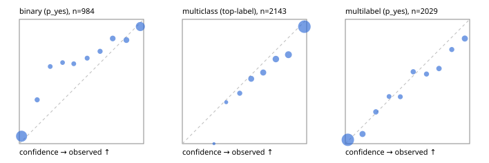

# Evaluation report

- model `Qwen/Qwen3-Reranker-4B` @ `22e683669b` (stock reranker pairs), adapter/checkpoint `runs/curve/vol25_e2/adapter`, prompt `answer-v1` (724795e9b666)
- data data/hf.jsonl, data/eval.jsonl; splits ['test']; n=3471; calibration `None`
- cuda / bfloat16; 2026-09-24T00:43:11+0000; wall 414.0s

## Overall

question accuracy 79.1%

**binary**: n 984, positives 475, accuracy 0.857, precision 0.881, recall 0.813, f1 0.846, auroc 0.935, brier 0.106, log_loss 0.364, ece 0.073

**multiclass**: n 2143, accuracy 0.814, macro_f1 0.860, log_loss 0.569, brier 0.277, ece_top_label 0.057

**multilabel**: n 344, labels 2029, exact_match 0.456, micro_f1 0.714, macro_f1 0.686, label_auroc 0.915, brier 0.093, log_loss 0.308, ece 0.037

## By family

| family | n | question acc % | details |
|---|---|---|---|
| eval_adversarial | 27 | 77.8 | bin acc 80.0 F1 80.0 AUROC 0.917 ECE 0.181; mc acc 100.0 mF1 100.0 ECE 0.060; ml EM 40.0 µF1 66.7 ECE 0.277 |
| eval_agent_output | 26 | 53.8 | bin acc 71.4 F1 71.4 AUROC 0.714 ECE 0.307; mc acc 28.6 mF1 21.4 ECE 0.676; ml EM 40.0 µF1 80.0 ECE 0.149 |
| eval_evidence | 17 | 94.1 | bin acc 100.0 F1 100.0 AUROC 1.000 ECE 0.017; ml EM 50.0 µF1 66.7 ECE 0.208 |
| eval_multilabel | 32 | 75.0 | bin acc 100.0 F1 100.0 AUROC 1.000 ECE 0.039; mc acc 0.0 mF1 0.0 ECE 0.630; ml EM 70.8 µF1 92.3 ECE 0.044 |
| eval_policy | 22 | 59.1 | bin acc 61.5 F1 61.5 AUROC 0.667 ECE 0.370; mc acc 60.0 mF1 44.4 ECE 0.512; ml EM 50.0 µF1 84.2 ECE 0.201 |
| eval_routing | 25 | 92.0 | bin acc 100.0 F1 100.0 AUROC 1.000 ECE 0.013; mc acc 92.3 mF1 87.9 ECE 0.134; ml EM 50.0 µF1 80.0 ECE 0.121 |
| eval_urgency_sentiment | 22 | 68.2 | bin acc 70.0 F1 72.7 AUROC 0.792 ECE 0.262; mc acc 70.0 mF1 58.3 ECE 0.228; ml EM 50.0 µF1 83.3 ECE 0.167 |
| heldout_boolq | 300 | 79.3 | bin acc 79.3 F1 82.2 AUROC 0.889 ECE 0.112 |
| heldout_emotion_multiclass | 300 | 58.0 | mc acc 58.0 mF1 48.3 ECE 0.170 |
| heldout_intent_clinc | 300 | 88.3 | mc acc 88.3 mF1 89.8 ECE 0.028 |
| heldout_question_type_trec | 300 | 77.3 | mc acc 77.3 mF1 76.4 ECE 0.085 |
| heldout_sentiment_sst2 | 300 | 87.7 | bin acc 87.7 F1 86.1 AUROC 0.986 ECE 0.135 |
| heldout_topic_dbpedia | 300 | 96.0 | mc acc 96.0 mF1 95.4 ECE 0.013 |
| hf_emotions_multilabel | 300 | 43.7 | ml EM 43.7 µF1 67.8 ECE 0.033 |
| hf_intent_banking77 | 300 | 95.0 | mc acc 95.0 mF1 93.7 ECE 0.012 |
| hf_nli | 300 | 91.0 | bin acc 91.0 F1 87.8 AUROC 0.966 ECE 0.050 |
| hf_sentiment_tweets | 300 | 69.0 | mc acc 69.0 mF1 68.3 ECE 0.109 |
| hf_topic_agnews | 300 | 87.3 | mc acc 87.3 mF1 87.3 ECE 0.070 |

## by hard case

| slice | n | question acc % |
|---|---|---|
| (none) | 3042 | 79.1 |
| contradiction | 107 | 98.1 |
| distractor | 33 | 72.7 |
| double_negation | 6 | 66.7 |
| evidence_end | 13 | 84.6 |
| evidence_middle | 11 | 72.7 |
| evidence_start | 9 | 77.8 |
| exception | 7 | 14.3 |
| hypothetical | 7 | 71.4 |
| injection | 10 | 70.0 |
| lexical_overlap | 20 | 75.0 |
| long_state | 50 | 70.0 |
| missing_evidence | 104 | 85.6 |
| multi_positive | 81 | 39.5 |
| multi_turn | 9 | 88.9 |
| negation | 30 | 80.0 |
| new_label_names | 3 | 33.3 |
| nota | 46 | 97.8 |
| numeric_reasoning | 16 | 68.8 |
| paraphrase | 22 | 68.2 |
| role_reversal | 15 | 60.0 |
| sarcasm | 12 | 58.3 |
| temporal_reasoning | 29 | 58.6 |
| zero_positive | 6 | 66.7 |

## by state tokens

| slice | n | question acc % |
|---|---|---|
| 00000-00127 | 3211 | 79.2 |
| 00128-00511 | 208 | 78.8 |
| 00512-02047 | 52 | 71.2 |

## by candidates

| slice | n | question acc % |
|---|---|---|
| 01 | 984 | 85.7 |
| 03 | 310 | 69.7 |
| 04 | 333 | 85.6 |
| 05 | 22 | 45.5 |
| 06 | 1218 | 68.7 |
| 07 | 49 | 98.0 |
| 08 | 555 | 91.0 |

## Paraphrase groups

11 groups; same prediction 63.6%; all correct 54.5%

## Multiclass abstention (coverage vs error on accepted)

| abstain_below | coverage % | error % |
|---|---|---|
| 0.0 | 100.0 | 18.6 |
| 0.4 | 99.0 | 18.1 |
| 0.5 | 95.5 | 16.6 |
| 0.6 | 89.0 | 14.3 |
| 0.7 | 81.9 | 11.9 |
| 0.8 | 72.8 | 9.4 |
| 0.9 | 61.7 | 5.9 |

## Reliability: binary

| bin | n | mean confidence | observed frequency |
|---|---|---|---|
| [0.0,0.1) | 432 | 0.018 | 0.060 |
| [0.1,0.2) | 34 | 0.143 | 0.353 |
| [0.2,0.3) | 29 | 0.248 | 0.621 |
| [0.3,0.4) | 23 | 0.348 | 0.652 |
| [0.4,0.5) | 28 | 0.438 | 0.643 |
| [0.5,0.6) | 32 | 0.545 | 0.688 |
| [0.6,0.7) | 35 | 0.649 | 0.743 |
| [0.7,0.8) | 52 | 0.751 | 0.846 |
| [0.8,0.9) | 60 | 0.861 | 0.833 |
| [0.9,1.0] | 259 | 0.974 | 0.942 |

## Reliability: multiclass

| bin | n | mean confidence | observed frequency |
|---|---|---|---|
| [0.2,0.3) | 1 | 0.254 | 0.000 |
| [0.3,0.4) | 21 | 0.353 | 0.333 |
| [0.4,0.5) | 74 | 0.462 | 0.405 |
| [0.5,0.6) | 140 | 0.554 | 0.521 |
| [0.6,0.7) | 152 | 0.651 | 0.572 |
| [0.7,0.8) | 194 | 0.752 | 0.680 |
| [0.8,0.9) | 239 | 0.854 | 0.715 |
| [0.9,1.0] | 1322 | 0.982 | 0.941 |

## Reliability: multilabel

| bin | n | mean confidence | observed frequency |
|---|---|---|---|
| [0.0,0.1) | 1215 | 0.020 | 0.031 |
| [0.1,0.2) | 141 | 0.138 | 0.078 |
| [0.2,0.3) | 86 | 0.245 | 0.256 |
| [0.3,0.4) | 58 | 0.352 | 0.379 |
| [0.4,0.5) | 61 | 0.442 | 0.377 |
| [0.5,0.6) | 83 | 0.546 | 0.578 |
| [0.6,0.7) | 75 | 0.653 | 0.560 |
| [0.7,0.8) | 91 | 0.753 | 0.604 |
| [0.8,0.9) | 70 | 0.856 | 0.757 |
| [0.9,1.0] | 149 | 0.961 | 0.846 |
