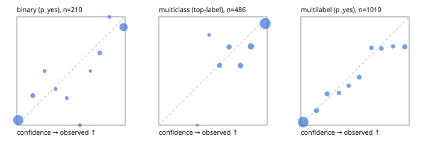

# Evaluation report

- model `Qwen/Qwen3-Reranker-4B` @ `22e683669b` (stock reranker pairs), adapter/checkpoint `runs/curve/vol25_e2/adapter`, prompt `answer-v1` (724795e9b666)
- data data/hf.jsonl, data/eval.jsonl; splits ['validation']; n=868; calibration `None`
- cuda / bfloat16; 2026-09-24T00:36:08+0000; wall 105.4s

## Overall

question accuracy 76.4%

**binary**: n 210, positives 79, accuracy 0.881, precision 0.838, recall 0.848, f1 0.843, auroc 0.945, brier 0.092, log_loss 0.338, ece 0.073

**multiclass**: n 486, accuracy 0.835, macro_f1 0.751, log_loss 0.500, brier 0.255, ece_top_label 0.072

**multilabel**: n 172, labels 1010, exact_match 0.419, micro_f1 0.673, macro_f1 0.571, label_auroc 0.899, brier 0.103, log_loss 0.346, ece 0.041

## By family

| family | n | question acc % | details |
|---|---|---|---|
| eval_adversarial | 14 | 85.7 | bin acc 71.4 F1 80.0 AUROC 0.900 ECE 0.248; mc acc 100.0 mF1 100.0 ECE 0.062; ml EM 100.0 µF1 100.0 ECE 0.007 |
| eval_agent_output | 20 | 70.0 | bin acc 91.7 F1 92.3 AUROC 0.889 ECE 0.172; mc acc 40.0 mF1 14.3 ECE 0.356; ml EM 33.3 µF1 0.0 ECE 0.247 |
| eval_evidence | 17 | 94.1 | bin acc 92.9 F1 90.9 AUROC 0.978 ECE 0.081; ml EM 100.0 µF1 100.0 ECE 0.034 |
| eval_multilabel | 12 | 41.7 | bin acc 0.0 F1 0.0 AUROC — ECE 0.936; mc acc 100.0 mF1 100.0 ECE 0.000; ml EM 33.3 µF1 80.0 ECE 0.160 |
| eval_policy | 24 | 41.7 | bin acc 41.7 F1 36.4 AUROC 0.543 ECE 0.473; mc acc 45.5 mF1 29.4 ECE 0.421; ml EM 0.0 µF1 0.0 ECE 0.545 |
| eval_routing | 16 | 81.2 | bin acc 85.7 F1 88.9 AUROC 0.900 ECE 0.156; mc acc 87.5 mF1 77.8 ECE 0.107; ml EM 0.0 µF1 0.0 ECE 0.178 |
| eval_urgency_sentiment | 15 | 80.0 | bin acc 85.7 F1 85.7 AUROC 1.000 ECE 0.102; mc acc 80.0 mF1 66.7 ECE 0.176; ml EM 66.7 µF1 66.7 ECE 0.171 |
| hf_emotions_multilabel | 150 | 40.7 | ml EM 40.7 µF1 65.6 ECE 0.033 |
| hf_intent_banking77 | 150 | 94.7 | mc acc 94.7 mF1 92.6 ECE 0.032 |
| hf_nli | 150 | 92.7 | bin acc 92.7 F1 88.7 AUROC 0.977 ECE 0.051 |
| hf_sentiment_tweets | 150 | 74.7 | mc acc 74.7 mF1 69.5 ECE 0.111 |
| hf_topic_agnews | 150 | 84.7 | mc acc 84.7 mF1 84.9 ECE 0.086 |

## by hard case

| slice | n | question acc % |
|---|---|---|
| (none) | 634 | 77.6 |
| contradiction | 63 | 93.7 |
| distractor | 20 | 75.0 |
| double_negation | 3 | 100.0 |
| evidence_end | 4 | 25.0 |
| evidence_middle | 7 | 85.7 |
| evidence_start | 3 | 66.7 |
| exception | 7 | 85.7 |
| hypothetical | 6 | 100.0 |
| injection | 16 | 81.2 |
| lexical_overlap | 13 | 76.9 |
| long_state | 26 | 69.2 |
| missing_evidence | 59 | 88.1 |
| multi_positive | 40 | 20.0 |
| multi_turn | 21 | 66.7 |
| negation | 9 | 55.6 |
| new_label_names | 5 | 60.0 |
| nota | 4 | 100.0 |
| numeric_reasoning | 13 | 61.5 |
| paraphrase | 10 | 50.0 |
| role_reversal | 7 | 28.6 |
| sarcasm | 5 | 60.0 |
| temporal_reasoning | 15 | 26.7 |
| zero_positive | 7 | 71.4 |

## by state tokens

| slice | n | question acc % |
|---|---|---|
| 00000-00127 | 796 | 77.1 |
| 00128-00511 | 46 | 67.4 |
| 00512-02047 | 26 | 69.2 |

## by candidates

| slice | n | question acc % |
|---|---|---|
| 01 | 210 | 88.1 |
| 03 | 162 | 74.1 |
| 04 | 174 | 82.8 |
| 05 | 13 | 61.5 |
| 06 | 159 | 40.3 |
| 08 | 150 | 94.7 |

## Paraphrase groups

5 groups; same prediction 60.0%; all correct 40.0%

## Multiclass abstention (coverage vs error on accepted)

| abstain_below | coverage % | error % |
|---|---|---|
| 0.0 | 100.0 | 16.5 |
| 0.4 | 99.8 | 16.3 |
| 0.5 | 98.6 | 16.3 |
| 0.6 | 92.6 | 14.4 |
| 0.7 | 85.2 | 13.3 |
| 0.8 | 77.0 | 9.9 |
| 0.9 | 63.4 | 6.2 |

## Reliability: binary

| bin | n | mean confidence | observed frequency |
|---|---|---|---|
| [0.0,0.1) | 108 | 0.013 | 0.046 |
| [0.1,0.2) | 11 | 0.147 | 0.273 |
| [0.2,0.3) | 4 | 0.255 | 0.500 |
| [0.3,0.4) | 3 | 0.359 | 0.333 |
| [0.4,0.5) | 4 | 0.461 | 0.250 |
| [0.5,0.6) | 3 | 0.583 | 0.000 |
| [0.6,0.7) | 2 | 0.679 | 0.500 |
| [0.7,0.8) | 9 | 0.766 | 0.667 |
| [0.8,0.9) | 3 | 0.854 | 1.000 |
| [0.9,1.0] | 63 | 0.986 | 0.905 |

## Reliability: multiclass

| bin | n | mean confidence | observed frequency |
|---|---|---|---|
| [0.3,0.4) | 1 | 0.355 | 0.000 |
| [0.4,0.5) | 6 | 0.465 | 0.833 |
| [0.5,0.6) | 29 | 0.561 | 0.552 |
| [0.6,0.7) | 36 | 0.649 | 0.722 |
| [0.7,0.8) | 40 | 0.753 | 0.550 |
| [0.8,0.9) | 66 | 0.850 | 0.727 |
| [0.9,1.0] | 308 | 0.982 | 0.938 |

## Reliability: multilabel

| bin | n | mean confidence | observed frequency |
|---|---|---|---|
| [0.0,0.1) | 588 | 0.021 | 0.029 |
| [0.1,0.2) | 67 | 0.144 | 0.134 |
| [0.2,0.3) | 59 | 0.242 | 0.288 |
| [0.3,0.4) | 37 | 0.352 | 0.297 |
| [0.4,0.5) | 33 | 0.442 | 0.364 |
| [0.5,0.6) | 52 | 0.539 | 0.442 |
| [0.6,0.7) | 35 | 0.651 | 0.714 |
| [0.7,0.8) | 41 | 0.744 | 0.707 |
| [0.8,0.9) | 33 | 0.852 | 0.727 |
| [0.9,1.0] | 65 | 0.960 | 0.723 |
