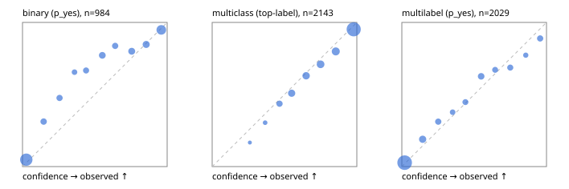

# Evaluation report

- model `Qwen/Qwen3-Reranker-4B` @ `22e683669b` (stock reranker pairs), adapter/checkpoint `runs/curve/vol50_e1/adapter`, prompt `answer-v1` (724795e9b666)
- data data/hf.jsonl, data/eval.jsonl; splits ['test']; n=3471; calibration `None`
- cuda / bfloat16; 2026-09-24T00:13:09+0000; wall 414.2s

## Overall

question accuracy 78.9%

**binary**: n 984, positives 475, accuracy 0.845, precision 0.874, recall 0.792, f1 0.831, auroc 0.934, brier 0.112, log_loss 0.349, ece 0.071

**multiclass**: n 2143, accuracy 0.819, macro_f1 0.855, log_loss 0.529, brier 0.265, ece_top_label 0.032

**multilabel**: n 344, labels 2029, exact_match 0.445, micro_f1 0.693, macro_f1 0.698, label_auroc 0.917, brier 0.092, log_loss 0.299, ece 0.025

## By family

| family | n | question acc % | details |
|---|---|---|---|
| eval_adversarial | 27 | 81.5 | bin acc 86.7 F1 85.7 AUROC 0.963 ECE 0.143; mc acc 100.0 mF1 100.0 ECE 0.047; ml EM 40.0 µF1 73.7 ECE 0.219 |
| eval_agent_output | 26 | 50.0 | bin acc 71.4 F1 75.0 AUROC 0.796 ECE 0.149; mc acc 14.3 mF1 6.2 ECE 0.583; ml EM 40.0 µF1 82.4 ECE 0.151 |
| eval_evidence | 17 | 88.2 | bin acc 100.0 F1 100.0 AUROC 1.000 ECE 0.039; ml EM 0.0 µF1 57.1 ECE 0.320 |
| eval_multilabel | 32 | 71.9 | bin acc 85.7 F1 85.7 AUROC 1.000 ECE 0.113; mc acc 0.0 mF1 0.0 ECE 0.489; ml EM 70.8 µF1 93.5 ECE 0.054 |
| eval_policy | 22 | 45.5 | bin acc 53.8 F1 62.5 AUROC 0.548 ECE 0.450; mc acc 40.0 mF1 23.8 ECE 0.294; ml EM 25.0 µF1 76.2 ECE 0.263 |
| eval_routing | 25 | 88.0 | bin acc 100.0 F1 100.0 AUROC 1.000 ECE 0.081; mc acc 84.6 mF1 81.8 ECE 0.066; ml EM 50.0 µF1 80.0 ECE 0.121 |
| eval_urgency_sentiment | 22 | 68.2 | bin acc 70.0 F1 72.7 AUROC 0.708 ECE 0.323; mc acc 70.0 mF1 58.3 ECE 0.269; ml EM 50.0 µF1 83.3 ECE 0.149 |
| heldout_boolq | 300 | 82.0 | bin acc 82.0 F1 85.0 AUROC 0.899 ECE 0.071 |
| heldout_emotion_multiclass | 300 | 58.3 | mc acc 58.3 mF1 46.3 ECE 0.145 |
| heldout_intent_clinc | 300 | 91.3 | mc acc 91.3 mF1 91.9 ECE 0.045 |
| heldout_question_type_trec | 300 | 79.0 | mc acc 79.0 mF1 79.2 ECE 0.067 |
| heldout_sentiment_sst2 | 300 | 80.7 | bin acc 80.7 F1 76.2 AUROC 0.984 ECE 0.194 |
| heldout_topic_dbpedia | 300 | 96.0 | mc acc 96.0 mF1 95.7 ECE 0.017 |
| hf_emotions_multilabel | 300 | 43.0 | ml EM 43.0 µF1 64.5 ECE 0.027 |
| hf_intent_banking77 | 300 | 94.7 | mc acc 94.7 mF1 93.8 ECE 0.018 |
| hf_nli | 300 | 91.7 | bin acc 91.7 F1 88.6 AUROC 0.967 ECE 0.026 |
| hf_sentiment_tweets | 300 | 68.7 | mc acc 68.7 mF1 68.9 ECE 0.045 |
| hf_topic_agnews | 300 | 88.0 | mc acc 88.0 mF1 88.0 ECE 0.045 |

## by hard case

| slice | n | question acc % |
|---|---|---|
| (none) | 3042 | 79.3 |
| contradiction | 107 | 100.0 |
| distractor | 33 | 51.5 |
| double_negation | 6 | 66.7 |
| evidence_end | 13 | 84.6 |
| evidence_middle | 11 | 63.6 |
| evidence_start | 9 | 66.7 |
| exception | 7 | 0.0 |
| hypothetical | 7 | 71.4 |
| injection | 10 | 70.0 |
| lexical_overlap | 20 | 70.0 |
| long_state | 50 | 66.0 |
| missing_evidence | 104 | 85.6 |
| multi_positive | 81 | 30.9 |
| multi_turn | 9 | 88.9 |
| negation | 30 | 83.3 |
| new_label_names | 3 | 33.3 |
| nota | 46 | 97.8 |
| numeric_reasoning | 16 | 56.2 |
| paraphrase | 22 | 63.6 |
| role_reversal | 15 | 60.0 |
| sarcasm | 12 | 58.3 |
| temporal_reasoning | 29 | 37.9 |
| zero_positive | 6 | 33.3 |

## by state tokens

| slice | n | question acc % |
|---|---|---|
| 00000-00127 | 3211 | 79.1 |
| 00128-00511 | 208 | 79.3 |
| 00512-02047 | 52 | 65.4 |

## by candidates

| slice | n | question acc % |
|---|---|---|
| 01 | 984 | 84.5 |
| 03 | 310 | 69.4 |
| 04 | 333 | 86.2 |
| 05 | 22 | 27.3 |
| 06 | 1218 | 69.1 |
| 07 | 49 | 93.9 |
| 08 | 555 | 92.4 |

## Paraphrase groups

11 groups; same prediction 72.7%; all correct 54.5%

## Multiclass abstention (coverage vs error on accepted)

| abstain_below | coverage % | error % |
|---|---|---|
| 0.0 | 100.0 | 18.1 |
| 0.4 | 98.6 | 17.3 |
| 0.5 | 94.3 | 15.5 |
| 0.6 | 86.5 | 12.5 |
| 0.7 | 78.4 | 9.9 |
| 0.8 | 68.6 | 7.2 |
| 0.9 | 57.7 | 4.8 |

## Reliability: binary

| bin | n | mean confidence | observed frequency |
|---|---|---|---|
| [0.0,0.1) | 396 | 0.026 | 0.048 |
| [0.1,0.2) | 48 | 0.146 | 0.312 |
| [0.2,0.3) | 42 | 0.256 | 0.476 |
| [0.3,0.4) | 29 | 0.360 | 0.655 |
| [0.4,0.5) | 39 | 0.440 | 0.667 |
| [0.5,0.6) | 57 | 0.552 | 0.772 |
| [0.6,0.7) | 43 | 0.640 | 0.837 |
| [0.7,0.8) | 65 | 0.755 | 0.800 |
| [0.8,0.9) | 72 | 0.855 | 0.847 |
| [0.9,1.0] | 193 | 0.959 | 0.948 |

## Reliability: multiclass

| bin | n | mean confidence | observed frequency |
|---|---|---|---|
| [0.2,0.3) | 6 | 0.260 | 0.167 |
| [0.3,0.4) | 23 | 0.366 | 0.304 |
| [0.4,0.5) | 94 | 0.466 | 0.436 |
| [0.5,0.6) | 167 | 0.550 | 0.509 |
| [0.6,0.7) | 173 | 0.650 | 0.630 |
| [0.7,0.8) | 210 | 0.749 | 0.710 |
| [0.8,0.9) | 234 | 0.855 | 0.799 |
| [0.9,1.0] | 1236 | 0.978 | 0.952 |

## Reliability: multilabel

| bin | n | mean confidence | observed frequency |
|---|---|---|---|
| [0.0,0.1) | 1246 | 0.019 | 0.027 |
| [0.1,0.2) | 153 | 0.144 | 0.190 |
| [0.2,0.3) | 93 | 0.252 | 0.312 |
| [0.3,0.4) | 53 | 0.351 | 0.377 |
| [0.4,0.5) | 76 | 0.439 | 0.447 |
| [0.5,0.6) | 115 | 0.548 | 0.626 |
| [0.6,0.7) | 76 | 0.645 | 0.671 |
| [0.7,0.8) | 83 | 0.750 | 0.687 |
| [0.8,0.9) | 44 | 0.857 | 0.773 |
| [0.9,1.0] | 90 | 0.956 | 0.889 |
