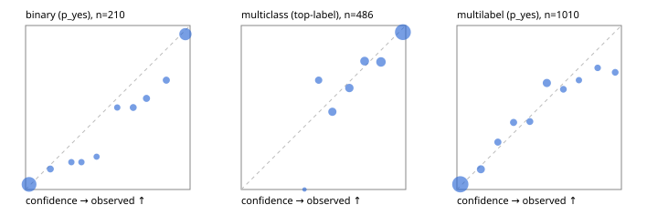

# Evaluation report

- model `Qwen/Qwen3-Reranker-4B` @ `22e683669b` (stock reranker pairs), adapter/checkpoint `runs/curve/vol50_e1/adapter`, prompt `answer-v1` (724795e9b666)
- data data/hf.jsonl, data/eval.jsonl; splits ['validation']; n=868; calibration `None`
- cuda / bfloat16; 2026-09-24T00:06:07+0000; wall 105.8s

## Overall

question accuracy 76.8%

**binary**: n 210, positives 79, accuracy 0.886, precision 0.809, recall 0.911, f1 0.857, auroc 0.951, brier 0.089, log_loss 0.296, ece 0.049

**multiclass**: n 486, accuracy 0.835, macro_f1 0.748, log_loss 0.456, brier 0.244, ece_top_label 0.046

**multilabel**: n 172, labels 1010, exact_match 0.436, micro_f1 0.657, macro_f1 0.529, label_auroc 0.899, brier 0.103, log_loss 0.332, ece 0.037

## By family

| family | n | question acc % | details |
|---|---|---|---|
| eval_adversarial | 14 | 78.6 | bin acc 71.4 F1 83.3 AUROC 0.800 ECE 0.262; mc acc 80.0 mF1 66.7 ECE 0.122; ml EM 100.0 µF1 100.0 ECE 0.026 |
| eval_agent_output | 20 | 70.0 | bin acc 83.3 F1 85.7 AUROC 0.889 ECE 0.206; mc acc 60.0 mF1 33.3 ECE 0.114; ml EM 33.3 µF1 0.0 ECE 0.232 |
| eval_evidence | 17 | 88.2 | bin acc 92.9 F1 90.9 AUROC 0.978 ECE 0.106; ml EM 66.7 µF1 88.9 ECE 0.080 |
| eval_multilabel | 12 | 33.3 | bin acc 0.0 F1 0.0 AUROC — ECE 0.893; mc acc 100.0 mF1 100.0 ECE 0.003; ml EM 22.2 µF1 76.9 ECE 0.155 |
| eval_policy | 24 | 41.7 | bin acc 50.0 F1 57.1 AUROC 0.514 ECE 0.445; mc acc 36.4 mF1 23.5 ECE 0.431; ml EM 0.0 µF1 66.7 ECE 0.457 |
| eval_routing | 16 | 75.0 | bin acc 71.4 F1 80.0 AUROC 0.900 ECE 0.205; mc acc 87.5 mF1 77.8 ECE 0.092; ml EM 0.0 µF1 0.0 ECE 0.274 |
| eval_urgency_sentiment | 15 | 80.0 | bin acc 100.0 F1 100.0 AUROC 1.000 ECE 0.098; mc acc 80.0 mF1 66.7 ECE 0.160; ml EM 33.3 µF1 40.0 ECE 0.207 |
| hf_emotions_multilabel | 150 | 44.7 | ml EM 44.7 µF1 64.3 ECE 0.034 |
| hf_intent_banking77 | 150 | 94.0 | mc acc 94.0 mF1 90.6 ECE 0.030 |
| hf_nli | 150 | 93.3 | bin acc 93.3 F1 89.8 AUROC 0.979 ECE 0.065 |
| hf_sentiment_tweets | 150 | 74.0 | mc acc 74.0 mF1 67.7 ECE 0.066 |
| hf_topic_agnews | 150 | 86.7 | mc acc 86.7 mF1 86.8 ECE 0.062 |

## by hard case

| slice | n | question acc % |
|---|---|---|
| (none) | 634 | 79.0 |
| contradiction | 63 | 90.5 |
| distractor | 20 | 65.0 |
| double_negation | 3 | 100.0 |
| evidence_end | 4 | 25.0 |
| evidence_middle | 7 | 85.7 |
| evidence_start | 3 | 100.0 |
| exception | 7 | 71.4 |
| hypothetical | 6 | 33.3 |
| injection | 16 | 75.0 |
| lexical_overlap | 13 | 61.5 |
| long_state | 26 | 57.7 |
| missing_evidence | 59 | 88.1 |
| multi_positive | 40 | 17.5 |
| multi_turn | 21 | 66.7 |
| negation | 9 | 44.4 |
| new_label_names | 5 | 20.0 |
| nota | 4 | 100.0 |
| numeric_reasoning | 13 | 61.5 |
| paraphrase | 10 | 40.0 |
| role_reversal | 7 | 14.3 |
| sarcasm | 5 | 60.0 |
| temporal_reasoning | 15 | 33.3 |
| zero_positive | 7 | 57.1 |

## by state tokens

| slice | n | question acc % |
|---|---|---|
| 00000-00127 | 796 | 77.8 |
| 00128-00511 | 46 | 71.7 |
| 00512-02047 | 26 | 57.7 |

## by candidates

| slice | n | question acc % |
|---|---|---|
| 01 | 210 | 88.6 |
| 03 | 162 | 72.2 |
| 04 | 174 | 83.9 |
| 05 | 13 | 61.5 |
| 06 | 159 | 43.4 |
| 08 | 150 | 94.0 |

## Paraphrase groups

5 groups; same prediction 60.0%; all correct 40.0%

## Multiclass abstention (coverage vs error on accepted)

| abstain_below | coverage % | error % |
|---|---|---|
| 0.0 | 100.0 | 16.5 |
| 0.4 | 99.8 | 16.3 |
| 0.5 | 94.9 | 15.4 |
| 0.6 | 87.0 | 12.1 |
| 0.7 | 78.4 | 9.2 |
| 0.8 | 68.9 | 7.5 |
| 0.9 | 56.0 | 4.0 |

## Reliability: binary

| bin | n | mean confidence | observed frequency |
|---|---|---|---|
| [0.0,0.1) | 96 | 0.021 | 0.031 |
| [0.1,0.2) | 8 | 0.150 | 0.125 |
| [0.2,0.3) | 6 | 0.278 | 0.167 |
| [0.3,0.4) | 6 | 0.340 | 0.167 |
| [0.4,0.5) | 5 | 0.432 | 0.200 |
| [0.5,0.6) | 6 | 0.557 | 0.500 |
| [0.6,0.7) | 8 | 0.655 | 0.500 |
| [0.7,0.8) | 9 | 0.735 | 0.556 |
| [0.8,0.9) | 9 | 0.856 | 0.667 |
| [0.9,1.0] | 57 | 0.972 | 0.947 |

## Reliability: multiclass

| bin | n | mean confidence | observed frequency |
|---|---|---|---|
| [0.3,0.4) | 1 | 0.385 | 0.000 |
| [0.4,0.5) | 24 | 0.471 | 0.667 |
| [0.5,0.6) | 38 | 0.554 | 0.474 |
| [0.6,0.7) | 42 | 0.657 | 0.619 |
| [0.7,0.8) | 46 | 0.750 | 0.783 |
| [0.8,0.9) | 63 | 0.849 | 0.778 |
| [0.9,1.0] | 272 | 0.983 | 0.960 |

## Reliability: multilabel

| bin | n | mean confidence | observed frequency |
|---|---|---|---|
| [0.0,0.1) | 601 | 0.021 | 0.032 |
| [0.1,0.2) | 73 | 0.145 | 0.123 |
| [0.2,0.3) | 45 | 0.249 | 0.289 |
| [0.3,0.4) | 44 | 0.345 | 0.409 |
| [0.4,0.5) | 41 | 0.443 | 0.415 |
| [0.5,0.6) | 77 | 0.547 | 0.649 |
| [0.6,0.7) | 36 | 0.647 | 0.611 |
| [0.7,0.8) | 27 | 0.742 | 0.667 |
| [0.8,0.9) | 31 | 0.856 | 0.742 |
| [0.9,1.0] | 35 | 0.962 | 0.714 |
