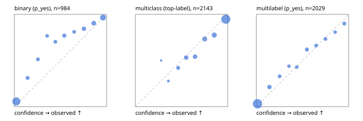

# Evaluation report

- model `Qwen/Qwen3-Reranker-4B` @ `22e683669b` (stock reranker pairs), adapter/checkpoint `runs/curve/vol50_e2/adapter`, prompt `answer-v1` (724795e9b666)
- data data/hf.jsonl, data/eval.jsonl; splits ['test']; n=3471; calibration `None`
- cuda / bfloat16; 2026-09-24T01:50:07+0000; wall 414.2s

## Overall

question accuracy 79.1%

**binary**: n 984, positives 475, accuracy 0.848, precision 0.895, recall 0.775, f1 0.831, auroc 0.940, brier 0.109, log_loss 0.350, ece 0.084

**multiclass**: n 2143, accuracy 0.817, macro_f1 0.865, log_loss 0.548, brier 0.267, ece_top_label 0.042

**multilabel**: n 344, labels 2029, exact_match 0.468, micro_f1 0.704, macro_f1 0.713, label_auroc 0.923, brier 0.089, log_loss 0.293, ece 0.030

## By family

| family | n | question acc % | details |
|---|---|---|---|
| eval_adversarial | 27 | 81.5 | bin acc 86.7 F1 85.7 AUROC 0.926 ECE 0.143; mc acc 100.0 mF1 100.0 ECE 0.056; ml EM 40.0 µF1 73.7 ECE 0.241 |
| eval_agent_output | 26 | 53.8 | bin acc 71.4 F1 75.0 AUROC 0.827 ECE 0.128; mc acc 14.3 mF1 6.2 ECE 0.513; ml EM 60.0 µF1 87.5 ECE 0.198 |
| eval_evidence | 17 | 88.2 | bin acc 100.0 F1 100.0 AUROC 1.000 ECE 0.033; ml EM 0.0 µF1 50.0 ECE 0.327 |
| eval_multilabel | 32 | 81.2 | bin acc 85.7 F1 85.7 AUROC 1.000 ECE 0.145; mc acc 100.0 mF1 100.0 ECE 0.488; ml EM 79.2 µF1 95.1 ECE 0.038 |
| eval_policy | 22 | 50.0 | bin acc 53.8 F1 57.1 AUROC 0.643 ECE 0.299; mc acc 40.0 mF1 23.8 ECE 0.449; ml EM 50.0 µF1 80.0 ECE 0.255 |
| eval_routing | 25 | 88.0 | bin acc 100.0 F1 100.0 AUROC 1.000 ECE 0.048; mc acc 84.6 mF1 81.8 ECE 0.102; ml EM 50.0 µF1 80.0 ECE 0.126 |
| eval_urgency_sentiment | 22 | 63.6 | bin acc 60.0 F1 60.0 AUROC 0.792 ECE 0.366; mc acc 70.0 mF1 58.3 ECE 0.233; ml EM 50.0 µF1 90.9 ECE 0.178 |
| heldout_boolq | 300 | 80.7 | bin acc 80.7 F1 83.1 AUROC 0.896 ECE 0.084 |
| heldout_emotion_multiclass | 300 | 59.7 | mc acc 59.7 mF1 50.0 ECE 0.165 |
| heldout_intent_clinc | 300 | 91.3 | mc acc 91.3 mF1 92.2 ECE 0.038 |
| heldout_question_type_trec | 300 | 77.0 | mc acc 77.0 mF1 77.5 ECE 0.079 |
| heldout_sentiment_sst2 | 300 | 82.7 | bin acc 82.7 F1 79.2 AUROC 0.985 ECE 0.182 |
| heldout_topic_dbpedia | 300 | 96.0 | mc acc 96.0 mF1 95.5 ECE 0.024 |
| hf_emotions_multilabel | 300 | 44.3 | ml EM 44.3 µF1 65.6 ECE 0.032 |
| hf_intent_banking77 | 300 | 95.0 | mc acc 95.0 mF1 94.3 ECE 0.018 |
| hf_nli | 300 | 92.3 | bin acc 92.3 F1 89.2 AUROC 0.972 ECE 0.043 |
| hf_sentiment_tweets | 300 | 67.3 | mc acc 67.3 mF1 67.4 ECE 0.037 |
| hf_topic_agnews | 300 | 87.3 | mc acc 87.3 mF1 87.3 ECE 0.060 |

## by hard case

| slice | n | question acc % |
|---|---|---|
| (none) | 3042 | 79.2 |
| contradiction | 107 | 100.0 |
| distractor | 33 | 66.7 |
| double_negation | 6 | 83.3 |
| evidence_end | 13 | 76.9 |
| evidence_middle | 11 | 72.7 |
| evidence_start | 9 | 88.9 |
| exception | 7 | 0.0 |
| hypothetical | 7 | 85.7 |
| injection | 10 | 70.0 |
| lexical_overlap | 20 | 70.0 |
| long_state | 50 | 70.0 |
| missing_evidence | 104 | 89.4 |
| multi_positive | 81 | 34.6 |
| multi_turn | 9 | 66.7 |
| negation | 30 | 83.3 |
| new_label_names | 3 | 33.3 |
| nota | 46 | 97.8 |
| numeric_reasoning | 16 | 56.2 |
| paraphrase | 22 | 68.2 |
| role_reversal | 15 | 53.3 |
| sarcasm | 12 | 58.3 |
| temporal_reasoning | 29 | 51.7 |
| zero_positive | 6 | 66.7 |

## by state tokens

| slice | n | question acc % |
|---|---|---|
| 00000-00127 | 3211 | 79.3 |
| 00128-00511 | 208 | 77.9 |
| 00512-02047 | 52 | 69.2 |

## by candidates

| slice | n | question acc % |
|---|---|---|
| 01 | 984 | 84.8 |
| 03 | 310 | 68.1 |
| 04 | 333 | 85.9 |
| 05 | 22 | 40.9 |
| 06 | 1218 | 69.2 |
| 07 | 49 | 98.0 |
| 08 | 555 | 92.6 |

## Paraphrase groups

11 groups; same prediction 81.8%; all correct 63.6%

## Multiclass abstention (coverage vs error on accepted)

| abstain_below | coverage % | error % |
|---|---|---|
| 0.0 | 100.0 | 18.3 |
| 0.4 | 99.1 | 17.9 |
| 0.5 | 94.4 | 15.9 |
| 0.6 | 87.0 | 13.2 |
| 0.7 | 79.7 | 10.2 |
| 0.8 | 70.1 | 8.0 |
| 0.9 | 59.1 | 5.3 |

## Reliability: binary

| bin | n | mean confidence | observed frequency |
|---|---|---|---|
| [0.0,0.1) | 422 | 0.022 | 0.057 |
| [0.1,0.2) | 45 | 0.143 | 0.311 |
| [0.2,0.3) | 39 | 0.255 | 0.513 |
| [0.3,0.4) | 30 | 0.356 | 0.767 |
| [0.4,0.5) | 37 | 0.445 | 0.703 |
| [0.5,0.6) | 52 | 0.541 | 0.769 |
| [0.6,0.7) | 37 | 0.648 | 0.811 |
| [0.7,0.8) | 64 | 0.753 | 0.844 |
| [0.8,0.9) | 83 | 0.861 | 0.904 |
| [0.9,1.0] | 175 | 0.961 | 0.966 |

## Reliability: multiclass

| bin | n | mean confidence | observed frequency |
|---|---|---|---|
| [0.2,0.3) | 2 | 0.279 | 0.500 |
| [0.3,0.4) | 18 | 0.358 | 0.278 |
| [0.4,0.5) | 100 | 0.464 | 0.420 |
| [0.5,0.6) | 158 | 0.551 | 0.532 |
| [0.6,0.7) | 157 | 0.647 | 0.541 |
| [0.7,0.8) | 206 | 0.752 | 0.733 |
| [0.8,0.9) | 236 | 0.855 | 0.775 |
| [0.9,1.0] | 1266 | 0.980 | 0.947 |

## Reliability: multilabel

| bin | n | mean confidence | observed frequency |
|---|---|---|---|
| [0.0,0.1) | 1308 | 0.013 | 0.031 |
| [0.1,0.2) | 127 | 0.141 | 0.213 |
| [0.2,0.3) | 73 | 0.252 | 0.329 |
| [0.3,0.4) | 57 | 0.354 | 0.439 |
| [0.4,0.5) | 63 | 0.438 | 0.429 |
| [0.5,0.6) | 105 | 0.548 | 0.619 |
| [0.6,0.7) | 74 | 0.648 | 0.662 |
| [0.7,0.8) | 75 | 0.749 | 0.733 |
| [0.8,0.9) | 57 | 0.854 | 0.807 |
| [0.9,1.0] | 90 | 0.953 | 0.900 |
