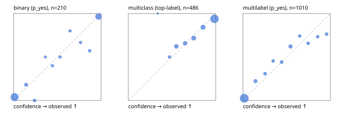

# Evaluation report

- model `Qwen/Qwen3-Reranker-4B` @ `22e683669b` (stock reranker pairs), adapter/checkpoint `runs/curve/vol50_e2/adapter`, prompt `answer-v1` (724795e9b666)
- data data/hf.jsonl, data/eval.jsonl; splits ['validation']; n=868; calibration `None`
- cuda / bfloat16; 2026-09-24T01:43:04+0000; wall 105.4s

## Overall

question accuracy 77.3%

**binary**: n 210, positives 79, accuracy 0.900, precision 0.863, recall 0.873, f1 0.868, auroc 0.959, brier 0.077, log_loss 0.262, ece 0.046

**multiclass**: n 486, accuracy 0.837, macro_f1 0.784, log_loss 0.490, brier 0.253, ece_top_label 0.041

**multilabel**: n 172, labels 1010, exact_match 0.436, micro_f1 0.667, macro_f1 0.580, label_auroc 0.910, brier 0.097, log_loss 0.315, ece 0.039

## By family

| family | n | question acc % | details |
|---|---|---|---|
| eval_adversarial | 14 | 78.6 | bin acc 71.4 F1 80.0 AUROC 0.850 ECE 0.136; mc acc 80.0 mF1 66.7 ECE 0.154; ml EM 100.0 µF1 100.0 ECE 0.016 |
| eval_agent_output | 20 | 70.0 | bin acc 83.3 F1 83.3 AUROC 0.889 ECE 0.138; mc acc 60.0 mF1 33.3 ECE 0.169; ml EM 33.3 µF1 0.0 ECE 0.201 |
| eval_evidence | 17 | 94.1 | bin acc 92.9 F1 90.9 AUROC 1.000 ECE 0.094; ml EM 100.0 µF1 100.0 ECE 0.046 |
| eval_multilabel | 12 | 33.3 | bin acc 0.0 F1 0.0 AUROC — ECE 0.874; mc acc 100.0 mF1 100.0 ECE 0.001; ml EM 22.2 µF1 80.8 ECE 0.165 |
| eval_policy | 24 | 50.0 | bin acc 58.3 F1 54.5 AUROC 0.629 ECE 0.376; mc acc 45.5 mF1 31.2 ECE 0.456; ml EM 0.0 µF1 66.7 ECE 0.490 |
| eval_routing | 16 | 75.0 | bin acc 71.4 F1 80.0 AUROC 0.900 ECE 0.200; mc acc 87.5 mF1 77.8 ECE 0.102; ml EM 0.0 µF1 0.0 ECE 0.274 |
| eval_urgency_sentiment | 15 | 93.3 | bin acc 100.0 F1 100.0 AUROC 1.000 ECE 0.083; mc acc 100.0 mF1 100.0 ECE 0.121; ml EM 66.7 µF1 50.0 ECE 0.174 |
| hf_emotions_multilabel | 150 | 43.3 | ml EM 43.3 µF1 64.3 ECE 0.037 |
| hf_intent_banking77 | 150 | 94.7 | mc acc 94.7 mF1 91.4 ECE 0.010 |
| hf_nli | 150 | 94.7 | bin acc 94.7 F1 91.7 AUROC 0.983 ECE 0.050 |
| hf_sentiment_tweets | 150 | 75.3 | mc acc 75.3 mF1 69.1 ECE 0.054 |
| hf_topic_agnews | 150 | 84.0 | mc acc 84.0 mF1 84.3 ECE 0.091 |

## by hard case

| slice | n | question acc % |
|---|---|---|
| (none) | 634 | 78.5 |
| contradiction | 63 | 93.7 |
| distractor | 20 | 85.0 |
| double_negation | 3 | 100.0 |
| evidence_end | 4 | 50.0 |
| evidence_middle | 7 | 100.0 |
| evidence_start | 3 | 100.0 |
| exception | 7 | 71.4 |
| hypothetical | 6 | 100.0 |
| injection | 16 | 81.2 |
| lexical_overlap | 13 | 69.2 |
| long_state | 26 | 73.1 |
| missing_evidence | 59 | 91.5 |
| multi_positive | 40 | 17.5 |
| multi_turn | 21 | 71.4 |
| negation | 9 | 55.6 |
| new_label_names | 5 | 40.0 |
| nota | 4 | 100.0 |
| numeric_reasoning | 13 | 53.8 |
| paraphrase | 10 | 40.0 |
| role_reversal | 7 | 28.6 |
| sarcasm | 5 | 40.0 |
| temporal_reasoning | 15 | 40.0 |
| zero_positive | 7 | 71.4 |

## by state tokens

| slice | n | question acc % |
|---|---|---|
| 00000-00127 | 796 | 77.8 |
| 00128-00511 | 46 | 71.7 |
| 00512-02047 | 26 | 73.1 |

## by candidates

| slice | n | question acc % |
|---|---|---|
| 01 | 210 | 90.0 |
| 03 | 162 | 73.5 |
| 04 | 174 | 82.8 |
| 05 | 13 | 76.9 |
| 06 | 159 | 42.1 |
| 08 | 150 | 94.7 |

## Paraphrase groups

5 groups; same prediction 60.0%; all correct 40.0%

## Multiclass abstention (coverage vs error on accepted)

| abstain_below | coverage % | error % |
|---|---|---|
| 0.0 | 100.0 | 16.3 |
| 0.4 | 99.8 | 16.3 |
| 0.5 | 96.5 | 15.1 |
| 0.6 | 87.2 | 12.7 |
| 0.7 | 79.4 | 10.6 |
| 0.8 | 68.5 | 7.8 |
| 0.9 | 56.8 | 6.2 |

## Reliability: binary

| bin | n | mean confidence | observed frequency |
|---|---|---|---|
| [0.0,0.1) | 103 | 0.011 | 0.039 |
| [0.1,0.2) | 11 | 0.144 | 0.182 |
| [0.2,0.3) | 7 | 0.240 | 0.000 |
| [0.3,0.4) | 4 | 0.363 | 0.500 |
| [0.4,0.5) | 5 | 0.444 | 0.400 |
| [0.5,0.6) | 6 | 0.531 | 0.500 |
| [0.6,0.7) | 5 | 0.646 | 0.800 |
| [0.7,0.8) | 6 | 0.765 | 0.667 |
| [0.8,0.9) | 7 | 0.870 | 0.571 |
| [0.9,1.0] | 56 | 0.970 | 0.964 |

## Reliability: multiclass

| bin | n | mean confidence | observed frequency |
|---|---|---|---|
| [0.3,0.4) | 1 | 0.336 | 1.000 |
| [0.4,0.5) | 16 | 0.472 | 0.500 |
| [0.5,0.6) | 45 | 0.550 | 0.622 |
| [0.6,0.7) | 38 | 0.650 | 0.658 |
| [0.7,0.8) | 53 | 0.748 | 0.717 |
| [0.8,0.9) | 57 | 0.855 | 0.842 |
| [0.9,1.0] | 276 | 0.985 | 0.938 |

## Reliability: multilabel

| bin | n | mean confidence | observed frequency |
|---|---|---|---|
| [0.0,0.1) | 632 | 0.015 | 0.025 |
| [0.1,0.2) | 63 | 0.143 | 0.222 |
| [0.2,0.3) | 39 | 0.253 | 0.308 |
| [0.3,0.4) | 33 | 0.346 | 0.455 |
| [0.4,0.5) | 43 | 0.443 | 0.442 |
| [0.5,0.6) | 66 | 0.544 | 0.621 |
| [0.6,0.7) | 31 | 0.649 | 0.742 |
| [0.7,0.8) | 35 | 0.746 | 0.657 |
| [0.8,0.9) | 30 | 0.855 | 0.733 |
| [0.9,1.0] | 38 | 0.957 | 0.763 |
