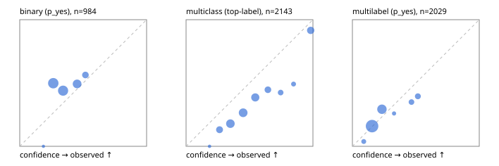

# Evaluation report

- model `Qwen/Qwen3-Reranker-0.6B` @ `e61197ed45` (shared-state cross-attention (custom-v1)), adapter/checkpoint `runs/custom_distill_frozen/checkpoint`, prompt `custom-v1` (b96b6174a187)
- data data/hf.jsonl, data/eval.jsonl; splits ['test']; n=3471; calibration `None`
- mps / float32; 2026-09-23T13:10:49-0700; wall 245.1s

## Overall

question accuracy 37.7%

**binary**: n 984, positives 475, accuracy 0.528, precision 0.563, recall 0.103, f1 0.174, auroc 0.507, brier 0.272, log_loss 0.744, ece 0.130

**multiclass**: n 2143, accuracy 0.367, macro_f1 0.184, log_loss 1.791, brier 0.771, ece_top_label 0.170

**multilabel**: n 344, labels 2029, exact_match 0.006, micro_f1 0.168, macro_f1 0.249, label_auroc 0.644, brier 0.165, log_loss 0.506, ece 0.034

## By family

| family | n | question acc % | details |
|---|---|---|---|
| eval_adversarial | 27 | 40.7 | bin acc 60.0 F1 66.7 AUROC 0.556 ECE 0.103; mc acc 28.6 mF1 20.0 ECE 0.329; ml EM 0.0 µF1 51.9 ECE 0.122 |
| eval_agent_output | 26 | 42.3 | bin acc 64.3 F1 66.7 AUROC 0.551 ECE 0.119; mc acc 14.3 mF1 5.6 ECE 0.335; ml EM 20.0 µF1 40.0 ECE 0.104 |
| eval_evidence | 17 | 47.1 | bin acc 53.3 F1 46.2 AUROC 0.620 ECE 0.136; ml EM 0.0 µF1 0.0 ECE 0.368 |
| eval_multilabel | 32 | 15.6 | bin acc 57.1 F1 57.1 AUROC 0.667 ECE 0.079; mc acc 0.0 mF1 0.0 ECE 0.229; ml EM 4.2 µF1 44.1 ECE 0.130 |
| eval_policy | 22 | 31.8 | bin acc 46.2 F1 63.2 AUROC 0.762 ECE 0.056; mc acc 20.0 mF1 8.3 ECE 0.337; ml EM 0.0 µF1 69.6 ECE 0.017 |
| eval_routing | 25 | 48.0 | bin acc 70.0 F1 72.7 AUROC 0.708 ECE 0.175; mc acc 38.5 mF1 23.1 ECE 0.393; ml EM 0.0 µF1 50.0 ECE 0.179 |
| eval_urgency_sentiment | 22 | 40.9 | bin acc 60.0 F1 71.4 AUROC 0.417 ECE 0.114; mc acc 30.0 mF1 15.2 ECE 0.222; ml EM 0.0 µF1 0.0 ECE 0.022 |
| heldout_boolq | 300 | 42.3 | bin acc 42.3 F1 13.9 AUROC 0.484 ECE 0.203 |
| heldout_emotion_multiclass | 300 | 8.7 | mc acc 8.7 mF1 6.9 ECE 0.268 |
| heldout_intent_clinc | 300 | 14.7 | mc acc 14.7 mF1 10.1 ECE 0.334 |
| heldout_question_type_trec | 300 | 27.7 | mc acc 27.7 mF1 8.8 ECE 0.200 |
| heldout_sentiment_sst2 | 300 | 50.0 | bin acc 50.0 F1 0.0 AUROC 0.476 ECE 0.220 |
| heldout_topic_dbpedia | 300 | 29.0 | mc acc 29.0 mF1 22.9 ECE 0.277 |
| hf_emotions_multilabel | 300 | 0.0 | ml EM 0.0 µF1 0.0 ECE 0.022 |
| hf_intent_banking77 | 300 | 41.0 | mc acc 41.0 mF1 33.1 ECE 0.038 |
| hf_nli | 300 | 64.7 | bin acc 64.7 F1 7.0 AUROC 0.528 ECE 0.055 |
| hf_sentiment_tweets | 300 | 48.7 | mc acc 48.7 mF1 35.6 ECE 0.076 |
| hf_topic_agnews | 300 | 88.3 | mc acc 88.3 mF1 88.4 ECE 0.070 |

## by hard case

| slice | n | question acc % |
|---|---|---|
| (none) | 3042 | 35.2 |
| contradiction | 107 | 91.6 |
| distractor | 33 | 12.1 |
| double_negation | 6 | 50.0 |
| evidence_end | 13 | 30.8 |
| evidence_middle | 11 | 45.5 |
| evidence_start | 9 | 55.6 |
| exception | 7 | 0.0 |
| hypothetical | 7 | 42.9 |
| injection | 10 | 10.0 |
| lexical_overlap | 20 | 45.0 |
| long_state | 50 | 34.0 |
| missing_evidence | 104 | 96.2 |
| multi_positive | 81 | 0.0 |
| multi_turn | 9 | 33.3 |
| negation | 30 | 20.0 |
| new_label_names | 3 | 33.3 |
| nota | 46 | 2.2 |
| numeric_reasoning | 16 | 43.8 |
| paraphrase | 22 | 13.6 |
| role_reversal | 15 | 20.0 |
| sarcasm | 12 | 16.7 |
| temporal_reasoning | 29 | 24.1 |
| zero_positive | 6 | 33.3 |

## by state tokens

| slice | n | question acc % |
|---|---|---|
| 00000-00127 | 3211 | 38.1 |
| 00128-00511 | 208 | 31.2 |
| 00512-02047 | 52 | 36.5 |

## by candidates

| slice | n | question acc % |
|---|---|---|
| 01 | 984 | 52.8 |
| 03 | 310 | 47.7 |
| 04 | 333 | 82.3 |
| 05 | 22 | 13.6 |
| 06 | 1218 | 16.1 |
| 07 | 49 | 2.0 |
| 08 | 555 | 29.9 |

## Paraphrase groups

11 groups; same prediction 45.5%; all correct 9.1%

## Multiclass abstention (coverage vs error on accepted)

| abstain_below | coverage % | error % |
|---|---|---|
| 0.0 | 100.0 | 63.3 |
| 0.4 | 68.3 | 53.8 |
| 0.5 | 46.9 | 44.8 |
| 0.6 | 29.3 | 34.9 |
| 0.7 | 20.5 | 26.1 |
| 0.8 | 15.6 | 16.2 |
| 0.9 | 12.7 | 8.4 |

## Reliability: binary

| bin | n | mean confidence | observed frequency |
|---|---|---|---|
| [0.1,0.2) | 1 | 0.187 | 0.000 |
| [0.2,0.3) | 353 | 0.265 | 0.499 |
| [0.3,0.4) | 330 | 0.341 | 0.439 |
| [0.4,0.5) | 213 | 0.452 | 0.493 |
| [0.5,0.6) | 87 | 0.518 | 0.563 |

## Reliability: multiclass

| bin | n | mean confidence | observed frequency |
|---|---|---|---|
| [0.1,0.2) | 4 | 0.185 | 0.000 |
| [0.2,0.3) | 229 | 0.264 | 0.131 |
| [0.3,0.4) | 447 | 0.349 | 0.179 |
| [0.4,0.5) | 457 | 0.450 | 0.265 |
| [0.5,0.6) | 378 | 0.545 | 0.386 |
| [0.6,0.7) | 188 | 0.645 | 0.447 |
| [0.7,0.8) | 106 | 0.746 | 0.425 |
| [0.8,0.9) | 61 | 0.847 | 0.492 |
| [0.9,1.0] | 273 | 0.982 | 0.916 |

## Reliability: multilabel

| bin | n | mean confidence | observed frequency |
|---|---|---|---|
| [0.0,0.1) | 53 | 0.090 | 0.038 |
| [0.1,0.2) | 1180 | 0.155 | 0.159 |
| [0.2,0.3) | 547 | 0.233 | 0.293 |
| [0.3,0.4) | 27 | 0.328 | 0.259 |
| [0.4,0.5) | 103 | 0.465 | 0.350 |
| [0.5,0.6) | 119 | 0.516 | 0.395 |
