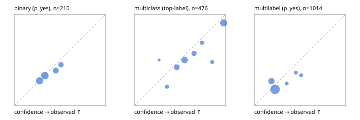

# Evaluation report

- model `Qwen/Qwen3-Reranker-0.6B` @ `e61197ed45` (shared-state cross-attention (custom-v1)), adapter/checkpoint `runs/custom_distill_lora/checkpoint`, prompt `custom-v1` (b96b6174a187)
- data data/hf.jsonl, data/eval.jsonl; splits ['calibration']; n=859; calibration `None`
- cuda / float32; 2026-09-23T20:38:44+0000; wall 17.1s

## Overall

question accuracy 50.4%

**binary**: n 210, positives 71, accuracy 0.648, precision 0.448, recall 0.183, f1 0.260, auroc 0.544, brier 0.225, log_loss 0.642, ece 0.025

**multiclass**: n 476, accuracy 0.618, macro_f1 0.402, log_loss 0.923, brier 0.487, ece_top_label 0.082

**multilabel**: n 173, labels 1014, exact_match 0.017, micro_f1 0.101, macro_f1 0.151, label_auroc 0.475, brier 0.172, log_loss 0.529, ece 0.065

## By family

| family | n | question acc % | details |
|---|---|---|---|
| eval_adversarial | 19 | 52.6 | bin acc 57.1 F1 57.1 AUROC 0.653 ECE 0.047; mc acc 33.3 mF1 20.0 ECE 0.430; ml EM 50.0 µF1 0.0 ECE 0.307 |
| eval_agent_output | 9 | 33.3 | bin acc 60.0 F1 50.0 AUROC 0.500 ECE 0.118; mc acc 0.0 mF1 0.0 ECE 0.445; ml EM 0.0 µF1 0.0 ECE 0.014 |
| eval_evidence | 19 | 47.4 | bin acc 56.2 F1 46.2 AUROC 0.600 ECE 0.167; ml EM 0.0 µF1 35.3 ECE 0.269 |
| eval_multilabel | 12 | 8.3 | bin acc 0.0 F1 0.0 AUROC — ECE 0.528; mc acc 0.0 mF1 0.0 ECE 0.614; ml EM 12.5 µF1 27.3 ECE 0.149 |
| eval_policy | 16 | 31.2 | bin acc 50.0 F1 60.0 AUROC 0.800 ECE 0.132; mc acc 25.0 mF1 14.3 ECE 0.424; ml EM 0.0 µF1 44.4 ECE 0.229 |
| eval_routing | 15 | 33.3 | bin acc 28.6 F1 28.6 AUROC 0.167 ECE 0.237; mc acc 28.6 mF1 16.7 ECE 0.305; ml EM 100.0 µF1 100.0 ECE 0.492 |
| eval_urgency_sentiment | 19 | 52.6 | bin acc 75.0 F1 50.0 AUROC 0.833 ECE 0.205; mc acc 50.0 mF1 33.3 ECE 0.202; ml EM 0.0 µF1 22.2 ECE 0.083 |
| hf_emotions_multilabel | 150 | 0.0 | ml EM 0.0 µF1 0.0 ECE 0.056 |
| hf_intent_banking77 | 150 | 60.0 | mc acc 60.0 mF1 50.9 ECE 0.097 |
| hf_nli | 150 | 69.3 | bin acc 69.3 F1 0.0 AUROC 0.472 ECE 0.008 |
| hf_sentiment_tweets | 150 | 47.3 | mc acc 47.3 mF1 36.0 ECE 0.087 |
| hf_topic_agnews | 150 | 83.3 | mc acc 83.3 mF1 83.4 ECE 0.134 |

## by hard case

| slice | n | question acc % |
|---|---|---|
| (none) | 624 | 46.8 |
| contradiction | 58 | 94.8 |
| distractor | 25 | 40.0 |
| double_negation | 3 | 0.0 |
| evidence_end | 11 | 45.5 |
| evidence_middle | 6 | 16.7 |
| evidence_start | 7 | 28.6 |
| exception | 4 | 0.0 |
| hypothetical | 7 | 14.3 |
| injection | 6 | 16.7 |
| lexical_overlap | 16 | 43.8 |
| long_state | 42 | 38.1 |
| missing_evidence | 62 | 95.2 |
| multi_positive | 42 | 2.4 |
| multi_turn | 12 | 16.7 |
| negation | 12 | 33.3 |
| new_label_names | 5 | 20.0 |
| nota | 4 | 50.0 |
| numeric_reasoning | 15 | 33.3 |
| paraphrase | 10 | 40.0 |
| role_reversal | 13 | 23.1 |
| sarcasm | 1 | 100.0 |
| temporal_reasoning | 14 | 42.9 |
| zero_positive | 4 | 50.0 |

## by state tokens

| slice | n | question acc % |
|---|---|---|
| 00000-00127 | 780 | 51.7 |
| 00128-00511 | 37 | 37.8 |
| 00512-02047 | 42 | 38.1 |

## by candidates

| slice | n | question acc % |
|---|---|---|
| 01 | 210 | 64.8 |
| 03 | 158 | 46.2 |
| 04 | 168 | 78.6 |
| 05 | 15 | 13.3 |
| 06 | 157 | 0.0 |
| 07 | 1 | 0.0 |
| 08 | 150 | 60.0 |

## Paraphrase groups

5 groups; same prediction 60.0%; all correct 20.0%

## Multiclass abstention (coverage vs error on accepted)

| abstain_below | coverage % | error % |
|---|---|---|
| 0.0 | 100.0 | 38.2 |
| 0.4 | 94.1 | 35.9 |
| 0.5 | 78.2 | 31.5 |
| 0.6 | 53.8 | 23.0 |
| 0.7 | 42.0 | 17.5 |
| 0.8 | 35.9 | 15.2 |
| 0.9 | 31.1 | 9.5 |

## Reliability: binary

| bin | n | mean confidence | observed frequency |
|---|---|---|---|
| [0.2,0.3) | 66 | 0.276 | 0.273 |
| [0.3,0.4) | 76 | 0.335 | 0.329 |
| [0.4,0.5) | 39 | 0.454 | 0.385 |
| [0.5,0.6) | 29 | 0.511 | 0.448 |

## Reliability: multiclass

| bin | n | mean confidence | observed frequency |
|---|---|---|---|
| [0.2,0.3) | 4 | 0.272 | 0.500 |
| [0.3,0.4) | 24 | 0.358 | 0.208 |
| [0.4,0.5) | 76 | 0.465 | 0.421 |
| [0.5,0.6) | 116 | 0.550 | 0.500 |
| [0.6,0.7) | 56 | 0.653 | 0.571 |
| [0.7,0.8) | 29 | 0.741 | 0.690 |
| [0.8,0.9) | 23 | 0.852 | 0.478 |
| [0.9,1.0] | 148 | 0.977 | 0.905 |

## Reliability: multilabel

| bin | n | mean confidence | observed frequency |
|---|---|---|---|
| [0.1,0.2) | 226 | 0.188 | 0.270 |
| [0.2,0.3) | 665 | 0.227 | 0.179 |
| [0.3,0.4) | 37 | 0.355 | 0.243 |
| [0.4,0.5) | 47 | 0.454 | 0.362 |
| [0.5,0.6) | 39 | 0.511 | 0.333 |
