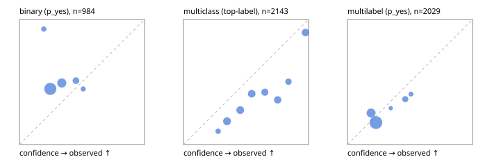

# Evaluation report

- model `Qwen/Qwen3-Reranker-0.6B` @ `e61197ed45` (shared-state cross-attention (custom-v1)), adapter/checkpoint `runs/custom_distill_lora/checkpoint`, prompt `custom-v1` (b96b6174a187)
- data data/hf.jsonl, data/eval.jsonl; splits ['test']; n=3471; calibration `None`
- cuda / float32; 2026-09-23T20:39:56+0000; wall 64.6s

## Overall

question accuracy 39.7%

**binary**: n 984, positives 475, accuracy 0.513, precision 0.444, recall 0.034, f1 0.063, auroc 0.451, brier 0.294, log_loss 0.799, ece 0.189

**multiclass**: n 2143, accuracy 0.406, macro_f1 0.238, log_loss 1.702, brier 0.755, ece_top_label 0.205

**multilabel**: n 344, labels 2029, exact_match 0.009, micro_f1 0.100, macro_f1 0.160, label_auroc 0.501, brier 0.170, log_loss 0.524, ece 0.060

## By family

| family | n | question acc % | details |
|---|---|---|---|
| eval_adversarial | 27 | 37.0 | bin acc 46.7 F1 33.3 AUROC 0.426 ECE 0.103; mc acc 28.6 mF1 16.7 ECE 0.459; ml EM 20.0 µF1 20.0 ECE 0.107 |
| eval_agent_output | 26 | 30.8 | bin acc 50.0 F1 22.2 AUROC 0.571 ECE 0.062; mc acc 0.0 mF1 0.0 ECE 0.497; ml EM 20.0 µF1 0.0 ECE 0.098 |
| eval_evidence | 17 | 41.2 | bin acc 46.7 F1 33.3 AUROC 0.520 ECE 0.129; ml EM 0.0 µF1 0.0 ECE 0.351 |
| eval_multilabel | 32 | 15.6 | bin acc 57.1 F1 40.0 AUROC 0.667 ECE 0.065; mc acc 0.0 mF1 0.0 ECE 0.280; ml EM 4.2 µF1 36.7 ECE 0.126 |
| eval_policy | 22 | 45.5 | bin acc 61.5 F1 66.7 AUROC 0.714 ECE 0.100; mc acc 40.0 mF1 23.8 ECE 0.369; ml EM 0.0 µF1 55.6 ECE 0.055 |
| eval_routing | 25 | 44.0 | bin acc 70.0 F1 57.1 AUROC 0.625 ECE 0.179; mc acc 30.8 mF1 16.7 ECE 0.458; ml EM 0.0 µF1 40.0 ECE 0.148 |
| eval_urgency_sentiment | 22 | 40.9 | bin acc 30.0 F1 36.4 AUROC 0.417 ECE 0.241; mc acc 60.0 mF1 50.0 ECE 0.337; ml EM 0.0 µF1 0.0 ECE 0.242 |
| heldout_boolq | 300 | 40.0 | bin acc 40.0 F1 0.0 AUROC 0.524 ECE 0.292 |
| heldout_emotion_multiclass | 300 | 13.3 | mc acc 13.3 mF1 10.5 ECE 0.206 |
| heldout_intent_clinc | 300 | 20.0 | mc acc 20.0 mF1 10.9 ECE 0.294 |
| heldout_question_type_trec | 300 | 26.7 | mc acc 26.7 mF1 7.0 ECE 0.488 |
| heldout_sentiment_sst2 | 300 | 50.0 | bin acc 50.0 F1 0.0 AUROC 0.198 ECE 0.279 |
| heldout_topic_dbpedia | 300 | 30.7 | mc acc 30.7 mF1 24.0 ECE 0.300 |
| hf_emotions_multilabel | 300 | 0.0 | ml EM 0.0 µF1 0.0 ECE 0.056 |
| hf_intent_banking77 | 300 | 54.3 | mc acc 54.3 mF1 46.8 ECE 0.049 |
| hf_nli | 300 | 64.0 | bin acc 64.0 F1 1.8 AUROC 0.540 ECE 0.061 |
| hf_sentiment_tweets | 300 | 52.3 | mc acc 52.3 mF1 43.3 ECE 0.055 |
| hf_topic_agnews | 300 | 88.0 | mc acc 88.0 mF1 88.1 ECE 0.066 |

## by hard case

| slice | n | question acc % |
|---|---|---|
| (none) | 3042 | 36.5 |
| contradiction | 107 | 91.6 |
| distractor | 33 | 18.2 |
| double_negation | 6 | 33.3 |
| evidence_end | 13 | 15.4 |
| evidence_middle | 11 | 36.4 |
| evidence_start | 9 | 33.3 |
| exception | 7 | 0.0 |
| hypothetical | 7 | 42.9 |
| injection | 10 | 60.0 |
| lexical_overlap | 20 | 50.0 |
| long_state | 50 | 24.0 |
| missing_evidence | 104 | 98.1 |
| multi_positive | 81 | 0.0 |
| multi_turn | 9 | 55.6 |
| negation | 30 | 30.0 |
| new_label_names | 3 | 33.3 |
| nota | 46 | 52.2 |
| numeric_reasoning | 16 | 37.5 |
| paraphrase | 22 | 18.2 |
| role_reversal | 15 | 40.0 |
| sarcasm | 12 | 33.3 |
| temporal_reasoning | 29 | 34.5 |
| zero_positive | 6 | 50.0 |

## by state tokens

| slice | n | question acc % |
|---|---|---|
| 00000-00127 | 3211 | 40.4 |
| 00128-00511 | 208 | 32.7 |
| 00512-02047 | 52 | 26.9 |

## by candidates

| slice | n | question acc % |
|---|---|---|
| 01 | 984 | 51.3 |
| 03 | 310 | 51.9 |
| 04 | 333 | 82.9 |
| 05 | 22 | 4.5 |
| 06 | 1218 | 17.4 |
| 07 | 49 | 49.0 |
| 08 | 555 | 35.9 |

## Paraphrase groups

11 groups; same prediction 36.4%; all correct 9.1%

## Multiclass abstention (coverage vs error on accepted)

| abstain_below | coverage % | error % |
|---|---|---|
| 0.0 | 100.0 | 59.4 |
| 0.4 | 79.0 | 53.1 |
| 0.5 | 62.8 | 48.1 |
| 0.6 | 47.6 | 44.5 |
| 0.7 | 35.9 | 40.1 |
| 0.8 | 22.3 | 25.3 |
| 0.9 | 13.9 | 10.4 |

## Reliability: binary

| bin | n | mean confidence | observed frequency |
|---|---|---|---|
| [0.1,0.2) | 39 | 0.194 | 0.923 |
| [0.2,0.3) | 553 | 0.247 | 0.445 |
| [0.3,0.4) | 262 | 0.339 | 0.492 |
| [0.4,0.5) | 94 | 0.452 | 0.511 |
| [0.5,0.6) | 36 | 0.509 | 0.444 |

## Reliability: multiclass

| bin | n | mean confidence | observed frequency |
|---|---|---|---|
| [0.2,0.3) | 94 | 0.277 | 0.106 |
| [0.3,0.4) | 355 | 0.349 | 0.186 |
| [0.4,0.5) | 349 | 0.454 | 0.275 |
| [0.5,0.6) | 325 | 0.545 | 0.406 |
| [0.6,0.7) | 251 | 0.651 | 0.418 |
| [0.7,0.8) | 291 | 0.753 | 0.357 |
| [0.8,0.9) | 181 | 0.839 | 0.503 |
| [0.9,1.0] | 297 | 0.976 | 0.896 |

## Reliability: multilabel

| bin | n | mean confidence | observed frequency |
|---|---|---|---|
| [0.1,0.2) | 504 | 0.189 | 0.252 |
| [0.2,0.3) | 1286 | 0.228 | 0.176 |
| [0.3,0.4) | 31 | 0.346 | 0.290 |
| [0.4,0.5) | 146 | 0.462 | 0.363 |
| [0.5,0.6) | 62 | 0.508 | 0.403 |
