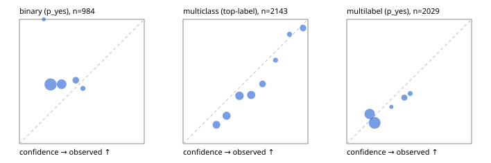

# Evaluation report

- model `Qwen/Qwen3-Reranker-0.6B` @ `e61197ed45` (shared-state cross-attention (custom-v1)), adapter/checkpoint `runs/custom_distill_lora/checkpoint`, prompt `custom-v1` (b96b6174a187)
- data data/hf.jsonl, data/eval.jsonl; splits ['test']; n=3471; calibration `{'method': 'temperature scaling per output type, grid search on NLL', 'min_n': 30, 'model': 'Qwen/Qwen3-Reranker-0.6B', 'revision': 'e61197ed45024b0ed8a2d74b80b4d909f1255473', 'adapter': 'runs/custom_distill_lora/checkpoint', 'adapter_sha256': 'e70bac80154e247e3465b066e298a822e49e1f24d289acedf77724cc4ac8ad31', 'prompt_sha': 'b96b6174a187', 'fit_report': 'reports/custom_distill_lora/calibration/report.json', 'fit_report_sha256': '17078734f1fc76d84a87cd7b4bee27b752e50e6fb6ae8c218585cb3e89d2515b', 'fit_data': [{'path': 'data/hf.jsonl', 'sha256': 'fe29b29286d5a372271e925825e8b9794f3f64be9a9fc04cad458b4b94ada510'}, {'path': 'data/eval.jsonl', 'sha256': 'be888eb38dcca063823924430e03985ddf2186b874e792d5734936ba93ba6910'}], 'created': '2026-09-23T20:40:01+0000', 'n': {'binary': 210, 'multiclass': 476, 'multilabel': 1014}, 'nll_before': {'binary': 0.6424561057163506, 'multiclass': 0.9225656935927897, 'multilabel': 0.5288760286966828}, 'nll_after': {'binary': 0.6423698388143241, 'multiclass': 0.8776729256790183, 'multilabel': 0.5285966686082725}, 'skipped': {}, 'threshold_report': 'reports/custom_distill_lora/validation/report.json', 'threshold_report_sha256': '02f1b7740c9b6f8ab3a57dffb068f8ed65704f4e7e5dc46e2512e1d522892415', 'threshold_rule': 'max F1 on validation after temperature scaling', 'file': 'calib/custom_distill_lora.json', 'file_sha256': 'b78a16427466c101abc433e24ef30ff03e7c097f829a3c1bf7ac7c98abbdd4ea'}`
- cuda / float32; 2026-09-23T20:41:13+0000; wall 64.5s

## Overall

question accuracy 38.1%

**binary**: n 984, positives 475, accuracy 0.461, precision 0.454, recall 0.575, f1 0.507, auroc 0.451, brier 0.291, log_loss 0.790, ece 0.181

**multiclass**: n 2143, accuracy 0.406, macro_f1 0.238, log_loss 1.505, brier 0.702, ece_top_label 0.106

**multilabel**: n 344, labels 2029, exact_match 0.000, micro_f1 0.354, macro_f1 0.374, label_auroc 0.501, brier 0.170, log_loss 0.524, ece 0.060

## By family

| family | n | question acc % | details |
|---|---|---|---|
| eval_adversarial | 27 | 29.6 | bin acc 40.0 F1 57.1 AUROC 0.426 ECE 0.103; mc acc 28.6 mF1 16.7 ECE 0.460; ml EM 0.0 µF1 56.2 ECE 0.105 |
| eval_agent_output | 26 | 26.9 | bin acc 50.0 F1 66.7 AUROC 0.571 ECE 0.062; mc acc 0.0 mF1 0.0 ECE 0.415; ml EM 0.0 µF1 55.2 ECE 0.097 |
| eval_evidence | 17 | 35.3 | bin acc 40.0 F1 52.6 AUROC 0.520 ECE 0.130; ml EM 0.0 µF1 42.9 ECE 0.356 |
| eval_multilabel | 32 | 9.4 | bin acc 42.9 F1 60.0 AUROC 0.667 ECE 0.065; mc acc 0.0 mF1 0.0 ECE 0.253; ml EM 0.0 µF1 52.6 ECE 0.117 |
| eval_policy | 22 | 36.4 | bin acc 46.2 F1 63.2 AUROC 0.714 ECE 0.101; mc acc 40.0 mF1 23.8 ECE 0.316; ml EM 0.0 µF1 69.6 ECE 0.056 |
| eval_routing | 25 | 32.0 | bin acc 40.0 F1 57.1 AUROC 0.625 ECE 0.180; mc acc 30.8 mF1 16.7 ECE 0.448; ml EM 0.0 µF1 50.0 ECE 0.147 |
| eval_urgency_sentiment | 22 | 54.5 | bin acc 60.0 F1 75.0 AUROC 0.417 ECE 0.240; mc acc 60.0 mF1 50.0 ECE 0.282; ml EM 0.0 µF1 66.7 ECE 0.324 |
| heldout_boolq | 300 | 55.0 | bin acc 55.0 F1 65.8 AUROC 0.524 ECE 0.285 |
| heldout_emotion_multiclass | 300 | 13.3 | mc acc 13.3 mF1 10.5 ECE 0.146 |
| heldout_intent_clinc | 300 | 20.0 | mc acc 20.0 mF1 10.9 ECE 0.185 |
| heldout_question_type_trec | 300 | 26.7 | mc acc 26.7 mF1 7.0 ECE 0.308 |
| heldout_sentiment_sst2 | 300 | 45.0 | bin acc 45.0 F1 1.2 AUROC 0.198 ECE 0.276 |
| heldout_topic_dbpedia | 300 | 30.7 | mc acc 30.7 mF1 24.0 ECE 0.178 |
| hf_emotions_multilabel | 300 | 0.0 | ml EM 0.0 µF1 32.6 ECE 0.057 |
| hf_intent_banking77 | 300 | 54.3 | mc acc 54.3 mF1 46.8 ECE 0.070 |
| hf_nli | 300 | 38.7 | bin acc 38.7 F1 53.3 AUROC 0.540 ECE 0.050 |
| hf_sentiment_tweets | 300 | 52.3 | mc acc 52.3 mF1 43.3 ECE 0.064 |
| hf_topic_agnews | 300 | 88.0 | mc acc 88.0 mF1 88.1 ECE 0.028 |

## by hard case

| slice | n | question acc % |
|---|---|---|
| (none) | 3042 | 41.2 |
| contradiction | 107 | 8.4 |
| distractor | 33 | 15.2 |
| double_negation | 6 | 16.7 |
| evidence_end | 13 | 30.8 |
| evidence_middle | 11 | 36.4 |
| evidence_start | 9 | 55.6 |
| exception | 7 | 0.0 |
| hypothetical | 7 | 14.3 |
| injection | 10 | 0.0 |
| lexical_overlap | 20 | 15.0 |
| long_state | 50 | 30.0 |
| missing_evidence | 104 | 3.8 |
| multi_positive | 81 | 0.0 |
| multi_turn | 9 | 44.4 |
| negation | 30 | 10.0 |
| new_label_names | 3 | 33.3 |
| nota | 46 | 52.2 |
| numeric_reasoning | 16 | 37.5 |
| paraphrase | 22 | 18.2 |
| role_reversal | 15 | 26.7 |
| sarcasm | 12 | 16.7 |
| temporal_reasoning | 29 | 24.1 |
| zero_positive | 6 | 0.0 |

## by state tokens

| slice | n | question acc % |
|---|---|---|
| 00000-00127 | 3211 | 38.0 |
| 00128-00511 | 208 | 43.3 |
| 00512-02047 | 52 | 28.8 |

## by candidates

| slice | n | question acc % |
|---|---|---|
| 01 | 984 | 46.1 |
| 03 | 310 | 51.9 |
| 04 | 333 | 82.3 |
| 05 | 22 | 0.0 |
| 06 | 1218 | 17.4 |
| 07 | 49 | 49.0 |
| 08 | 555 | 35.9 |

## Paraphrase groups

11 groups; same prediction 36.4%; all correct 9.1%

## Multiclass abstention (coverage vs error on accepted)

| abstain_below | coverage % | error % |
|---|---|---|
| 0.0 | 100.0 | 59.4 |
| 0.4 | 65.7 | 48.2 |
| 0.5 | 44.8 | 41.9 |
| 0.6 | 25.7 | 27.8 |
| 0.7 | 16.0 | 13.2 |
| 0.8 | 12.8 | 8.4 |
| 0.9 | 9.3 | 7.0 |

## Reliability: binary

| bin | n | mean confidence | observed frequency |
|---|---|---|---|
| [0.1,0.2) | 7 | 0.195 | 1.000 |
| [0.2,0.3) | 540 | 0.249 | 0.476 |
| [0.3,0.4) | 303 | 0.338 | 0.479 |
| [0.4,0.5) | 98 | 0.452 | 0.510 |
| [0.5,0.6) | 36 | 0.509 | 0.444 |

## Reliability: multiclass

| bin | n | mean confidence | observed frequency |
|---|---|---|---|
| [0.2,0.3) | 343 | 0.267 | 0.152 |
| [0.3,0.4) | 392 | 0.348 | 0.224 |
| [0.4,0.5) | 447 | 0.451 | 0.385 |
| [0.5,0.6) | 411 | 0.546 | 0.392 |
| [0.6,0.7) | 208 | 0.637 | 0.481 |
| [0.7,0.8) | 67 | 0.740 | 0.672 |
| [0.8,0.9) | 75 | 0.852 | 0.880 |
| [0.9,1.0] | 200 | 0.961 | 0.930 |

## Reliability: multilabel

| bin | n | mean confidence | observed frequency |
|---|---|---|---|
| [0.1,0.2) | 745 | 0.184 | 0.239 |
| [0.2,0.3) | 1052 | 0.224 | 0.167 |
| [0.3,0.4) | 27 | 0.357 | 0.296 |
| [0.4,0.5) | 143 | 0.462 | 0.371 |
| [0.5,0.6) | 62 | 0.508 | 0.403 |
