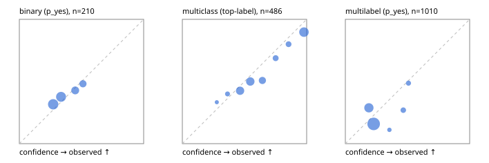

# Evaluation report

- model `Qwen/Qwen3-Reranker-0.6B` @ `e61197ed45` (shared-state cross-attention (custom-v1)), adapter/checkpoint `runs/custom_distill_lora/checkpoint`, prompt `custom-v1` (b96b6174a187)
- data data/hf.jsonl, data/eval.jsonl; splits ['validation']; n=868; calibration `None`
- cuda / float32; 2026-09-23T20:38:20+0000; wall 16.7s

## Overall

question accuracy 51.2%

**binary**: n 210, positives 79, accuracy 0.619, precision 0.481, recall 0.165, f1 0.245, auroc 0.581, brier 0.232, log_loss 0.656, ece 0.038

**multiclass**: n 486, accuracy 0.632, macro_f1 0.394, log_loss 0.959, brier 0.476, ece_top_label 0.068

**multilabel**: n 172, labels 1010, exact_match 0.041, micro_f1 0.143, macro_f1 0.195, label_auroc 0.453, brier 0.170, log_loss 0.525, ece 0.085

## By family

| family | n | question acc % | details |
|---|---|---|---|
| eval_adversarial | 14 | 35.7 | bin acc 14.3 F1 0.0 AUROC 0.200 ECE 0.434; mc acc 80.0 mF1 66.7 ECE 0.174; ml EM 0.0 µF1 50.0 ECE 0.259 |
| eval_agent_output | 20 | 50.0 | bin acc 58.3 F1 28.6 AUROC 0.639 ECE 0.149; mc acc 20.0 mF1 9.5 ECE 0.387; ml EM 66.7 µF1 0.0 ECE 0.216 |
| eval_evidence | 17 | 29.4 | bin acc 35.7 F1 30.8 AUROC 0.378 ECE 0.226; ml EM 0.0 µF1 0.0 ECE 0.199 |
| eval_multilabel | 12 | 16.7 | bin acc 100.0 F1 0.0 AUROC — ECE 0.479; mc acc 0.0 mF1 0.0 ECE 0.822; ml EM 11.1 µF1 57.1 ECE 0.081 |
| eval_policy | 24 | 33.3 | bin acc 41.7 F1 58.8 AUROC 0.314 ECE 0.095; mc acc 18.2 mF1 10.5 ECE 0.535; ml EM 100.0 µF1 100.0 ECE 0.497 |
| eval_routing | 16 | 50.0 | bin acc 42.9 F1 50.0 AUROC 0.400 ECE 0.219; mc acc 50.0 mF1 37.5 ECE 0.445; ml EM 100.0 µF1 0.0 ECE 0.446 |
| eval_urgency_sentiment | 15 | 66.7 | bin acc 71.4 F1 75.0 AUROC 0.750 ECE 0.342; mc acc 60.0 mF1 42.9 ECE 0.565; ml EM 66.7 µF1 66.7 ECE 0.359 |
| hf_emotions_multilabel | 150 | 0.0 | ml EM 0.0 µF1 0.0 ECE 0.077 |
| hf_intent_banking77 | 150 | 57.3 | mc acc 57.3 mF1 48.0 ECE 0.136 |
| hf_nli | 150 | 68.7 | bin acc 68.7 F1 0.0 AUROC 0.489 ECE 0.065 |
| hf_sentiment_tweets | 150 | 51.3 | mc acc 51.3 mF1 44.0 ECE 0.086 |
| hf_topic_agnews | 150 | 86.7 | mc acc 86.7 mF1 87.0 ECE 0.084 |

## by hard case

| slice | n | question acc % |
|---|---|---|
| (none) | 634 | 46.8 |
| contradiction | 63 | 92.1 |
| distractor | 20 | 30.0 |
| double_negation | 3 | 33.3 |
| evidence_end | 4 | 50.0 |
| evidence_middle | 7 | 42.9 |
| evidence_start | 3 | 100.0 |
| exception | 7 | 14.3 |
| hypothetical | 6 | 33.3 |
| injection | 16 | 75.0 |
| lexical_overlap | 13 | 38.5 |
| long_state | 26 | 34.6 |
| missing_evidence | 59 | 91.5 |
| multi_positive | 40 | 2.5 |
| multi_turn | 21 | 47.6 |
| negation | 9 | 33.3 |
| new_label_names | 5 | 20.0 |
| nota | 4 | 0.0 |
| numeric_reasoning | 13 | 38.5 |
| paraphrase | 10 | 40.0 |
| role_reversal | 7 | 14.3 |
| sarcasm | 5 | 40.0 |
| temporal_reasoning | 15 | 73.3 |
| zero_positive | 7 | 85.7 |

## by state tokens

| slice | n | question acc % |
|---|---|---|
| 00000-00127 | 796 | 52.0 |
| 00128-00511 | 46 | 45.7 |
| 00512-02047 | 26 | 34.6 |

## by candidates

| slice | n | question acc % |
|---|---|---|
| 01 | 210 | 61.9 |
| 03 | 162 | 51.2 |
| 04 | 174 | 81.0 |
| 05 | 13 | 30.8 |
| 06 | 159 | 0.0 |
| 08 | 150 | 57.3 |

## Paraphrase groups

5 groups; same prediction 60.0%; all correct 40.0%

## Multiclass abstention (coverage vs error on accepted)

| abstain_below | coverage % | error % |
|---|---|---|
| 0.0 | 100.0 | 36.8 |
| 0.4 | 95.7 | 35.7 |
| 0.5 | 76.3 | 30.2 |
| 0.6 | 55.3 | 22.7 |
| 0.7 | 42.8 | 14.9 |
| 0.8 | 36.2 | 11.9 |
| 0.9 | 30.0 | 10.3 |

## Reliability: binary

| bin | n | mean confidence | observed frequency |
|---|---|---|---|
| [0.2,0.3) | 79 | 0.272 | 0.316 |
| [0.3,0.4) | 69 | 0.336 | 0.377 |
| [0.4,0.5) | 35 | 0.450 | 0.429 |
| [0.5,0.6) | 27 | 0.511 | 0.481 |

## Reliability: multiclass

| bin | n | mean confidence | observed frequency |
|---|---|---|---|
| [0.2,0.3) | 6 | 0.277 | 0.333 |
| [0.3,0.4) | 15 | 0.363 | 0.400 |
| [0.4,0.5) | 94 | 0.464 | 0.426 |
| [0.5,0.6) | 102 | 0.547 | 0.500 |
| [0.6,0.7) | 61 | 0.644 | 0.508 |
| [0.7,0.8) | 32 | 0.751 | 0.688 |
| [0.8,0.9) | 30 | 0.855 | 0.800 |
| [0.9,1.0] | 146 | 0.978 | 0.897 |

## Reliability: multilabel

| bin | n | mean confidence | observed frequency |
|---|---|---|---|
| [0.1,0.2) | 281 | 0.189 | 0.288 |
| [0.2,0.3) | 622 | 0.228 | 0.159 |
| [0.3,0.4) | 18 | 0.355 | 0.111 |
| [0.4,0.5) | 52 | 0.466 | 0.269 |
| [0.5,0.6) | 37 | 0.508 | 0.486 |
