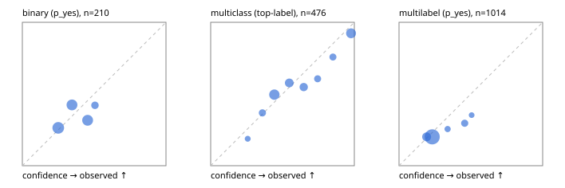

# Evaluation report

- model `Qwen/Qwen3-Reranker-0.6B` @ `e61197ed45` (shared-state cross-attention (custom-v1)), adapter/checkpoint `runs/custom_frozen/checkpoint`, prompt `custom-v1` (b96b6174a187)
- data data/hf.jsonl, data/eval.jsonl; splits ['calibration']; n=859; calibration `None`
- mps / float32; 2026-09-23T11:45:37-0700; wall 37.3s

## Overall

question accuracy 50.2%

**binary**: n 210, positives 71, accuracy 0.648, precision 0.421, recall 0.113, f1 0.178, auroc 0.560, brier 0.225, log_loss 0.642, ece 0.074

**multiclass**: n 476, accuracy 0.613, macro_f1 0.403, log_loss 0.933, brier 0.500, ece_top_label 0.062

**multilabel**: n 173, labels 1014, exact_match 0.017, micro_f1 0.095, macro_f1 0.146, label_auroc 0.544, brier 0.171, log_loss 0.525, ece 0.044

## By family

| family | n | question acc % | details |
|---|---|---|---|
| eval_adversarial | 19 | 52.6 | bin acc 57.1 F1 25.0 AUROC 0.510 ECE 0.229; mc acc 33.3 mF1 20.0 ECE 0.233; ml EM 50.0 µF1 0.0 ECE 0.322 |
| eval_agent_output | 9 | 11.1 | bin acc 0.0 F1 0.0 AUROC 0.000 ECE 0.510; mc acc 50.0 mF1 33.3 ECE 0.721; ml EM 0.0 µF1 0.0 ECE 0.024 |
| eval_evidence | 19 | 42.1 | bin acc 50.0 F1 33.3 AUROC 0.455 ECE 0.246; ml EM 0.0 µF1 26.7 ECE 0.156 |
| eval_multilabel | 12 | 25.0 | bin acc 50.0 F1 66.7 AUROC — ECE 0.504; mc acc 0.0 mF1 0.0 ECE 0.374; ml EM 25.0 µF1 50.0 ECE 0.193 |
| eval_policy | 16 | 31.2 | bin acc 50.0 F1 50.0 AUROC 0.667 ECE 0.123; mc acc 25.0 mF1 14.3 ECE 0.402; ml EM 0.0 µF1 44.4 ECE 0.221 |
| eval_routing | 15 | 33.3 | bin acc 42.9 F1 0.0 AUROC 0.167 ECE 0.099; mc acc 28.6 mF1 15.2 ECE 0.434; ml EM 0.0 µF1 0.0 ECE 0.015 |
| eval_urgency_sentiment | 19 | 52.6 | bin acc 100.0 F1 100.0 AUROC 1.000 ECE 0.464; mc acc 25.0 mF1 15.4 ECE 0.361; ml EM 0.0 µF1 0.0 ECE 0.073 |
| hf_emotions_multilabel | 150 | 0.0 | ml EM 0.0 µF1 0.0 ECE 0.029 |
| hf_intent_banking77 | 150 | 57.3 | mc acc 57.3 mF1 51.6 ECE 0.078 |
| hf_nli | 150 | 69.3 | bin acc 69.3 F1 0.0 AUROC 0.541 ECE 0.052 |
| hf_sentiment_tweets | 150 | 51.3 | mc acc 51.3 mF1 36.8 ECE 0.089 |
| hf_topic_agnews | 150 | 81.3 | mc acc 81.3 mF1 81.8 ECE 0.066 |

## by hard case

| slice | n | question acc % |
|---|---|---|
| (none) | 624 | 45.7 |
| contradiction | 58 | 94.8 |
| distractor | 25 | 36.0 |
| double_negation | 3 | 0.0 |
| evidence_end | 11 | 36.4 |
| evidence_middle | 6 | 33.3 |
| evidence_start | 7 | 71.4 |
| exception | 4 | 0.0 |
| hypothetical | 7 | 71.4 |
| injection | 6 | 33.3 |
| lexical_overlap | 16 | 56.2 |
| long_state | 42 | 38.1 |
| missing_evidence | 62 | 95.2 |
| multi_positive | 42 | 0.0 |
| multi_turn | 12 | 33.3 |
| negation | 12 | 58.3 |
| new_label_names | 5 | 20.0 |
| nota | 4 | 50.0 |
| numeric_reasoning | 15 | 13.3 |
| paraphrase | 10 | 50.0 |
| role_reversal | 13 | 46.2 |
| sarcasm | 1 | 0.0 |
| temporal_reasoning | 14 | 42.9 |
| zero_positive | 4 | 75.0 |

## by state tokens

| slice | n | question acc % |
|---|---|---|
| 00000-00127 | 780 | 51.5 |
| 00128-00511 | 37 | 35.1 |
| 00512-02047 | 42 | 38.1 |

## by candidates

| slice | n | question acc % |
|---|---|---|
| 01 | 210 | 64.8 |
| 03 | 158 | 50.0 |
| 04 | 168 | 75.6 |
| 05 | 15 | 20.0 |
| 06 | 157 | 0.0 |
| 07 | 1 | 0.0 |
| 08 | 150 | 57.3 |

## Paraphrase groups

5 groups; same prediction 80.0%; all correct 40.0%

## Multiclass abstention (coverage vs error on accepted)

| abstain_below | coverage % | error % |
|---|---|---|
| 0.0 | 100.0 | 38.7 |
| 0.4 | 88.7 | 34.8 |
| 0.5 | 63.7 | 28.7 |
| 0.6 | 48.7 | 24.6 |
| 0.7 | 35.7 | 17.1 |
| 0.8 | 28.8 | 11.7 |
| 0.9 | 21.8 | 7.7 |

## Reliability: binary

| bin | n | mean confidence | observed frequency |
|---|---|---|---|
| [0.2,0.3) | 72 | 0.250 | 0.264 |
| [0.3,0.4) | 59 | 0.346 | 0.424 |
| [0.4,0.5) | 60 | 0.454 | 0.317 |
| [0.5,0.6) | 19 | 0.506 | 0.421 |

## Reliability: multiclass

| bin | n | mean confidence | observed frequency |
|---|---|---|---|
| [0.2,0.3) | 16 | 0.258 | 0.188 |
| [0.3,0.4) | 38 | 0.360 | 0.368 |
| [0.4,0.5) | 119 | 0.443 | 0.496 |
| [0.5,0.6) | 71 | 0.547 | 0.577 |
| [0.6,0.7) | 62 | 0.648 | 0.548 |
| [0.7,0.8) | 33 | 0.744 | 0.606 |
| [0.8,0.9) | 33 | 0.851 | 0.758 |
| [0.9,1.0] | 104 | 0.977 | 0.923 |

## Reliability: multilabel

| bin | n | mean confidence | observed frequency |
|---|---|---|---|
| [0.1,0.2) | 159 | 0.192 | 0.201 |
| [0.2,0.3) | 697 | 0.231 | 0.201 |
| [0.3,0.4) | 43 | 0.338 | 0.256 |
| [0.4,0.5) | 81 | 0.457 | 0.296 |
| [0.5,0.6) | 34 | 0.505 | 0.353 |
