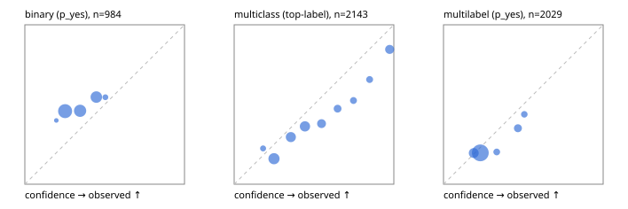

# Evaluation report

- model `Qwen/Qwen3-Reranker-0.6B` @ `e61197ed45` (shared-state cross-attention (custom-v1)), adapter/checkpoint `runs/custom_frozen/checkpoint`, prompt `custom-v1` (b96b6174a187)
- data data/hf.jsonl, data/eval.jsonl; splits ['test']; n=3471; calibration `None`
- mps / float32; 2026-09-23T11:48:07-0700; wall 147.1s

## Overall

question accuracy 39.0%

**binary**: n 984, positives 475, accuracy 0.519, precision 0.545, recall 0.025, f1 0.048, auroc 0.536, brier 0.274, log_loss 0.748, ece 0.148

**multiclass**: n 2143, accuracy 0.391, macro_f1 0.249, log_loss 1.544, brier 0.726, ece_top_label 0.112

**multilabel**: n 344, labels 2029, exact_match 0.012, micro_f1 0.125, macro_f1 0.176, label_auroc 0.565, brier 0.169, log_loss 0.520, ece 0.041

## By family

| family | n | question acc % | details |
|---|---|---|---|
| eval_adversarial | 27 | 44.4 | bin acc 60.0 F1 25.0 AUROC 0.537 ECE 0.045; mc acc 14.3 mF1 10.0 ECE 0.580; ml EM 40.0 µF1 50.0 ECE 0.223 |
| eval_agent_output | 26 | 26.9 | bin acc 35.7 F1 0.0 AUROC 0.592 ECE 0.182; mc acc 14.3 mF1 7.4 ECE 0.387; ml EM 20.0 µF1 0.0 ECE 0.095 |
| eval_evidence | 17 | 58.8 | bin acc 66.7 F1 28.6 AUROC 0.460 ECE 0.139; ml EM 0.0 µF1 0.0 ECE 0.206 |
| eval_multilabel | 32 | 12.5 | bin acc 42.9 F1 33.3 AUROC 0.500 ECE 0.101; mc acc 0.0 mF1 0.0 ECE 0.253; ml EM 4.2 µF1 40.4 ECE 0.117 |
| eval_policy | 22 | 40.9 | bin acc 61.5 F1 61.5 AUROC 0.571 ECE 0.107; mc acc 20.0 mF1 8.3 ECE 0.262; ml EM 0.0 µF1 69.6 ECE 0.027 |
| eval_routing | 25 | 48.0 | bin acc 80.0 F1 66.7 AUROC 0.792 ECE 0.233; mc acc 30.8 mF1 17.6 ECE 0.425; ml EM 0.0 µF1 0.0 ECE 0.148 |
| eval_urgency_sentiment | 22 | 36.4 | bin acc 40.0 F1 0.0 AUROC 0.333 ECE 0.159; mc acc 40.0 mF1 36.2 ECE 0.279; ml EM 0.0 µF1 0.0 ECE 0.043 |
| heldout_boolq | 300 | 41.0 | bin acc 41.0 F1 3.3 AUROC 0.518 ECE 0.206 |
| heldout_emotion_multiclass | 300 | 15.0 | mc acc 15.0 mF1 8.1 ECE 0.102 |
| heldout_intent_clinc | 300 | 20.7 | mc acc 20.7 mF1 13.2 ECE 0.142 |
| heldout_question_type_trec | 300 | 27.3 | mc acc 27.3 mF1 13.0 ECE 0.145 |
| heldout_sentiment_sst2 | 300 | 50.0 | bin acc 50.0 F1 0.0 AUROC 0.476 ECE 0.239 |
| heldout_topic_dbpedia | 300 | 25.7 | mc acc 25.7 mF1 20.0 ECE 0.298 |
| hf_emotions_multilabel | 300 | 0.0 | ml EM 0.0 µF1 0.0 ECE 0.033 |
| hf_intent_banking77 | 300 | 57.7 | mc acc 57.7 mF1 51.6 ECE 0.040 |
| hf_nli | 300 | 63.7 | bin acc 63.7 F1 0.0 AUROC 0.532 ECE 0.050 |
| hf_sentiment_tweets | 300 | 41.7 | mc acc 41.7 mF1 29.6 ECE 0.080 |
| hf_topic_agnews | 300 | 87.7 | mc acc 87.7 mF1 87.5 ECE 0.048 |

## by hard case

| slice | n | question acc % |
|---|---|---|
| (none) | 3042 | 35.7 |
| contradiction | 107 | 95.3 |
| distractor | 33 | 30.3 |
| double_negation | 6 | 66.7 |
| evidence_end | 13 | 23.1 |
| evidence_middle | 11 | 18.2 |
| evidence_start | 9 | 44.4 |
| exception | 7 | 42.9 |
| hypothetical | 7 | 42.9 |
| injection | 10 | 60.0 |
| lexical_overlap | 20 | 40.0 |
| long_state | 50 | 36.0 |
| missing_evidence | 104 | 98.1 |
| multi_positive | 81 | 1.2 |
| multi_turn | 9 | 33.3 |
| negation | 30 | 36.7 |
| new_label_names | 3 | 66.7 |
| nota | 46 | 43.5 |
| numeric_reasoning | 16 | 68.8 |
| paraphrase | 22 | 18.2 |
| role_reversal | 15 | 46.7 |
| sarcasm | 12 | 25.0 |
| temporal_reasoning | 29 | 41.4 |
| zero_positive | 6 | 50.0 |

## by state tokens

| slice | n | question acc % |
|---|---|---|
| 00000-00127 | 3211 | 39.2 |
| 00128-00511 | 208 | 35.6 |
| 00512-02047 | 52 | 38.5 |

## by candidates

| slice | n | question acc % |
|---|---|---|
| 01 | 984 | 51.9 |
| 03 | 310 | 41.0 |
| 04 | 333 | 81.4 |
| 05 | 22 | 13.6 |
| 06 | 1218 | 16.9 |
| 07 | 49 | 40.8 |
| 08 | 555 | 38.7 |

## Paraphrase groups

11 groups; same prediction 63.6%; all correct 9.1%

## Multiclass abstention (coverage vs error on accepted)

| abstain_below | coverage % | error % |
|---|---|---|
| 0.0 | 100.0 | 60.9 |
| 0.4 | 57.8 | 48.3 |
| 0.5 | 39.8 | 41.3 |
| 0.6 | 28.5 | 33.1 |
| 0.7 | 21.3 | 26.5 |
| 0.8 | 16.7 | 20.7 |
| 0.9 | 12.1 | 15.4 |

## Reliability: binary

| bin | n | mean confidence | observed frequency |
|---|---|---|---|
| [0.1,0.2) | 5 | 0.197 | 0.400 |
| [0.2,0.3) | 419 | 0.252 | 0.458 |
| [0.3,0.4) | 293 | 0.346 | 0.461 |
| [0.4,0.5) | 245 | 0.448 | 0.547 |
| [0.5,0.6) | 22 | 0.505 | 0.545 |

## Reliability: multiclass

| bin | n | mean confidence | observed frequency |
|---|---|---|---|
| [0.1,0.2) | 49 | 0.181 | 0.224 |
| [0.2,0.3) | 493 | 0.250 | 0.160 |
| [0.3,0.4) | 362 | 0.355 | 0.296 |
| [0.4,0.5) | 386 | 0.444 | 0.363 |
| [0.5,0.6) | 242 | 0.547 | 0.380 |
| [0.6,0.7) | 154 | 0.648 | 0.474 |
| [0.7,0.8) | 99 | 0.747 | 0.525 |
| [0.8,0.9) | 99 | 0.848 | 0.657 |
| [0.9,1.0] | 259 | 0.974 | 0.846 |

## Reliability: multilabel

| bin | n | mean confidence | observed frequency |
|---|---|---|---|
| [0.1,0.2) | 327 | 0.189 | 0.196 |
| [0.2,0.3) | 1394 | 0.231 | 0.197 |
| [0.3,0.4) | 84 | 0.333 | 0.202 |
| [0.4,0.5) | 151 | 0.466 | 0.351 |
| [0.5,0.6) | 73 | 0.506 | 0.438 |
