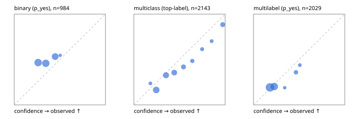

# Evaluation report

- model `Qwen/Qwen3-Reranker-0.6B` @ `e61197ed45` (shared-state cross-attention (custom-v1)), adapter/checkpoint `runs/custom_frozen/checkpoint`, prompt `custom-v1` (b96b6174a187)
- data data/hf.jsonl, data/eval.jsonl; splits ['test']; n=3471; calibration `{'method': 'temperature scaling per output type, grid search on NLL', 'min_n': 30, 'model': 'Qwen/Qwen3-Reranker-0.6B', 'revision': 'e61197ed45024b0ed8a2d74b80b4d909f1255473', 'adapter': 'runs/custom_frozen/checkpoint', 'adapter_sha256': '7dc0cabbb31e493be19da6dd6d91784c1c6087b90c75c8c33178f4ff48fa438a', 'prompt_sha': 'b96b6174a187', 'fit_report': 'reports/custom_frozen/calibration/report.json', 'fit_report_sha256': 'dc2c52564521b87b42eb909f79543cdace1d24d41f7dfc46d2c7f8ba2b919388', 'fit_data': [{'path': 'data/hf.jsonl', 'sha256': 'fe29b29286d5a372271e925825e8b9794f3f64be9a9fc04cad458b4b94ada510'}, {'path': 'data/eval.jsonl', 'sha256': 'be888eb38dcca063823924430e03985ddf2186b874e792d5734936ba93ba6910'}], 'created': '2026-09-23T11:48:09-0700', 'n': {'binary': 210, 'multiclass': 476, 'multilabel': 1014}, 'nll_before': {'binary': 0.6419658697203049, 'multiclass': 0.9332753833812846, 'multilabel': 0.5252202738626472}, 'nll_after': {'binary': 0.6414943117487201, 'multiclass': 0.927911837117371, 'multilabel': 0.5236014620649194}, 'skipped': {}, 'threshold_report': 'reports/custom_frozen/validation/report.json', 'threshold_report_sha256': '49ac047f890fea5641d3f28e8f49a435dd06291e8d3f04137379e1511dfd36c8', 'threshold_rule': 'max F1 on validation after temperature scaling', 'file': 'calib/custom_frozen.json', 'file_sha256': 'c51b272d69476a8af38b3a7de0df119cd7f666a1f28ed32de1d45ec78c9bc798'}`
- mps / float32; 2026-09-23T11:50:35-0700; wall 143.3s

## Overall

question accuracy 38.1%

**binary**: n 984, positives 475, accuracy 0.491, precision 0.484, recall 0.842, f1 0.615, auroc 0.536, brier 0.269, log_loss 0.737, ece 0.136

**multiclass**: n 2143, accuracy 0.391, macro_f1 0.249, log_loss 1.505, brier 0.715, ece_top_label 0.085

**multilabel**: n 344, labels 2029, exact_match 0.000, micro_f1 0.354, macro_f1 0.373, label_auroc 0.565, brier 0.168, log_loss 0.518, ece 0.029

## By family

| family | n | question acc % | details |
|---|---|---|---|
| eval_adversarial | 27 | 25.9 | bin acc 40.0 F1 57.1 AUROC 0.537 ECE 0.049; mc acc 14.3 mF1 10.0 ECE 0.560; ml EM 0.0 µF1 56.2 ECE 0.221 |
| eval_agent_output | 26 | 30.8 | bin acc 50.0 F1 66.7 AUROC 0.592 ECE 0.178; mc acc 14.3 mF1 7.4 ECE 0.349; ml EM 0.0 µF1 55.2 ECE 0.092 |
| eval_evidence | 17 | 29.4 | bin acc 33.3 F1 50.0 AUROC 0.460 ECE 0.142; ml EM 0.0 µF1 42.9 ECE 0.203 |
| eval_multilabel | 32 | 9.4 | bin acc 42.9 F1 60.0 AUROC 0.500 ECE 0.098; mc acc 0.0 mF1 0.0 ECE 0.246; ml EM 0.0 µF1 52.6 ECE 0.114 |
| eval_policy | 22 | 31.8 | bin acc 46.2 F1 63.2 AUROC 0.571 ECE 0.108; mc acc 20.0 mF1 8.3 ECE 0.237; ml EM 0.0 µF1 69.6 ECE 0.026 |
| eval_routing | 25 | 32.0 | bin acc 40.0 F1 57.1 AUROC 0.792 ECE 0.239; mc acc 30.8 mF1 17.6 ECE 0.479; ml EM 0.0 µF1 50.0 ECE 0.146 |
| eval_urgency_sentiment | 22 | 45.5 | bin acc 60.0 F1 75.0 AUROC 0.333 ECE 0.154; mc acc 40.0 mF1 36.2 ECE 0.267; ml EM 0.0 µF1 66.7 ECE 0.048 |
| heldout_boolq | 300 | 59.3 | bin acc 59.3 F1 74.5 AUROC 0.518 ECE 0.197 |
| heldout_emotion_multiclass | 300 | 15.0 | mc acc 15.0 mF1 8.1 ECE 0.090 |
| heldout_intent_clinc | 300 | 20.7 | mc acc 20.7 mF1 13.2 ECE 0.127 |
| heldout_question_type_trec | 300 | 27.3 | mc acc 27.3 mF1 13.0 ECE 0.112 |
| heldout_sentiment_sst2 | 300 | 48.3 | bin acc 48.3 F1 56.1 AUROC 0.476 ECE 0.220 |
| heldout_topic_dbpedia | 300 | 25.7 | mc acc 25.7 mF1 20.0 ECE 0.257 |
| hf_emotions_multilabel | 300 | 0.0 | ml EM 0.0 µF1 32.4 ECE 0.021 |
| hf_intent_banking77 | 300 | 57.7 | mc acc 57.7 mF1 51.6 ECE 0.084 |
| hf_nli | 300 | 41.0 | bin acc 41.0 F1 49.3 AUROC 0.532 ECE 0.041 |
| hf_sentiment_tweets | 300 | 41.7 | mc acc 41.7 mF1 29.6 ECE 0.063 |
| hf_topic_agnews | 300 | 87.7 | mc acc 87.7 mF1 87.5 ECE 0.050 |

## by hard case

| slice | n | question acc % |
|---|---|---|
| (none) | 3042 | 40.5 |
| contradiction | 107 | 15.9 |
| distractor | 33 | 18.2 |
| double_negation | 6 | 16.7 |
| evidence_end | 13 | 30.8 |
| evidence_middle | 11 | 36.4 |
| evidence_start | 9 | 55.6 |
| exception | 7 | 28.6 |
| hypothetical | 7 | 14.3 |
| injection | 10 | 0.0 |
| lexical_overlap | 20 | 5.0 |
| long_state | 50 | 34.0 |
| missing_evidence | 104 | 20.2 |
| multi_positive | 81 | 0.0 |
| multi_turn | 9 | 33.3 |
| negation | 30 | 6.7 |
| new_label_names | 3 | 66.7 |
| nota | 46 | 43.5 |
| numeric_reasoning | 16 | 43.8 |
| paraphrase | 22 | 18.2 |
| role_reversal | 15 | 20.0 |
| sarcasm | 12 | 8.3 |
| temporal_reasoning | 29 | 27.6 |
| zero_positive | 6 | 0.0 |

## by state tokens

| slice | n | question acc % |
|---|---|---|
| 00000-00127 | 3211 | 37.5 |
| 00128-00511 | 208 | 47.6 |
| 00512-02047 | 52 | 32.7 |

## by candidates

| slice | n | question acc % |
|---|---|---|
| 01 | 984 | 49.1 |
| 03 | 310 | 41.0 |
| 04 | 333 | 80.8 |
| 05 | 22 | 4.5 |
| 06 | 1218 | 16.9 |
| 07 | 49 | 40.8 |
| 08 | 555 | 38.7 |

## Paraphrase groups

11 groups; same prediction 45.5%; all correct 9.1%

## Multiclass abstention (coverage vs error on accepted)

| abstain_below | coverage % | error % |
|---|---|---|
| 0.0 | 100.0 | 60.9 |
| 0.4 | 52.1 | 46.6 |
| 0.5 | 34.8 | 37.7 |
| 0.6 | 24.5 | 29.1 |
| 0.7 | 18.7 | 22.2 |
| 0.8 | 14.0 | 16.7 |
| 0.9 | 10.1 | 11.6 |

## Reliability: binary

| bin | n | mean confidence | observed frequency |
|---|---|---|---|
| [0.2,0.3) | 354 | 0.262 | 0.466 |
| [0.3,0.4) | 345 | 0.346 | 0.458 |
| [0.4,0.5) | 263 | 0.449 | 0.532 |
| [0.5,0.6) | 22 | 0.504 | 0.545 |

## Reliability: multiclass

| bin | n | mean confidence | observed frequency |
|---|---|---|---|
| [0.1,0.2) | 76 | 0.181 | 0.237 |
| [0.2,0.3) | 535 | 0.245 | 0.164 |
| [0.3,0.4) | 416 | 0.352 | 0.327 |
| [0.4,0.5) | 371 | 0.443 | 0.356 |
| [0.5,0.6) | 220 | 0.544 | 0.418 |
| [0.6,0.7) | 124 | 0.640 | 0.484 |
| [0.7,0.8) | 101 | 0.748 | 0.614 |
| [0.8,0.9) | 84 | 0.852 | 0.702 |
| [0.9,1.0] | 216 | 0.973 | 0.884 |

## Reliability: multilabel

| bin | n | mean confidence | observed frequency |
|---|---|---|---|
| [0.1,0.2) | 1022 | 0.180 | 0.193 |
| [0.2,0.3) | 736 | 0.227 | 0.202 |
| [0.3,0.4) | 53 | 0.341 | 0.189 |
| [0.4,0.5) | 145 | 0.465 | 0.359 |
| [0.5,0.6) | 73 | 0.507 | 0.438 |
