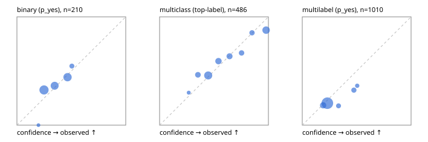

# Evaluation report

- model `Qwen/Qwen3-Reranker-0.6B` @ `e61197ed45` (shared-state cross-attention (custom-v1)), adapter/checkpoint `runs/custom_frozen/checkpoint`, prompt `custom-v1` (b96b6174a187)
- data data/hf.jsonl, data/eval.jsonl; splits ['validation']; n=868; calibration `None`
- mps / float32; 2026-09-23T11:44:57-0700; wall 36.7s

## Overall

question accuracy 51.2%

**binary**: n 210, positives 79, accuracy 0.629, precision 0.545, recall 0.076, f1 0.133, auroc 0.574, brier 0.233, log_loss 0.661, ece 0.045

**multiclass**: n 486, accuracy 0.630, macro_f1 0.499, log_loss 0.963, brier 0.496, ece_top_label 0.051

**multilabel**: n 172, labels 1010, exact_match 0.035, micro_f1 0.097, macro_f1 0.138, label_auroc 0.536, brier 0.169, log_loss 0.521, ece 0.044

## By family

| family | n | question acc % | details |
|---|---|---|---|
| eval_adversarial | 14 | 35.7 | bin acc 28.6 F1 0.0 AUROC 0.300 ECE 0.323; mc acc 60.0 mF1 42.9 ECE 0.175; ml EM 0.0 µF1 0.0 ECE 0.028 |
| eval_agent_output | 20 | 45.0 | bin acc 58.3 F1 28.6 AUROC 0.833 ECE 0.317; mc acc 0.0 mF1 0.0 ECE 0.551; ml EM 66.7 µF1 0.0 ECE 0.258 |
| eval_evidence | 17 | 47.1 | bin acc 57.1 F1 25.0 AUROC 0.556 ECE 0.126; ml EM 0.0 µF1 42.9 ECE 0.247 |
| eval_multilabel | 12 | 25.0 | bin acc 100.0 F1 0.0 AUROC — ECE 0.476; mc acc 50.0 mF1 33.3 ECE 0.409; ml EM 11.1 µF1 35.0 ECE 0.077 |
| eval_policy | 24 | 41.7 | bin acc 50.0 F1 50.0 AUROC 0.571 ECE 0.087; mc acc 36.4 mF1 23.5 ECE 0.391; ml EM 0.0 µF1 66.7 ECE 0.008 |
| eval_routing | 16 | 62.5 | bin acc 42.9 F1 33.3 AUROC 0.600 ECE 0.247; mc acc 75.0 mF1 66.7 ECE 0.228; ml EM 100.0 µF1 0.0 ECE 0.449 |
| eval_urgency_sentiment | 15 | 46.7 | bin acc 28.6 F1 0.0 AUROC 0.417 ECE 0.361; mc acc 60.0 mF1 42.9 ECE 0.561; ml EM 66.7 µF1 0.0 ECE 0.368 |
| hf_emotions_multilabel | 150 | 0.0 | ml EM 0.0 µF1 0.0 ECE 0.030 |
| hf_intent_banking77 | 150 | 66.0 | mc acc 66.0 mF1 60.0 ECE 0.120 |
| hf_nli | 150 | 68.7 | bin acc 68.7 F1 0.0 AUROC 0.488 ECE 0.089 |
| hf_sentiment_tweets | 150 | 44.7 | mc acc 44.7 mF1 31.5 ECE 0.077 |
| hf_topic_agnews | 150 | 82.0 | mc acc 82.0 mF1 82.6 ECE 0.064 |

## by hard case

| slice | n | question acc % |
|---|---|---|
| (none) | 634 | 46.4 |
| contradiction | 63 | 96.8 |
| distractor | 20 | 25.0 |
| double_negation | 3 | 66.7 |
| evidence_end | 4 | 50.0 |
| evidence_middle | 7 | 28.6 |
| evidence_start | 3 | 66.7 |
| exception | 7 | 28.6 |
| hypothetical | 6 | 66.7 |
| injection | 16 | 56.2 |
| lexical_overlap | 13 | 61.5 |
| long_state | 26 | 30.8 |
| missing_evidence | 59 | 96.6 |
| multi_positive | 40 | 0.0 |
| multi_turn | 21 | 42.9 |
| negation | 9 | 22.2 |
| new_label_names | 5 | 20.0 |
| nota | 4 | 25.0 |
| numeric_reasoning | 13 | 53.8 |
| paraphrase | 10 | 20.0 |
| role_reversal | 7 | 42.9 |
| sarcasm | 5 | 40.0 |
| temporal_reasoning | 15 | 46.7 |
| zero_positive | 7 | 85.7 |

## by state tokens

| slice | n | question acc % |
|---|---|---|
| 00000-00127 | 796 | 51.9 |
| 00128-00511 | 46 | 50.0 |
| 00512-02047 | 26 | 30.8 |

## by candidates

| slice | n | question acc % |
|---|---|---|
| 01 | 210 | 62.9 |
| 03 | 162 | 45.7 |
| 04 | 174 | 78.7 |
| 05 | 13 | 15.4 |
| 06 | 159 | 0.0 |
| 08 | 150 | 66.0 |

## Paraphrase groups

5 groups; same prediction 40.0%; all correct 0.0%

## Multiclass abstention (coverage vs error on accepted)

| abstain_below | coverage % | error % |
|---|---|---|
| 0.0 | 100.0 | 37.0 |
| 0.4 | 89.1 | 34.6 |
| 0.5 | 61.7 | 26.0 |
| 0.6 | 48.1 | 21.8 |
| 0.7 | 36.8 | 17.3 |
| 0.8 | 28.8 | 12.9 |
| 0.9 | 21.8 | 12.3 |

## Reliability: binary

| bin | n | mean confidence | observed frequency |
|---|---|---|---|
| [0.1,0.2) | 3 | 0.198 | 0.000 |
| [0.2,0.3) | 80 | 0.249 | 0.325 |
| [0.3,0.4) | 55 | 0.347 | 0.364 |
| [0.4,0.5) | 61 | 0.465 | 0.443 |
| [0.5,0.6) | 11 | 0.505 | 0.545 |

## Reliability: multiclass

| bin | n | mean confidence | observed frequency |
|---|---|---|---|
| [0.2,0.3) | 10 | 0.268 | 0.300 |
| [0.3,0.4) | 43 | 0.352 | 0.465 |
| [0.4,0.5) | 133 | 0.447 | 0.459 |
| [0.5,0.6) | 66 | 0.541 | 0.591 |
| [0.6,0.7) | 55 | 0.643 | 0.636 |
| [0.7,0.8) | 39 | 0.754 | 0.667 |
| [0.8,0.9) | 34 | 0.849 | 0.853 |
| [0.9,1.0] | 106 | 0.979 | 0.877 |

## Reliability: multilabel

| bin | n | mean confidence | observed frequency |
|---|---|---|---|
| [0.1,0.2) | 131 | 0.191 | 0.183 |
| [0.2,0.3) | 725 | 0.230 | 0.203 |
| [0.3,0.4) | 56 | 0.334 | 0.179 |
| [0.4,0.5) | 65 | 0.474 | 0.323 |
| [0.5,0.6) | 33 | 0.505 | 0.364 |
