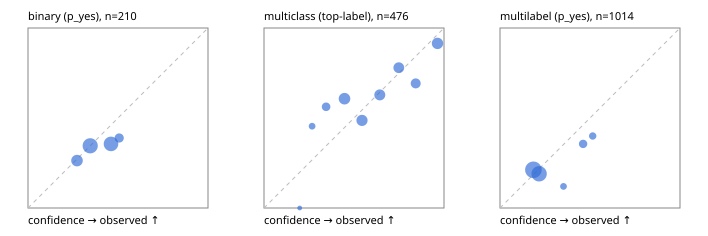

# Evaluation report

- model `Qwen/Qwen3-Reranker-0.6B` @ `e61197ed45` (shared-state cross-attention (custom-v1)), adapter/checkpoint `runs/custom_sim_frozen/checkpoint`, prompt `custom-v1` (b96b6174a187)
- data data/hf.jsonl, data/eval.jsonl; splits ['calibration']; n=859; calibration `None`
- cuda / float32; 2026-09-23T20:49:35+0000; wall 14.4s

## Overall

question accuracy 53.2%

**binary**: n 210, positives 71, accuracy 0.643, precision 0.389, recall 0.099, f1 0.157, auroc 0.553, brier 0.226, log_loss 0.644, ece 0.048

**multiclass**: n 476, accuracy 0.670, macro_f1 0.514, log_loss 0.919, brier 0.480, ece_top_label 0.088

**multilabel**: n 173, labels 1014, exact_match 0.017, micro_f1 0.110, macro_f1 0.175, label_auroc 0.533, brier 0.169, log_loss 0.521, ece 0.040

## By family

| family | n | question acc % | details |
|---|---|---|---|
| eval_adversarial | 19 | 52.6 | bin acc 57.1 F1 25.0 AUROC 0.449 ECE 0.202; mc acc 33.3 mF1 20.0 ECE 0.326; ml EM 50.0 µF1 0.0 ECE 0.299 |
| eval_agent_output | 9 | 22.2 | bin acc 40.0 F1 40.0 AUROC 0.333 ECE 0.110; mc acc 0.0 mF1 0.0 ECE 0.577; ml EM 0.0 µF1 28.6 ECE 0.062 |
| eval_evidence | 19 | 42.1 | bin acc 50.0 F1 20.0 AUROC 0.418 ECE 0.199; ml EM 0.0 µF1 15.4 ECE 0.169 |
| eval_multilabel | 12 | 33.3 | bin acc 50.0 F1 66.7 AUROC — ECE 0.493; mc acc 50.0 mF1 33.3 ECE 0.271; ml EM 25.0 µF1 64.0 ECE 0.228 |
| eval_policy | 16 | 43.8 | bin acc 62.5 F1 57.1 AUROC 0.867 ECE 0.121; mc acc 50.0 mF1 33.3 ECE 0.528; ml EM 0.0 µF1 50.0 ECE 0.223 |
| eval_routing | 15 | 33.3 | bin acc 42.9 F1 0.0 AUROC 0.250 ECE 0.094; mc acc 28.6 mF1 20.0 ECE 0.588; ml EM 0.0 µF1 0.0 ECE 0.030 |
| eval_urgency_sentiment | 19 | 42.1 | bin acc 75.0 F1 50.0 AUROC 0.833 ECE 0.223; mc acc 25.0 mF1 15.4 ECE 0.541; ml EM 0.0 µF1 0.0 ECE 0.068 |
| hf_emotions_multilabel | 150 | 0.0 | ml EM 0.0 µF1 0.0 ECE 0.027 |
| hf_intent_banking77 | 150 | 76.0 | mc acc 76.0 mF1 67.8 ECE 0.187 |
| hf_nli | 150 | 68.0 | bin acc 68.0 F1 0.0 AUROC 0.533 ECE 0.044 |
| hf_sentiment_tweets | 150 | 50.7 | mc acc 50.7 mF1 35.5 ECE 0.172 |
| hf_topic_agnews | 150 | 80.7 | mc acc 80.7 mF1 80.7 ECE 0.088 |

## by hard case

| slice | n | question acc % |
|---|---|---|
| (none) | 624 | 50.0 |
| contradiction | 58 | 91.4 |
| distractor | 25 | 32.0 |
| double_negation | 3 | 0.0 |
| evidence_end | 11 | 27.3 |
| evidence_middle | 6 | 0.0 |
| evidence_start | 7 | 28.6 |
| exception | 4 | 25.0 |
| hypothetical | 7 | 28.6 |
| injection | 6 | 33.3 |
| lexical_overlap | 16 | 62.5 |
| long_state | 42 | 35.7 |
| missing_evidence | 62 | 96.8 |
| multi_positive | 42 | 0.0 |
| multi_turn | 12 | 33.3 |
| negation | 12 | 50.0 |
| new_label_names | 5 | 40.0 |
| nota | 4 | 75.0 |
| numeric_reasoning | 15 | 33.3 |
| paraphrase | 10 | 40.0 |
| role_reversal | 13 | 53.8 |
| sarcasm | 1 | 0.0 |
| temporal_reasoning | 14 | 35.7 |
| zero_positive | 4 | 75.0 |

## by state tokens

| slice | n | question acc % |
|---|---|---|
| 00000-00127 | 780 | 55.3 |
| 00128-00511 | 37 | 29.7 |
| 00512-02047 | 42 | 35.7 |

## by candidates

| slice | n | question acc % |
|---|---|---|
| 01 | 210 | 64.3 |
| 03 | 158 | 49.4 |
| 04 | 168 | 75.0 |
| 05 | 15 | 26.7 |
| 06 | 157 | 0.0 |
| 07 | 1 | 0.0 |
| 08 | 150 | 76.0 |

## Paraphrase groups

5 groups; same prediction 100.0%; all correct 40.0%

## Multiclass abstention (coverage vs error on accepted)

| abstain_below | coverage % | error % |
|---|---|---|
| 0.0 | 100.0 | 33.0 |
| 0.4 | 90.8 | 31.5 |
| 0.5 | 73.1 | 29.6 |
| 0.6 | 57.1 | 23.5 |
| 0.7 | 42.4 | 18.8 |
| 0.8 | 28.2 | 17.2 |
| 0.9 | 17.2 | 8.5 |

## Reliability: binary

| bin | n | mean confidence | observed frequency |
|---|---|---|---|
| [0.2,0.3) | 38 | 0.272 | 0.263 |
| [0.3,0.4) | 81 | 0.346 | 0.346 |
| [0.4,0.5) | 73 | 0.461 | 0.356 |
| [0.5,0.6) | 18 | 0.507 | 0.389 |

## Reliability: multiclass

| bin | n | mean confidence | observed frequency |
|---|---|---|---|
| [0.1,0.2) | 1 | 0.198 | 0.000 |
| [0.2,0.3) | 11 | 0.267 | 0.455 |
| [0.3,0.4) | 32 | 0.345 | 0.562 |
| [0.4,0.5) | 84 | 0.447 | 0.607 |
| [0.5,0.6) | 76 | 0.545 | 0.487 |
| [0.6,0.7) | 70 | 0.643 | 0.629 |
| [0.7,0.8) | 68 | 0.749 | 0.779 |
| [0.8,0.9) | 52 | 0.843 | 0.692 |
| [0.9,1.0] | 82 | 0.964 | 0.915 |

## Reliability: multilabel

| bin | n | mean confidence | observed frequency |
|---|---|---|---|
| [0.1,0.2) | 495 | 0.185 | 0.212 |
| [0.2,0.3) | 400 | 0.217 | 0.190 |
| [0.3,0.4) | 25 | 0.353 | 0.120 |
| [0.4,0.5) | 59 | 0.461 | 0.356 |
| [0.5,0.6) | 35 | 0.515 | 0.400 |
