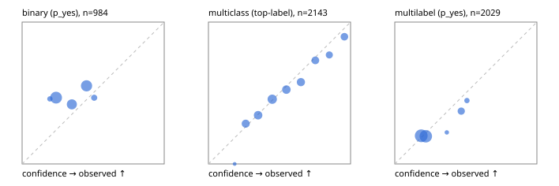

# Evaluation report

- model `Qwen/Qwen3-Reranker-0.6B` @ `e61197ed45` (shared-state cross-attention (custom-v1)), adapter/checkpoint `runs/custom_sim_frozen/checkpoint`, prompt `custom-v1` (b96b6174a187)
- data data/hf.jsonl, data/eval.jsonl; splits ['test']; n=3471; calibration `None`
- cuda / float32; 2026-09-23T20:50:37+0000; wall 54.1s

## Overall

question accuracy 48.0%

**binary**: n 984, positives 475, accuracy 0.514, precision 0.467, recall 0.044, f1 0.081, auroc 0.524, brier 0.274, log_loss 0.751, ece 0.141

**multiclass**: n 2143, accuracy 0.539, macro_f1 0.543, log_loss 1.175, brier 0.590, ece_top_label 0.033

**multilabel**: n 344, labels 2029, exact_match 0.015, micro_f1 0.086, macro_f1 0.130, label_auroc 0.544, brier 0.168, log_loss 0.518, ece 0.026

## By family

| family | n | question acc % | details |
|---|---|---|---|
| eval_adversarial | 27 | 51.9 | bin acc 60.0 F1 0.0 AUROC 0.648 ECE 0.060; mc acc 57.1 mF1 40.7 ECE 0.367; ml EM 20.0 µF1 0.0 ECE 0.067 |
| eval_agent_output | 26 | 34.6 | bin acc 50.0 F1 46.2 AUROC 0.449 ECE 0.013; mc acc 14.3 mF1 7.4 ECE 0.693; ml EM 20.0 µF1 33.3 ECE 0.117 |
| eval_evidence | 17 | 52.9 | bin acc 53.3 F1 53.3 AUROC 0.760 ECE 0.153; ml EM 50.0 µF1 0.0 ECE 0.282 |
| eval_multilabel | 32 | 15.6 | bin acc 57.1 F1 57.1 AUROC 0.667 ECE 0.232; mc acc 0.0 mF1 0.0 ECE 0.312; ml EM 4.2 µF1 32.9 ECE 0.111 |
| eval_policy | 22 | 36.4 | bin acc 46.2 F1 22.2 AUROC 0.548 ECE 0.056; mc acc 20.0 mF1 12.5 ECE 0.465; ml EM 25.0 µF1 62.5 ECE 0.085 |
| eval_routing | 25 | 40.0 | bin acc 50.0 F1 0.0 AUROC 0.792 ECE 0.283; mc acc 38.5 mF1 23.8 ECE 0.461; ml EM 0.0 µF1 0.0 ECE 0.137 |
| eval_urgency_sentiment | 22 | 45.5 | bin acc 50.0 F1 28.6 AUROC 0.375 ECE 0.126; mc acc 50.0 mF1 52.1 ECE 0.312; ml EM 0.0 µF1 0.0 ECE 0.050 |
| heldout_boolq | 300 | 40.3 | bin acc 40.3 F1 7.3 AUROC 0.528 ECE 0.173 |
| heldout_emotion_multiclass | 300 | 27.0 | mc acc 27.0 mF1 21.6 ECE 0.052 |
| heldout_intent_clinc | 300 | 61.0 | mc acc 61.0 mF1 56.2 ECE 0.088 |
| heldout_question_type_trec | 300 | 31.0 | mc acc 31.0 mF1 25.9 ECE 0.164 |
| heldout_sentiment_sst2 | 300 | 50.0 | bin acc 50.0 F1 0.0 AUROC 0.479 ECE 0.275 |
| heldout_topic_dbpedia | 300 | 58.0 | mc acc 58.0 mF1 56.4 ECE 0.077 |
| hf_emotions_multilabel | 300 | 0.0 | ml EM 0.0 µF1 0.0 ECE 0.018 |
| hf_intent_banking77 | 300 | 76.0 | mc acc 76.0 mF1 72.0 ECE 0.191 |
| hf_nli | 300 | 63.7 | bin acc 63.7 F1 5.2 AUROC 0.541 ECE 0.041 |
| hf_sentiment_tweets | 300 | 45.3 | mc acc 45.3 mF1 31.6 ECE 0.129 |
| hf_topic_agnews | 300 | 81.7 | mc acc 81.7 mF1 81.7 ECE 0.088 |

## by hard case

| slice | n | question acc % |
|---|---|---|
| (none) | 3042 | 45.7 |
| contradiction | 107 | 91.6 |
| distractor | 33 | 21.2 |
| double_negation | 6 | 50.0 |
| evidence_end | 13 | 23.1 |
| evidence_middle | 11 | 9.1 |
| evidence_start | 9 | 44.4 |
| exception | 7 | 14.3 |
| hypothetical | 7 | 57.1 |
| injection | 10 | 60.0 |
| lexical_overlap | 20 | 45.0 |
| long_state | 50 | 22.0 |
| missing_evidence | 104 | 95.2 |
| multi_positive | 81 | 1.2 |
| multi_turn | 9 | 33.3 |
| negation | 30 | 36.7 |
| new_label_names | 3 | 66.7 |
| nota | 46 | 80.4 |
| numeric_reasoning | 16 | 37.5 |
| paraphrase | 22 | 22.7 |
| role_reversal | 15 | 60.0 |
| sarcasm | 12 | 25.0 |
| temporal_reasoning | 29 | 24.1 |
| zero_positive | 6 | 66.7 |

## by state tokens

| slice | n | question acc % |
|---|---|---|
| 00000-00127 | 3211 | 49.0 |
| 00128-00511 | 208 | 38.5 |
| 00512-02047 | 52 | 25.0 |

## by candidates

| slice | n | question acc % |
|---|---|---|
| 01 | 984 | 51.4 |
| 03 | 310 | 45.8 |
| 04 | 333 | 76.9 |
| 05 | 22 | 18.2 |
| 06 | 1218 | 28.6 |
| 07 | 49 | 75.5 |
| 08 | 555 | 67.4 |

## Paraphrase groups

11 groups; same prediction 45.5%; all correct 9.1%

## Multiclass abstention (coverage vs error on accepted)

| abstain_below | coverage % | error % |
|---|---|---|
| 0.0 | 100.0 | 46.1 |
| 0.4 | 73.5 | 37.9 |
| 0.5 | 54.9 | 32.4 |
| 0.6 | 40.4 | 26.9 |
| 0.7 | 28.0 | 20.0 |
| 0.8 | 17.6 | 15.9 |
| 0.9 | 9.9 | 10.3 |

## Reliability: binary

| bin | n | mean confidence | observed frequency |
|---|---|---|---|
| [0.1,0.2) | 24 | 0.195 | 0.458 |
| [0.2,0.3) | 368 | 0.239 | 0.467 |
| [0.3,0.4) | 231 | 0.350 | 0.420 |
| [0.4,0.5) | 316 | 0.453 | 0.551 |
| [0.5,0.6) | 45 | 0.507 | 0.467 |

## Reliability: multiclass

| bin | n | mean confidence | observed frequency |
|---|---|---|---|
| [0.1,0.2) | 4 | 0.184 | 0.000 |
| [0.2,0.3) | 257 | 0.262 | 0.284 |
| [0.3,0.4) | 306 | 0.350 | 0.343 |
| [0.4,0.5) | 399 | 0.449 | 0.456 |
| [0.5,0.6) | 311 | 0.549 | 0.524 |
| [0.6,0.7) | 267 | 0.651 | 0.577 |
| [0.7,0.8) | 222 | 0.752 | 0.730 |
| [0.8,0.9) | 164 | 0.851 | 0.768 |
| [0.9,1.0] | 213 | 0.957 | 0.897 |

## Reliability: multilabel

| bin | n | mean confidence | observed frequency |
|---|---|---|---|
| [0.1,0.2) | 918 | 0.186 | 0.198 |
| [0.2,0.3) | 882 | 0.219 | 0.195 |
| [0.3,0.4) | 18 | 0.366 | 0.222 |
| [0.4,0.5) | 164 | 0.468 | 0.372 |
| [0.5,0.6) | 47 | 0.508 | 0.447 |
