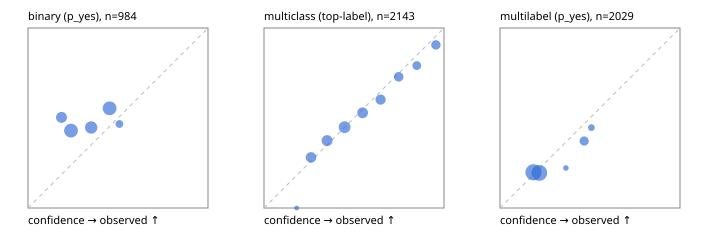

# Evaluation report

- model `Qwen/Qwen3-Reranker-0.6B` @ `e61197ed45` (shared-state cross-attention (custom-v1)), adapter/checkpoint `runs/custom_sim_frozen/checkpoint`, prompt `custom-v1` (b96b6174a187)
- data data/hf.jsonl, data/eval.jsonl; splits ['test']; n=3471; calibration `{'method': 'temperature scaling per output type, grid search on NLL', 'min_n': 30, 'model': 'Qwen/Qwen3-Reranker-0.6B', 'revision': 'e61197ed45024b0ed8a2d74b80b4d909f1255473', 'adapter': 'runs/custom_sim_frozen/checkpoint', 'adapter_sha256': 'f953d6567afa2c2f49d771bd0707688b879a4be490f5023bc41e99af8e6d31e7', 'prompt_sha': 'b96b6174a187', 'fit_report': 'reports/custom_sim_frozen/calibration/report.json', 'fit_report_sha256': 'ec1fcc1b8549363334fe4615d9c44dde38426fb3d9724bfbdbfb38ce1c489ac0', 'fit_data': [{'path': 'data/hf.jsonl', 'sha256': 'fe29b29286d5a372271e925825e8b9794f3f64be9a9fc04cad458b4b94ada510'}, {'path': 'data/eval.jsonl', 'sha256': 'be888eb38dcca063823924430e03985ddf2186b874e792d5734936ba93ba6910'}], 'created': '2026-09-23T20:50:42+0000', 'n': {'binary': 210, 'multiclass': 476, 'multilabel': 1014}, 'nll_before': {'binary': 0.644440537063574, 'multiclass': 0.919185332958721, 'multilabel': 0.521315679271017}, 'nll_after': {'binary': 0.6439958623426344, 'multiclass': 0.9184250068602287, 'multilabel': 0.521315679271017}, 'skipped': {}, 'threshold_report': 'reports/custom_sim_frozen/validation/report.json', 'threshold_report_sha256': 'b622bee3a90e91cd627ee7ed1bc0ca45230bced196301a9888a2ba82d63a1212', 'threshold_rule': 'max F1 on validation after temperature scaling', 'file': 'calib/custom_sim_frozen.json', 'file_sha256': '084e1b60d00980446e92b6f16350c5f84b280620dd845fc0595a7eaf2ee2f749'}`
- cuda / float32; 2026-09-23T20:51:43+0000; wall 54.1s

## Overall

question accuracy 47.0%

**binary**: n 984, positives 475, accuracy 0.483, precision 0.483, recall 1.000, f1 0.651, auroc 0.524, brier 0.279, log_loss 0.766, ece 0.155

**multiclass**: n 2143, accuracy 0.539, macro_f1 0.543, log_loss 1.173, brier 0.589, ece_top_label 0.026

**multilabel**: n 344, labels 2029, exact_match 0.003, micro_f1 0.354, macro_f1 0.374, label_auroc 0.544, brier 0.168, log_loss 0.518, ece 0.026

## By family

| family | n | question acc % | details |
|---|---|---|---|
| eval_adversarial | 27 | 37.0 | bin acc 40.0 F1 57.1 AUROC 0.648 ECE 0.056; mc acc 57.1 mF1 40.7 ECE 0.367; ml EM 0.0 µF1 56.2 ECE 0.067 |
| eval_agent_output | 26 | 30.8 | bin acc 50.0 F1 66.7 AUROC 0.449 ECE 0.014; mc acc 14.3 mF1 7.4 ECE 0.682; ml EM 0.0 µF1 55.2 ECE 0.117 |
| eval_evidence | 17 | 29.4 | bin acc 33.3 F1 50.0 AUROC 0.760 ECE 0.152; ml EM 0.0 µF1 42.9 ECE 0.282 |
| eval_multilabel | 32 | 9.4 | bin acc 42.9 F1 60.0 AUROC 0.667 ECE 0.234; mc acc 0.0 mF1 0.0 ECE 0.307; ml EM 0.0 µF1 52.6 ECE 0.111 |
| eval_policy | 22 | 31.8 | bin acc 46.2 F1 63.2 AUROC 0.548 ECE 0.057; mc acc 20.0 mF1 12.5 ECE 0.457; ml EM 0.0 µF1 69.6 ECE 0.085 |
| eval_routing | 25 | 36.0 | bin acc 40.0 F1 57.1 AUROC 0.792 ECE 0.282; mc acc 38.5 mF1 23.8 ECE 0.451; ml EM 0.0 µF1 50.0 ECE 0.137 |
| eval_urgency_sentiment | 22 | 50.0 | bin acc 60.0 F1 75.0 AUROC 0.375 ECE 0.128; mc acc 50.0 mF1 52.1 ECE 0.307; ml EM 0.0 µF1 66.7 ECE 0.050 |
| heldout_boolq | 300 | 59.7 | bin acc 59.7 F1 74.7 AUROC 0.528 ECE 0.181 |
| heldout_emotion_multiclass | 300 | 27.0 | mc acc 27.0 mF1 21.6 ECE 0.040 |
| heldout_intent_clinc | 300 | 61.0 | mc acc 61.0 mF1 56.2 ECE 0.081 |
| heldout_question_type_trec | 300 | 31.0 | mc acc 31.0 mF1 25.9 ECE 0.151 |
| heldout_sentiment_sst2 | 300 | 50.0 | bin acc 50.0 F1 66.7 AUROC 0.479 ECE 0.298 |
| heldout_topic_dbpedia | 300 | 58.0 | mc acc 58.0 mF1 56.4 ECE 0.063 |
| hf_emotions_multilabel | 300 | 0.3 | ml EM 0.3 µF1 32.5 ECE 0.018 |
| hf_intent_banking77 | 300 | 76.0 | mc acc 76.0 mF1 72.0 ECE 0.208 |
| hf_nli | 300 | 36.3 | bin acc 36.3 F1 53.3 AUROC 0.541 ECE 0.048 |
| hf_sentiment_tweets | 300 | 45.3 | mc acc 45.3 mF1 31.6 ECE 0.120 |
| hf_topic_agnews | 300 | 81.7 | mc acc 81.7 mF1 81.7 ECE 0.096 |

## by hard case

| slice | n | question acc % |
|---|---|---|
| (none) | 3042 | 51.3 |
| contradiction | 107 | 0.9 |
| distractor | 33 | 15.2 |
| double_negation | 6 | 16.7 |
| evidence_end | 13 | 38.5 |
| evidence_middle | 11 | 36.4 |
| evidence_start | 9 | 55.6 |
| exception | 7 | 14.3 |
| hypothetical | 7 | 14.3 |
| injection | 10 | 10.0 |
| lexical_overlap | 20 | 15.0 |
| long_state | 50 | 32.0 |
| missing_evidence | 104 | 0.0 |
| multi_positive | 81 | 0.0 |
| multi_turn | 9 | 33.3 |
| negation | 30 | 10.0 |
| new_label_names | 3 | 66.7 |
| nota | 46 | 80.4 |
| numeric_reasoning | 16 | 25.0 |
| paraphrase | 22 | 22.7 |
| role_reversal | 15 | 20.0 |
| sarcasm | 12 | 8.3 |
| temporal_reasoning | 29 | 24.1 |
| zero_positive | 6 | 0.0 |

## by state tokens

| slice | n | question acc % |
|---|---|---|
| 00000-00127 | 3211 | 47.0 |
| 00128-00511 | 208 | 51.4 |
| 00512-02047 | 52 | 30.8 |

## by candidates

| slice | n | question acc % |
|---|---|---|
| 01 | 984 | 48.3 |
| 03 | 310 | 45.5 |
| 04 | 333 | 76.3 |
| 05 | 22 | 9.1 |
| 06 | 1218 | 28.7 |
| 07 | 49 | 75.5 |
| 08 | 555 | 67.4 |

## Paraphrase groups

11 groups; same prediction 36.4%; all correct 9.1%

## Multiclass abstention (coverage vs error on accepted)

| abstain_below | coverage % | error % |
|---|---|---|
| 0.0 | 100.0 | 46.1 |
| 0.4 | 71.9 | 37.8 |
| 0.5 | 53.1 | 31.7 |
| 0.6 | 38.4 | 25.8 |
| 0.7 | 26.3 | 19.3 |
| 0.8 | 16.3 | 14.6 |
| 0.9 | 9.0 | 9.4 |

## Reliability: binary

| bin | n | mean confidence | observed frequency |
|---|---|---|---|
| [0.1,0.2) | 147 | 0.186 | 0.503 |
| [0.2,0.3) | 286 | 0.239 | 0.430 |
| [0.3,0.4) | 217 | 0.351 | 0.447 |
| [0.4,0.5) | 289 | 0.453 | 0.554 |
| [0.5,0.6) | 45 | 0.508 | 0.467 |

## Reliability: multiclass

| bin | n | mean confidence | observed frequency |
|---|---|---|---|
| [0.1,0.2) | 4 | 0.182 | 0.000 |
| [0.2,0.3) | 281 | 0.261 | 0.281 |
| [0.3,0.4) | 318 | 0.351 | 0.374 |
| [0.4,0.5) | 403 | 0.448 | 0.449 |
| [0.5,0.6) | 314 | 0.548 | 0.529 |
| [0.6,0.7) | 259 | 0.648 | 0.602 |
| [0.7,0.8) | 214 | 0.748 | 0.729 |
| [0.8,0.9) | 158 | 0.849 | 0.791 |
| [0.9,1.0] | 192 | 0.955 | 0.906 |

## Reliability: multilabel

| bin | n | mean confidence | observed frequency |
|---|---|---|---|
| [0.1,0.2) | 918 | 0.186 | 0.198 |
| [0.2,0.3) | 882 | 0.219 | 0.195 |
| [0.3,0.4) | 18 | 0.366 | 0.222 |
| [0.4,0.5) | 164 | 0.468 | 0.372 |
| [0.5,0.6) | 47 | 0.508 | 0.447 |
