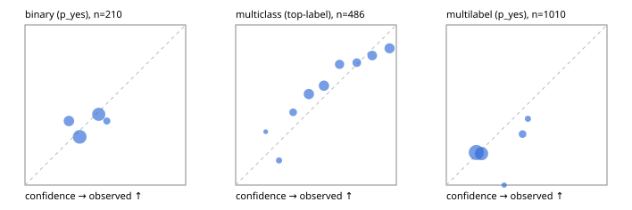

# Evaluation report

- model `Qwen/Qwen3-Reranker-0.6B` @ `e61197ed45` (shared-state cross-attention (custom-v1)), adapter/checkpoint `runs/custom_sim_frozen/checkpoint`, prompt `custom-v1` (b96b6174a187)
- data data/hf.jsonl, data/eval.jsonl; splits ['validation']; n=868; calibration `None`
- cuda / float32; 2026-09-23T20:49:14+0000; wall 14.1s

## Overall

question accuracy 53.7%

**binary**: n 210, positives 79, accuracy 0.614, precision 0.400, recall 0.051, f1 0.090, auroc 0.553, brier 0.233, log_loss 0.661, ece 0.051

**multiclass**: n 486, accuracy 0.683, macro_f1 0.555, log_loss 0.865, brier 0.453, ece_top_label 0.082

**multilabel**: n 172, labels 1010, exact_match 0.029, micro_f1 0.099, macro_f1 0.146, label_auroc 0.513, brier 0.169, log_loss 0.520, ece 0.034

## By family

| family | n | question acc % | details |
|---|---|---|---|
| eval_adversarial | 14 | 42.9 | bin acc 42.9 F1 33.3 AUROC 0.300 ECE 0.401; mc acc 60.0 mF1 42.9 ECE 0.336; ml EM 0.0 µF1 50.0 ECE 0.169 |
| eval_agent_output | 20 | 45.0 | bin acc 50.0 F1 25.0 AUROC 0.778 ECE 0.108; mc acc 40.0 mF1 13.3 ECE 0.248; ml EM 33.3 µF1 57.1 ECE 0.284 |
| eval_evidence | 17 | 47.1 | bin acc 57.1 F1 0.0 AUROC 0.600 ECE 0.128; ml EM 0.0 µF1 0.0 ECE 0.236 |
| eval_multilabel | 12 | 25.0 | bin acc 100.0 F1 0.0 AUROC — ECE 0.487; mc acc 50.0 mF1 33.3 ECE 0.446; ml EM 11.1 µF1 35.9 ECE 0.066 |
| eval_policy | 24 | 29.2 | bin acc 41.7 F1 22.2 AUROC 0.343 ECE 0.096; mc acc 18.2 mF1 10.5 ECE 0.565; ml EM 0.0 µF1 66.7 ECE 0.003 |
| eval_routing | 16 | 43.8 | bin acc 28.6 F1 0.0 AUROC 0.300 ECE 0.246; mc acc 50.0 mF1 45.8 ECE 0.392; ml EM 100.0 µF1 0.0 ECE 0.449 |
| eval_urgency_sentiment | 15 | 53.3 | bin acc 42.9 F1 33.3 AUROC 0.583 ECE 0.121; mc acc 60.0 mF1 42.9 ECE 0.272; ml EM 66.7 µF1 0.0 ECE 0.343 |
| hf_emotions_multilabel | 150 | 0.0 | ml EM 0.0 µF1 0.0 ECE 0.019 |
| hf_intent_banking77 | 150 | 79.3 | mc acc 79.3 mF1 72.8 ECE 0.212 |
| hf_nli | 150 | 67.3 | bin acc 67.3 F1 0.0 AUROC 0.453 ECE 0.098 |
| hf_sentiment_tweets | 150 | 48.0 | mc acc 48.0 mF1 33.3 ECE 0.100 |
| hf_topic_agnews | 150 | 84.0 | mc acc 84.0 mF1 84.4 ECE 0.091 |

## by hard case

| slice | n | question acc % |
|---|---|---|
| (none) | 634 | 50.5 |
| contradiction | 63 | 93.7 |
| distractor | 20 | 50.0 |
| double_negation | 3 | 66.7 |
| evidence_end | 4 | 75.0 |
| evidence_middle | 7 | 57.1 |
| evidence_start | 3 | 0.0 |
| exception | 7 | 14.3 |
| hypothetical | 6 | 66.7 |
| injection | 16 | 56.2 |
| lexical_overlap | 13 | 53.8 |
| long_state | 26 | 42.3 |
| missing_evidence | 59 | 98.3 |
| multi_positive | 40 | 0.0 |
| multi_turn | 21 | 38.1 |
| negation | 9 | 22.2 |
| new_label_names | 5 | 20.0 |
| nota | 4 | 0.0 |
| numeric_reasoning | 13 | 30.8 |
| paraphrase | 10 | 10.0 |
| role_reversal | 7 | 28.6 |
| sarcasm | 5 | 40.0 |
| temporal_reasoning | 15 | 40.0 |
| zero_positive | 7 | 71.4 |

## by state tokens

| slice | n | question acc % |
|---|---|---|
| 00000-00127 | 796 | 54.9 |
| 00128-00511 | 46 | 39.1 |
| 00512-02047 | 26 | 42.3 |

## by candidates

| slice | n | question acc % |
|---|---|---|
| 01 | 210 | 61.4 |
| 03 | 162 | 47.5 |
| 04 | 174 | 78.2 |
| 05 | 13 | 38.5 |
| 06 | 159 | 0.0 |
| 08 | 150 | 79.3 |

## Paraphrase groups

5 groups; same prediction 40.0%; all correct 0.0%

## Multiclass abstention (coverage vs error on accepted)

| abstain_below | coverage % | error % |
|---|---|---|
| 0.0 | 100.0 | 31.7 |
| 0.4 | 89.9 | 28.1 |
| 0.5 | 71.8 | 24.4 |
| 0.6 | 53.9 | 19.8 |
| 0.7 | 41.4 | 18.4 |
| 0.8 | 30.9 | 16.7 |
| 0.9 | 16.9 | 14.6 |

## Reliability: binary

| bin | n | mean confidence | observed frequency |
|---|---|---|---|
| [0.2,0.3) | 40 | 0.273 | 0.400 |
| [0.3,0.4) | 83 | 0.341 | 0.301 |
| [0.4,0.5) | 77 | 0.459 | 0.442 |
| [0.5,0.6) | 10 | 0.510 | 0.400 |

## Reliability: multiclass

| bin | n | mean confidence | observed frequency |
|---|---|---|---|
| [0.1,0.2) | 3 | 0.187 | 0.333 |
| [0.2,0.3) | 13 | 0.270 | 0.154 |
| [0.3,0.4) | 33 | 0.358 | 0.455 |
| [0.4,0.5) | 88 | 0.455 | 0.568 |
| [0.5,0.6) | 87 | 0.550 | 0.621 |
| [0.6,0.7) | 61 | 0.646 | 0.754 |
| [0.7,0.8) | 51 | 0.754 | 0.765 |
| [0.8,0.9) | 68 | 0.850 | 0.809 |
| [0.9,1.0] | 82 | 0.958 | 0.854 |

## Reliability: multilabel

| bin | n | mean confidence | observed frequency |
|---|---|---|---|
| [0.1,0.2) | 522 | 0.187 | 0.203 |
| [0.2,0.3) | 381 | 0.219 | 0.197 |
| [0.3,0.4) | 12 | 0.360 | 0.000 |
| [0.4,0.5) | 66 | 0.475 | 0.318 |
| [0.5,0.6) | 29 | 0.508 | 0.414 |
