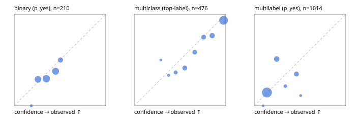

# Evaluation report

- model `Qwen/Qwen3-Reranker-0.6B` @ `e61197ed45` (shared-state cross-attention (custom-v1)), adapter/checkpoint `runs/custom_sim_lora/checkpoint`, prompt `custom-v1` (b96b6174a187)
- data data/hf.jsonl, data/eval.jsonl; splits ['calibration']; n=859; calibration `None`
- cuda / float32; 2026-09-23T21:21:31+0000; wall 15.9s

## Overall

question accuracy 59.7%

**binary**: n 210, positives 71, accuracy 0.662, precision 0.500, recall 0.169, f1 0.253, auroc 0.580, brier 0.222, log_loss 0.635, ece 0.050

**multiclass**: n 476, accuracy 0.779, macro_f1 0.694, log_loss 0.555, brier 0.302, ece_top_label 0.060

**multilabel**: n 173, labels 1014, exact_match 0.017, micro_f1 0.009, macro_f1 0.015, label_auroc 0.683, brier 0.164, log_loss 0.501, ece 0.059

## By family

| family | n | question acc % | details |
|---|---|---|---|
| eval_adversarial | 19 | 52.6 | bin acc 57.1 F1 50.0 AUROC 0.408 ECE 0.128; mc acc 33.3 mF1 20.0 ECE 0.725; ml EM 50.0 µF1 0.0 ECE 0.344 |
| eval_agent_output | 9 | 22.2 | bin acc 20.0 F1 33.3 AUROC 0.167 ECE 0.309; mc acc 50.0 mF1 33.3 ECE 0.446; ml EM 0.0 µF1 0.0 ECE 0.035 |
| eval_evidence | 19 | 52.6 | bin acc 62.5 F1 40.0 AUROC 0.545 ECE 0.163; ml EM 0.0 µF1 16.7 ECE 0.128 |
| eval_multilabel | 12 | 25.0 | bin acc 0.0 F1 0.0 AUROC — ECE 0.536; mc acc 50.0 mF1 33.3 ECE 0.353; ml EM 25.0 µF1 0.0 ECE 0.151 |
| eval_policy | 16 | 37.5 | bin acc 62.5 F1 57.1 AUROC 0.533 ECE 0.117; mc acc 25.0 mF1 14.3 ECE 0.494; ml EM 0.0 µF1 0.0 ECE 0.197 |
| eval_routing | 15 | 60.0 | bin acc 57.1 F1 57.1 AUROC 0.667 ECE 0.063; mc acc 71.4 mF1 50.0 ECE 0.339; ml EM 0.0 µF1 0.0 ECE 0.011 |
| eval_urgency_sentiment | 19 | 52.6 | bin acc 87.5 F1 80.0 AUROC 0.917 ECE 0.335; mc acc 37.5 mF1 25.0 ECE 0.485; ml EM 0.0 µF1 0.0 ECE 0.084 |
| hf_emotions_multilabel | 150 | 0.0 | ml EM 0.0 µF1 0.0 ECE 0.049 |
| hf_intent_banking77 | 150 | 92.0 | mc acc 92.0 mF1 87.8 ECE 0.065 |
| hf_nli | 150 | 69.3 | bin acc 69.3 F1 0.0 AUROC 0.554 ECE 0.045 |
| hf_sentiment_tweets | 150 | 60.7 | mc acc 60.7 mF1 58.3 ECE 0.140 |
| hf_topic_agnews | 150 | 86.7 | mc acc 86.7 mF1 86.7 ECE 0.070 |

## by hard case

| slice | n | question acc % |
|---|---|---|
| (none) | 624 | 58.5 |
| contradiction | 58 | 94.8 |
| distractor | 25 | 48.0 |
| double_negation | 3 | 0.0 |
| evidence_end | 11 | 45.5 |
| evidence_middle | 6 | 33.3 |
| evidence_start | 7 | 42.9 |
| exception | 4 | 0.0 |
| hypothetical | 7 | 57.1 |
| injection | 6 | 50.0 |
| lexical_overlap | 16 | 50.0 |
| long_state | 42 | 40.5 |
| missing_evidence | 62 | 98.4 |
| multi_positive | 42 | 0.0 |
| multi_turn | 12 | 33.3 |
| negation | 12 | 50.0 |
| new_label_names | 5 | 60.0 |
| nota | 4 | 50.0 |
| numeric_reasoning | 15 | 46.7 |
| paraphrase | 10 | 60.0 |
| role_reversal | 13 | 38.5 |
| sarcasm | 1 | 0.0 |
| temporal_reasoning | 14 | 35.7 |
| zero_positive | 4 | 75.0 |

## by state tokens

| slice | n | question acc % |
|---|---|---|
| 00000-00127 | 780 | 61.7 |
| 00128-00511 | 37 | 40.5 |
| 00512-02047 | 42 | 40.5 |

## by candidates

| slice | n | question acc % |
|---|---|---|
| 01 | 210 | 66.2 |
| 03 | 158 | 58.9 |
| 04 | 168 | 82.1 |
| 05 | 15 | 33.3 |
| 06 | 157 | 0.0 |
| 07 | 1 | 0.0 |
| 08 | 150 | 92.0 |

## Paraphrase groups

5 groups; same prediction 100.0%; all correct 60.0%

## Multiclass abstention (coverage vs error on accepted)

| abstain_below | coverage % | error % |
|---|---|---|
| 0.0 | 100.0 | 22.1 |
| 0.4 | 98.3 | 21.4 |
| 0.5 | 93.7 | 19.3 |
| 0.6 | 84.0 | 14.8 |
| 0.7 | 75.4 | 11.7 |
| 0.8 | 66.2 | 9.8 |
| 0.9 | 53.6 | 6.7 |

## Reliability: binary

| bin | n | mean confidence | observed frequency |
|---|---|---|---|
| [0.1,0.2) | 2 | 0.187 | 0.000 |
| [0.2,0.3) | 52 | 0.260 | 0.288 |
| [0.3,0.4) | 71 | 0.350 | 0.296 |
| [0.4,0.5) | 61 | 0.452 | 0.377 |
| [0.5,0.6) | 24 | 0.506 | 0.500 |

## Reliability: multiclass

| bin | n | mean confidence | observed frequency |
|---|---|---|---|
| [0.2,0.3) | 2 | 0.289 | 0.500 |
| [0.3,0.4) | 6 | 0.375 | 0.333 |
| [0.4,0.5) | 22 | 0.453 | 0.364 |
| [0.5,0.6) | 46 | 0.553 | 0.413 |
| [0.6,0.7) | 41 | 0.661 | 0.585 |
| [0.7,0.8) | 44 | 0.758 | 0.750 |
| [0.8,0.9) | 60 | 0.852 | 0.767 |
| [0.9,1.0] | 255 | 0.975 | 0.933 |

## Reliability: multilabel

| bin | n | mean confidence | observed frequency |
|---|---|---|---|
| [0.0,0.1) | 4 | 0.098 | 0.000 |
| [0.1,0.2) | 737 | 0.139 | 0.145 |
| [0.2,0.3) | 141 | 0.245 | 0.511 |
| [0.3,0.4) | 28 | 0.340 | 0.214 |
| [0.4,0.5) | 95 | 0.461 | 0.347 |
| [0.5,0.6) | 9 | 0.507 | 0.111 |
