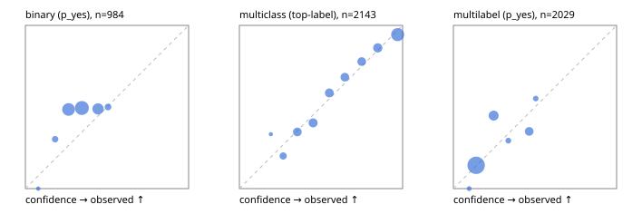

# Evaluation report

- model `Qwen/Qwen3-Reranker-0.6B` @ `e61197ed45` (shared-state cross-attention (custom-v1)), adapter/checkpoint `runs/custom_sim_lora/checkpoint`, prompt `custom-v1` (b96b6174a187)
- data data/hf.jsonl, data/eval.jsonl; splits ['test']; n=3471; calibration `None`
- cuda / float32; 2026-09-23T21:22:38+0000; wall 60.1s

## Overall

question accuracy 58.2%

**binary**: n 984, positives 475, accuracy 0.517, precision 0.500, recall 0.036, f1 0.067, auroc 0.514, brier 0.274, log_loss 0.747, ece 0.141

**multiclass**: n 2143, accuracy 0.702, macro_f1 0.761, log_loss 0.797, brier 0.392, ece_top_label 0.030

**multilabel**: n 344, labels 2029, exact_match 0.017, micro_f1 0.068, macro_f1 0.105, label_auroc 0.686, brier 0.161, log_loss 0.495, ece 0.046

## By family

| family | n | question acc % | details |
|---|---|---|---|
| eval_adversarial | 27 | 59.3 | bin acc 66.7 F1 54.5 AUROC 0.630 ECE 0.143; mc acc 71.4 mF1 52.4 ECE 0.370; ml EM 20.0 µF1 20.0 ECE 0.133 |
| eval_agent_output | 26 | 34.6 | bin acc 42.9 F1 33.3 AUROC 0.551 ECE 0.094; mc acc 42.9 mF1 33.3 ECE 0.277; ml EM 0.0 µF1 0.0 ECE 0.095 |
| eval_evidence | 17 | 41.2 | bin acc 46.7 F1 33.3 AUROC 0.520 ECE 0.185; ml EM 0.0 µF1 0.0 ECE 0.297 |
| eval_multilabel | 32 | 18.8 | bin acc 28.6 F1 28.6 AUROC 0.250 ECE 0.225; mc acc 0.0 mF1 0.0 ECE 0.717; ml EM 16.7 µF1 41.7 ECE 0.165 |
| eval_policy | 22 | 40.9 | bin acc 46.2 F1 22.2 AUROC 0.452 ECE 0.053; mc acc 40.0 mF1 23.8 ECE 0.231; ml EM 25.0 µF1 0.0 ECE 0.115 |
| eval_routing | 25 | 56.0 | bin acc 70.0 F1 57.1 AUROC 0.875 ECE 0.168; mc acc 53.8 mF1 36.7 ECE 0.295; ml EM 0.0 µF1 0.0 ECE 0.137 |
| eval_urgency_sentiment | 22 | 50.0 | bin acc 50.0 F1 44.4 AUROC 0.500 ECE 0.147; mc acc 60.0 mF1 56.2 ECE 0.448; ml EM 0.0 µF1 0.0 ECE 0.143 |
| heldout_boolq | 300 | 41.0 | bin acc 41.0 F1 2.2 AUROC 0.549 ECE 0.246 |
| heldout_emotion_multiclass | 300 | 45.3 | mc acc 45.3 mF1 37.7 ECE 0.092 |
| heldout_intent_clinc | 300 | 79.3 | mc acc 79.3 mF1 80.2 ECE 0.086 |
| heldout_question_type_trec | 300 | 43.3 | mc acc 43.3 mF1 41.0 ECE 0.070 |
| heldout_sentiment_sst2 | 300 | 50.0 | bin acc 50.0 F1 0.0 AUROC 0.453 ECE 0.212 |
| heldout_topic_dbpedia | 300 | 81.7 | mc acc 81.7 mF1 81.5 ECE 0.142 |
| hf_emotions_multilabel | 300 | 0.0 | ml EM 0.0 µF1 0.0 ECE 0.039 |
| hf_intent_banking77 | 300 | 93.0 | mc acc 93.0 mF1 93.3 ECE 0.053 |
| hf_nli | 300 | 64.3 | bin acc 64.3 F1 3.6 AUROC 0.536 ECE 0.071 |
| hf_sentiment_tweets | 300 | 62.3 | mc acc 62.3 mF1 62.5 ECE 0.087 |
| hf_topic_agnews | 300 | 89.0 | mc acc 89.0 mF1 89.1 ECE 0.045 |

## by hard case

| slice | n | question acc % |
|---|---|---|
| (none) | 3042 | 58.1 |
| contradiction | 107 | 92.5 |
| distractor | 33 | 24.2 |
| double_negation | 6 | 50.0 |
| evidence_end | 13 | 15.4 |
| evidence_middle | 11 | 36.4 |
| evidence_start | 9 | 55.6 |
| exception | 7 | 28.6 |
| hypothetical | 7 | 42.9 |
| injection | 10 | 60.0 |
| lexical_overlap | 20 | 55.0 |
| long_state | 50 | 34.0 |
| missing_evidence | 104 | 97.1 |
| multi_positive | 81 | 2.5 |
| multi_turn | 9 | 33.3 |
| negation | 30 | 40.0 |
| new_label_names | 3 | 33.3 |
| nota | 46 | 2.2 |
| numeric_reasoning | 16 | 50.0 |
| paraphrase | 22 | 31.8 |
| role_reversal | 15 | 66.7 |
| sarcasm | 12 | 25.0 |
| temporal_reasoning | 29 | 27.6 |
| zero_positive | 6 | 66.7 |

## by state tokens

| slice | n | question acc % |
|---|---|---|
| 00000-00127 | 3211 | 59.5 |
| 00128-00511 | 208 | 44.2 |
| 00512-02047 | 52 | 36.5 |

## by candidates

| slice | n | question acc % |
|---|---|---|
| 01 | 984 | 51.7 |
| 03 | 310 | 62.9 |
| 04 | 333 | 83.8 |
| 05 | 22 | 22.7 |
| 06 | 1218 | 42.2 |
| 07 | 49 | 4.1 |
| 08 | 555 | 93.0 |

## Paraphrase groups

11 groups; same prediction 63.6%; all correct 18.2%

## Multiclass abstention (coverage vs error on accepted)

| abstain_below | coverage % | error % |
|---|---|---|
| 0.0 | 100.0 | 29.8 |
| 0.4 | 85.0 | 22.7 |
| 0.5 | 74.2 | 17.3 |
| 0.6 | 64.2 | 13.5 |
| 0.7 | 54.6 | 10.3 |
| 0.8 | 45.2 | 7.9 |
| 0.9 | 33.0 | 5.7 |

## Reliability: binary

| bin | n | mean confidence | observed frequency |
|---|---|---|---|
| [0.0,0.1) | 2 | 0.078 | 0.000 |
| [0.1,0.2) | 33 | 0.182 | 0.303 |
| [0.2,0.3) | 301 | 0.264 | 0.485 |
| [0.3,0.4) | 395 | 0.346 | 0.494 |
| [0.4,0.5) | 219 | 0.445 | 0.489 |
| [0.5,0.6) | 34 | 0.506 | 0.500 |

## Reliability: multiclass

| bin | n | mean confidence | observed frequency |
|---|---|---|---|
| [0.1,0.2) | 3 | 0.193 | 0.333 |
| [0.2,0.3) | 105 | 0.268 | 0.200 |
| [0.3,0.4) | 213 | 0.355 | 0.347 |
| [0.4,0.5) | 231 | 0.452 | 0.403 |
| [0.5,0.6) | 215 | 0.551 | 0.586 |
| [0.6,0.7) | 205 | 0.646 | 0.683 |
| [0.7,0.8) | 203 | 0.750 | 0.778 |
| [0.8,0.9) | 261 | 0.848 | 0.862 |
| [0.9,1.0] | 707 | 0.969 | 0.943 |

## Reliability: multilabel

| bin | n | mean confidence | observed frequency |
|---|---|---|---|
| [0.0,0.1) | 11 | 0.097 | 0.000 |
| [0.1,0.2) | 1451 | 0.139 | 0.143 |
| [0.2,0.3) | 313 | 0.247 | 0.447 |
| [0.3,0.4) | 34 | 0.337 | 0.294 |
| [0.4,0.5) | 191 | 0.465 | 0.351 |
| [0.5,0.6) | 29 | 0.505 | 0.552 |
