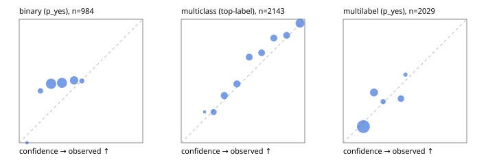

# Evaluation report

- model `Qwen/Qwen3-Reranker-0.6B` @ `e61197ed45` (shared-state cross-attention (custom-v1)), adapter/checkpoint `runs/custom_sim_lora/checkpoint`, prompt `custom-v1` (b96b6174a187)
- data data/hf.jsonl, data/eval.jsonl; splits ['test']; n=3471; calibration `{'method': 'temperature scaling per output type, grid search on NLL', 'min_n': 30, 'model': 'Qwen/Qwen3-Reranker-0.6B', 'revision': 'e61197ed45024b0ed8a2d74b80b4d909f1255473', 'adapter': 'runs/custom_sim_lora/checkpoint', 'adapter_sha256': 'f82add53c7b04e15196a7ce254298cc2e69fa45da791ec1a49d6fc1223f80257', 'prompt_sha': 'b96b6174a187', 'fit_report': 'reports/custom_sim_lora/calibration/report.json', 'fit_report_sha256': '258e76ffc4ae2e6195152f4a61e0d50f9c96bb2d35a0ffb6de3137d6ddada79d', 'fit_data': [{'path': 'data/hf.jsonl', 'sha256': 'fe29b29286d5a372271e925825e8b9794f3f64be9a9fc04cad458b4b94ada510'}, {'path': 'data/eval.jsonl', 'sha256': 'be888eb38dcca063823924430e03985ddf2186b874e792d5734936ba93ba6910'}], 'created': '2026-09-23T21:22:44+0000', 'n': {'binary': 210, 'multiclass': 476, 'multilabel': 1014}, 'nll_before': {'binary': 0.6348473066079006, 'multiclass': 0.5552241004387476, 'multilabel': 0.5011932358362975}, 'nll_after': {'binary': 0.6344741814118616, 'multiclass': 0.5425019787783298, 'multilabel': 0.49851688956256474}, 'skipped': {}, 'threshold_report': 'reports/custom_sim_lora/validation/report.json', 'threshold_report_sha256': '47029ea8dc45e8facc5c6b31b831e730de6212d6ae441c18f39e19a227d90577', 'threshold_rule': 'max F1 on validation after temperature scaling', 'file': 'calib/custom_sim_lora.json', 'file_sha256': 'ecf16d6e16bbce9f0b0287bca024cfbab4fa6f202a3394a8b7f9465b03694d1c'}`
- cuda / float32; 2026-09-23T21:23:51+0000; wall 60.1s

## Overall

question accuracy 59.6%

**binary**: n 984, positives 475, accuracy 0.507, precision 0.492, recall 0.667, f1 0.567, auroc 0.514, brier 0.278, log_loss 0.759, ece 0.154

**multiclass**: n 2143, accuracy 0.702, macro_f1 0.761, log_loss 0.809, brier 0.398, ece_top_label 0.046

**multilabel**: n 344, labels 2029, exact_match 0.189, micro_f1 0.475, macro_f1 0.357, label_auroc 0.686, brier 0.160, log_loss 0.494, ece 0.062

## By family

| family | n | question acc % | details |
|---|---|---|---|
| eval_adversarial | 27 | 40.7 | bin acc 40.0 F1 57.1 AUROC 0.630 ECE 0.141; mc acc 71.4 mF1 52.4 ECE 0.264; ml EM 0.0 µF1 56.2 ECE 0.118 |
| eval_agent_output | 26 | 38.5 | bin acc 50.0 F1 66.7 AUROC 0.551 ECE 0.096; mc acc 42.9 mF1 33.3 ECE 0.254; ml EM 0.0 µF1 55.2 ECE 0.097 |
| eval_evidence | 17 | 35.3 | bin acc 40.0 F1 52.6 AUROC 0.520 ECE 0.187; ml EM 0.0 µF1 42.9 ECE 0.191 |
| eval_multilabel | 32 | 9.4 | bin acc 42.9 F1 60.0 AUROC 0.250 ECE 0.226; mc acc 0.0 mF1 0.0 ECE 0.638; ml EM 0.0 µF1 52.6 ECE 0.169 |
| eval_policy | 22 | 36.4 | bin acc 46.2 F1 63.2 AUROC 0.452 ECE 0.055; mc acc 40.0 mF1 23.8 ECE 0.225; ml EM 0.0 µF1 69.6 ECE 0.113 |
| eval_routing | 25 | 44.0 | bin acc 40.0 F1 57.1 AUROC 0.875 ECE 0.165; mc acc 53.8 mF1 36.7 ECE 0.302; ml EM 0.0 µF1 50.0 ECE 0.140 |
| eval_urgency_sentiment | 22 | 54.5 | bin acc 60.0 F1 75.0 AUROC 0.500 ECE 0.209; mc acc 60.0 mF1 56.2 ECE 0.433; ml EM 0.0 µF1 66.7 ECE 0.138 |
| heldout_boolq | 300 | 59.0 | bin acc 59.0 F1 69.2 AUROC 0.549 ECE 0.258 |
| heldout_emotion_multiclass | 300 | 45.3 | mc acc 45.3 mF1 37.7 ECE 0.057 |
| heldout_intent_clinc | 300 | 79.3 | mc acc 79.3 mF1 80.2 ECE 0.124 |
| heldout_question_type_trec | 300 | 43.3 | mc acc 43.3 mF1 41.0 ECE 0.060 |
| heldout_sentiment_sst2 | 300 | 46.3 | bin acc 46.3 F1 45.1 AUROC 0.453 ECE 0.228 |
| heldout_topic_dbpedia | 300 | 81.7 | mc acc 81.7 mF1 81.5 ECE 0.188 |
| hf_emotions_multilabel | 300 | 21.7 | ml EM 21.7 µF1 44.5 ECE 0.058 |
| hf_intent_banking77 | 300 | 93.0 | mc acc 93.0 mF1 93.3 ECE 0.097 |
| hf_nli | 300 | 48.3 | bin acc 48.3 F1 49.5 AUROC 0.536 ECE 0.067 |
| hf_sentiment_tweets | 300 | 62.3 | mc acc 62.3 mF1 62.5 ECE 0.055 |
| hf_topic_agnews | 300 | 89.0 | mc acc 89.0 mF1 89.1 ECE 0.019 |

## by hard case

| slice | n | question acc % |
|---|---|---|
| (none) | 3042 | 64.3 |
| contradiction | 107 | 32.7 |
| distractor | 33 | 21.2 |
| double_negation | 6 | 16.7 |
| evidence_end | 13 | 38.5 |
| evidence_middle | 11 | 36.4 |
| evidence_start | 9 | 55.6 |
| exception | 7 | 28.6 |
| hypothetical | 7 | 14.3 |
| injection | 10 | 20.0 |
| lexical_overlap | 20 | 20.0 |
| long_state | 50 | 38.0 |
| missing_evidence | 104 | 34.6 |
| multi_positive | 81 | 2.5 |
| multi_turn | 9 | 33.3 |
| negation | 30 | 13.3 |
| new_label_names | 3 | 33.3 |
| nota | 46 | 2.2 |
| numeric_reasoning | 16 | 37.5 |
| paraphrase | 22 | 27.3 |
| role_reversal | 15 | 26.7 |
| sarcasm | 12 | 8.3 |
| temporal_reasoning | 29 | 27.6 |
| zero_positive | 6 | 0.0 |

## by state tokens

| slice | n | question acc % |
|---|---|---|
| 00000-00127 | 3211 | 60.2 |
| 00128-00511 | 208 | 56.2 |
| 00512-02047 | 52 | 36.5 |

## by candidates

| slice | n | question acc % |
|---|---|---|
| 01 | 984 | 50.7 |
| 03 | 310 | 62.6 |
| 04 | 333 | 83.5 |
| 05 | 22 | 18.2 |
| 06 | 1218 | 47.4 |
| 07 | 49 | 2.0 |
| 08 | 555 | 93.0 |

## Paraphrase groups

11 groups; same prediction 45.5%; all correct 18.2%

## Multiclass abstention (coverage vs error on accepted)

| abstain_below | coverage % | error % |
|---|---|---|
| 0.0 | 100.0 | 29.8 |
| 0.4 | 80.0 | 20.5 |
| 0.5 | 67.9 | 14.8 |
| 0.6 | 56.8 | 11.8 |
| 0.7 | 46.7 | 8.4 |
| 0.8 | 35.7 | 6.3 |
| 0.9 | 24.6 | 3.2 |

## Reliability: binary

| bin | n | mean confidence | observed frequency |
|---|---|---|---|
| [0.0,0.1) | 2 | 0.063 | 0.000 |
| [0.1,0.2) | 50 | 0.172 | 0.420 |
| [0.2,0.3) | 362 | 0.258 | 0.478 |
| [0.3,0.4) | 336 | 0.346 | 0.485 |
| [0.4,0.5) | 200 | 0.444 | 0.505 |
| [0.5,0.6) | 34 | 0.507 | 0.500 |

## Reliability: multiclass

| bin | n | mean confidence | observed frequency |
|---|---|---|---|
| [0.1,0.2) | 4 | 0.189 | 0.250 |
| [0.2,0.3) | 157 | 0.262 | 0.248 |
| [0.3,0.4) | 267 | 0.349 | 0.382 |
| [0.4,0.5) | 260 | 0.451 | 0.477 |
| [0.5,0.6) | 238 | 0.551 | 0.693 |
| [0.6,0.7) | 217 | 0.651 | 0.728 |
| [0.7,0.8) | 236 | 0.749 | 0.847 |
| [0.8,0.9) | 237 | 0.853 | 0.869 |
| [0.9,1.0] | 527 | 0.962 | 0.968 |

## Reliability: multilabel

| bin | n | mean confidence | observed frequency |
|---|---|---|---|
| [0.1,0.2) | 1357 | 0.164 | 0.131 |
| [0.2,0.3) | 366 | 0.249 | 0.407 |
| [0.3,0.4) | 81 | 0.323 | 0.333 |
| [0.4,0.5) | 196 | 0.467 | 0.357 |
| [0.5,0.6) | 29 | 0.504 | 0.552 |
