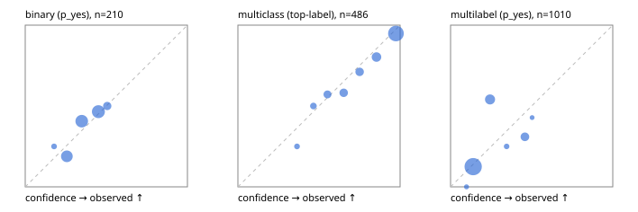

# Evaluation report

- model `Qwen/Qwen3-Reranker-0.6B` @ `e61197ed45` (shared-state cross-attention (custom-v1)), adapter/checkpoint `runs/custom_sim_lora/checkpoint`, prompt `custom-v1` (b96b6174a187)
- data data/hf.jsonl, data/eval.jsonl; splits ['validation']; n=868; calibration `None`
- cuda / float32; 2026-09-23T21:21:08+0000; wall 15.6s

## Overall

question accuracy 61.8%

**binary**: n 210, positives 79, accuracy 0.624, precision 0.500, recall 0.114, f1 0.186, auroc 0.625, brier 0.224, log_loss 0.640, ece 0.041

**multiclass**: n 486, accuracy 0.819, macro_f1 0.771, log_loss 0.539, brier 0.268, ece_top_label 0.036

**multilabel**: n 172, labels 1010, exact_match 0.041, micro_f1 0.027, macro_f1 0.036, label_auroc 0.708, brier 0.159, log_loss 0.488, ece 0.075

## By family

| family | n | question acc % | details |
|---|---|---|---|
| eval_adversarial | 14 | 35.7 | bin acc 14.3 F1 0.0 AUROC 0.400 ECE 0.385; mc acc 80.0 mF1 66.7 ECE 0.238; ml EM 0.0 µF1 50.0 ECE 0.232 |
| eval_agent_output | 20 | 45.0 | bin acc 50.0 F1 40.0 AUROC 0.667 ECE 0.100; mc acc 20.0 mF1 16.7 ECE 0.523; ml EM 66.7 µF1 0.0 ECE 0.284 |
| eval_evidence | 17 | 41.2 | bin acc 42.9 F1 20.0 AUROC 0.489 ECE 0.167; ml EM 33.3 µF1 0.0 ECE 0.196 |
| eval_multilabel | 12 | 25.0 | bin acc 100.0 F1 0.0 AUROC — ECE 0.470; mc acc 50.0 mF1 33.3 ECE 0.677; ml EM 11.1 µF1 15.4 ECE 0.060 |
| eval_policy | 24 | 50.0 | bin acc 66.7 F1 60.0 AUROC 0.800 ECE 0.238; mc acc 36.4 mF1 23.5 ECE 0.466; ml EM 0.0 µF1 0.0 ECE 0.019 |
| eval_routing | 16 | 56.2 | bin acc 28.6 F1 0.0 AUROC 0.300 ECE 0.270; mc acc 75.0 mF1 71.4 ECE 0.238; ml EM 100.0 µF1 0.0 ECE 0.446 |
| eval_urgency_sentiment | 15 | 73.3 | bin acc 57.1 F1 57.1 AUROC 0.667 ECE 0.206; mc acc 100.0 mF1 100.0 ECE 0.275; ml EM 66.7 µF1 0.0 ECE 0.355 |
| hf_emotions_multilabel | 150 | 0.0 | ml EM 0.0 µF1 0.0 ECE 0.066 |
| hf_intent_banking77 | 150 | 95.3 | mc acc 95.3 mF1 94.6 ECE 0.051 |
| hf_nli | 150 | 68.7 | bin acc 68.7 F1 4.1 AUROC 0.572 ECE 0.062 |
| hf_sentiment_tweets | 150 | 70.0 | mc acc 70.0 mF1 65.6 ECE 0.061 |
| hf_topic_agnews | 150 | 86.0 | mc acc 86.0 mF1 86.2 ECE 0.064 |

## by hard case

| slice | n | question acc % |
|---|---|---|
| (none) | 634 | 60.6 |
| contradiction | 63 | 95.2 |
| distractor | 20 | 60.0 |
| double_negation | 3 | 66.7 |
| evidence_end | 4 | 50.0 |
| evidence_middle | 7 | 85.7 |
| evidence_start | 3 | 0.0 |
| exception | 7 | 28.6 |
| hypothetical | 6 | 16.7 |
| injection | 16 | 62.5 |
| lexical_overlap | 13 | 61.5 |
| long_state | 26 | 50.0 |
| missing_evidence | 59 | 94.9 |
| multi_positive | 40 | 0.0 |
| multi_turn | 21 | 42.9 |
| negation | 9 | 55.6 |
| new_label_names | 5 | 40.0 |
| nota | 4 | 0.0 |
| numeric_reasoning | 13 | 30.8 |
| paraphrase | 10 | 40.0 |
| role_reversal | 7 | 14.3 |
| sarcasm | 5 | 20.0 |
| temporal_reasoning | 15 | 53.3 |
| zero_positive | 7 | 100.0 |

## by state tokens

| slice | n | question acc % |
|---|---|---|
| 00000-00127 | 796 | 62.9 |
| 00128-00511 | 46 | 47.8 |
| 00512-02047 | 26 | 50.0 |

## by candidates

| slice | n | question acc % |
|---|---|---|
| 01 | 210 | 62.4 |
| 03 | 162 | 69.1 |
| 04 | 174 | 83.3 |
| 05 | 13 | 38.5 |
| 06 | 159 | 0.0 |
| 08 | 150 | 95.3 |

## Paraphrase groups

5 groups; same prediction 80.0%; all correct 40.0%

## Multiclass abstention (coverage vs error on accepted)

| abstain_below | coverage % | error % |
|---|---|---|
| 0.0 | 100.0 | 18.1 |
| 0.4 | 98.4 | 17.2 |
| 0.5 | 94.7 | 15.9 |
| 0.6 | 87.4 | 13.6 |
| 0.7 | 78.6 | 10.5 |
| 0.8 | 69.3 | 8.0 |
| 0.9 | 55.8 | 5.2 |

## Reliability: binary

| bin | n | mean confidence | observed frequency |
|---|---|---|---|
| [0.1,0.2) | 4 | 0.178 | 0.250 |
| [0.2,0.3) | 53 | 0.257 | 0.189 |
| [0.3,0.4) | 64 | 0.348 | 0.406 |
| [0.4,0.5) | 71 | 0.451 | 0.465 |
| [0.5,0.6) | 18 | 0.506 | 0.500 |

## Reliability: multiclass

| bin | n | mean confidence | observed frequency |
|---|---|---|---|
| [0.3,0.4) | 8 | 0.365 | 0.250 |
| [0.4,0.5) | 18 | 0.465 | 0.500 |
| [0.5,0.6) | 35 | 0.552 | 0.571 |
| [0.6,0.7) | 43 | 0.652 | 0.581 |
| [0.7,0.8) | 45 | 0.750 | 0.711 |
| [0.8,0.9) | 66 | 0.854 | 0.803 |
| [0.9,1.0] | 271 | 0.974 | 0.948 |

## Reliability: multilabel

| bin | n | mean confidence | observed frequency |
|---|---|---|---|
| [0.0,0.1) | 8 | 0.098 | 0.000 |
| [0.1,0.2) | 721 | 0.139 | 0.125 |
| [0.2,0.3) | 161 | 0.244 | 0.540 |
| [0.3,0.4) | 16 | 0.346 | 0.250 |
| [0.4,0.5) | 97 | 0.458 | 0.309 |
| [0.5,0.6) | 7 | 0.503 | 0.429 |
