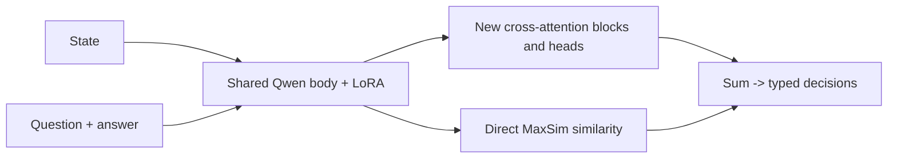
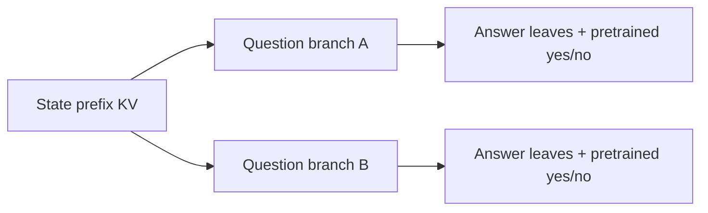

# SelfJev: deep project review

## SelfJev: what the project actually proves

A review of the current working tree, saved experiments and two trained architecture families, with a new validation-only component analysis.

**You have demonstrated that useful typed classification can be built with familiar methods and modest adaptation compute.** The stock Qwen reranker plus LoRA is a credible working baseline. The shared-state system demonstrates a large reduction in repeated computation, but currently sacrifices too much decision quality. No measured configuration yet combines the best quality and the best scaling.

| Result | What is established |
|---|---|
| 80.3% | 4B reranker + LoRA: 2,788 / 3,471 test questions correct. |
| 58.2% | Best shared-state variant: similarity + joint LoRA, 2,020 / 3,471 correct. |
| 38.4x | Shared-state speedup at 8K tokens, 16 questions x 3 candidates, same A10G GPU. |
| 82.3% -> 82.1% | New validation ablation: multiclass accuracy barely changes when the cross-attention head contribution is removed. |

### The most consequential finding

The second architecture changes the model much more than its name suggests. It removes the pretrained yes/no readout, separates document and question during all Qwen backbone layers, and trains new cross-attention blocks and heads. Its strongest current classification signal comes through a direct MaxSim similarity term. That helps choose a relatively good label; it has not learned reliable absolute support judgments.

### My recommendation

Use **4B + LoRA as the working quality baseline**. Make the shared-prefix tree model the next focused architectural experiment, because it reuses document computation while retaining pretrained interactions and the yes/no readout. For the existing custom model, first isolate binary learning and compare against a similarity-only training baseline. More synthetic data without those controls would leave the central question unanswered.

> Evidence standard: 78 tests passed; headline metrics recomputed for 13 reports; all 3,471 IDs, targets and candidate lists aligned; external responses reconstructed from cache. No new training, paid API calls or infrastructure changes. Review outputs are separate from implementation, data and weights.

Read pages 2-3 for architecture, 4-6 for results and the new ablation, 7-10 for diagnosis and measurement limits, and 11-14 for the next architecture, code findings and experiment plan.

## Architecture A: preserve the trained scorer

Qwen3-Reranker + attention LoRA + typed output handling. There is no new classification head.

For every state / question / candidate, the wrapper builds the official reranker template. The instruction and query precede the document. One causal forward pass per batch produces the final-position yes and no logits; their difference is the raw score. No answer text is generated. Document tokens can attend to the question and candidate throughout the backbone.

| Output | Computation | Meaning |
|---|---|---|
| Binary | sigmoid(yes - no) | Does the text support answering yes? |
| Multiclass | softmax(candidate scores) | Choose among this question's candidates. |
| Multilabel | independent sigmoids | Select every supported candidate. |

Training preserves that same computation. Binary and multilabel use BCEWithLogits; multiclass uses cross entropy across one question's candidate scores. Multilabel loss is averaged within each question, then questions are weighted equally across each optimizer step. Candidate reordering updates the targets. There is no batch-wide softmax error.

LoRA rank 16, alpha 32 and dropout 0.05 update the q/k/v/o attention projections throughout the backbone. The 0.6B pilot trains 4,587,520 parameters; the 4B and 8B runs train approximately 11.8M and 15.3M. This adapts language processing, rather than fitting a classifier to frozen embeddings.

### What the implementation gets right

The code checks token IDs, retains the causal mask, includes template overhead in length limits, uses left padding and the final real prediction position, and requests vocabulary logits only at that position. Tests cover agreement with the official reference, batching and mappings, gradient flow, a training entrypoint, and save/reload behavior. Request validation and explicit overlength errors are implemented.

> The cost is repeated document encoding: 16 questions with 3 candidates mean 48 state-containing sequences. Batching them does not share their state computation. The underlying scoring pattern is public in the [official Qwen model card](https://huggingface.co/Qwen/Qwen3-Reranker-0.6B).

Implementation: [model.py](/Users/julien/Documents/Repos/SelfJev/src/personal_jev/model.py), [train.py](/Users/julien/Documents/Repos/SelfJev/src/personal_jev/train.py), [formatting.py](/Users/julien/Documents/Repos/SelfJev/src/personal_jev/formatting.py) and [classify.py](/Users/julien/Documents/Repos/SelfJev/src/personal_jev/classify.py).

## Architecture B: learn a new interaction

The shared-state model reuses Qwen's transformer body, but replaces its trained scoring mechanism.

The document is encoded as Document + state. Each candidate is a separate short sequence containing task type, question and proposed answer; binary uses Yes. These passes share the Qwen weights. They do not share a sequence, so the document cannot use the question while Qwen encodes it, and candidate tokens cannot see the document inside Qwen.

The final 1,024-dimensional token features are standardized with separate state/candidate mean and standard deviation buffers, fitted on a training sample. New projections reduce them to width 256. Two new blocks apply 8-head candidate-to-state cross-attention and a 1,024-wide feed-forward layer. Each block has a learnable null memory slot. Mean pooling includes the candidate template, question and answer tokens; a 256 -> 128 -> 1 head outputs the score.

Binary and multilabel share one head; multiclass has another. Candidates never attend to each other. The state memory is unchanged across the two blocks. There is no additional candidate self-attention after reading state evidence. These choices are computationally economical, but substantially change the representation and interaction problem.

### What the similarity variant adds

MaxSim uses standardized 1,024-dimensional backbone features directly: for each candidate content token, take its maximum cosine similarity to a state content token, then average. Binary content is the question; other tasks use the answer description. The score is **head output + learned type weight x MaxSim**. This path bypasses the 256-wide cross-attention blocks and heads. Learned weights in the best checkpoint are 20.034 for multiclass and 0.076 for binary/multilabel.

> New modules: 2,172,418 parameters, plus 2 similarity weights and optionally 4,587,520 LoRA parameters. Frozen-backbone runs are probes in the conventional sense; jointly adapted runs are learned scoring models. Identical states are encoded once per call, with shared memory K/V. There is no persistent state cache across requests.

Implementation: [custom.py](/Users/julien/Documents/Repos/SelfJev/src/personal_jev/custom.py) and [train_custom.py](/Users/julien/Documents/Repos/SelfJev/src/personal_jev/train_custom.py).

## The quality results are real; the gap is real

All rows below use the same 3,471 test questions. Percentages are raw decisions at T=1 and threshold 0.5; AUROC measures ranking.

| Model / run | Overall | Binary AUROC | Multiclass accuracy | Multilabel exact |
|---|---|---|---|---|
| 0.6B base | 61.0% | 0.605 | 73.3% | 1.2% |
| 0.6B + LoRA | 73.5% | 0.863 | 78.3% | 31.1% |
| 4B base | 62.8% | 0.604 | 76.2% | 2.0% |
| 4B + LoRA | 80.3% | 0.945 | 82.3% | 47.7% |
| 8B base | 66.2% | 0.658 | 79.8% | 10.2% |
| 8B + LoRA | 80.7% | 0.945 | 82.9% | 48.0% |
| Custom frozen | 39.0% | 0.536 | 39.1% | 1.2% |
| Custom + labels, frozen | 37.7% | 0.507 | 36.7% | 0.6% |
| Custom + labels + LoRA | 39.7% | 0.451 | 40.6% | 0.9% |
| Custom + sim, frozen | 48.0% | 0.524 | 53.9% | 1.5% |
| Custom + sim + LoRA | 58.2% | 0.514 | 70.2% | 1.7% |
| Jev, cached API | 82.7% | 0.981 | 84.6% | 40.1% |
| GPT-6 Astra, cached API | 85.8% | 0.971 | 87.0% | 55.8% |

LoRA raises the 0.6B model by 12.5 percentage points and the 4B model by 17.5 points. Moving from 4B + LoRA to 8B + LoRA adds only 12 correct questions: 141 are unique wins for 4B and 153 for 8B (question-level McNemar p=0.52). This supports choosing 4B for efficiency on this mixture; it does not establish statistical equivalence on every task.

The 4B model still trails Jev by 83 correct questions: 208 unique wins for 4B versus 291 for Jev (p=0.000235). The 8B model trails by 71. Their better multilabel exact match partly offsets weaker binary and multiclass results. Those tradeoffs disappear in a single headline percentage.

The plain custom LoRA continuation stopped at step 390/882 without a validation improvement and has no final test report. The completed mixed-label LoRA variant reaches 39.7%; the completed similarity + LoRA variant reaches 58.2%. Do not conflate these runs or treat the stopped continuation as a complete architecture comparison.

> Precision differs: 0.6B and custom quality columns are fp32; 4B/8B are bf16. A separate 0.6B LoRA bf16 test reaches 73.7% with 43 decision flips. Provider rows are observed cached runs, not claims about all settings or current service behavior. Sources and hashes are in [audit.json](/Users/julien/Documents/Repos/SelfJev/reports/deep_review_2026-09-23/audit.json).

## The aggregate understates the reasoning gap

The test mixture is dominated by short public-dataset reformulations. Its authored reasoning questions account for only 4.9% of the total.

| Model | Training-family public tasks 1,500 questions | Held-out public datasets 1,800 questions | Authored cases 171 questions |
|---|---|---|---|
| 0.6B + LoRA | 73.5% | 75.3% | 55.0% |
| 4B + LoRA | 78.9% | 82.4% | 70.8% |
| 8B + LoRA | 78.1% | 83.3% | 74.9% |
| Custom frozen | 50.1% | 29.9% | 36.3% |
| Custom + sim + LoRA | 61.7% | 56.8% | 42.1% |
| Jev | 74.3% | 88.6% | 94.7% |
| GPT-6 Astra | 79.6% | 89.7% | 100.0% |

The gap between 4B LoRA and Jev is 2.4 points overall but **24.0 points on the authored cases**. The 8B model improves that authored slice to 74.9%, still below Jev's 94.7%. Agent-output grading is a particularly visible difference: 8B gets 53.8%, Jev 92.3%, on only 26 questions. The exact slice estimates are noisy; the overall pattern matters more than ranking tiny families.

The best custom model gets 93.0% on Banking77 and 89.0% on AG News, but only 79.3% on CLINC, 81.7% on DBpedia, 43.3% on TREC and 45.3% on emotion. It has recovered useful matching and learned familiar task structure. That is weaker evidence for following arbitrary new criteria or applying rules.

### These are dynamic-candidate tests, not standard benchmark scores

| Dataset-derived task | Candidate construction |
|---|---|
| Banking77 | Gold label + 7 sampled negatives, rather than all 77 labels. |
| CLINC | Gold + 6 sampled negatives + none; out-of-scope has 7 options. |
| DBpedia | Gold + 5 sampled negatives, rather than all 14 labels. |
| GoEmotions | Annotated positives + sampled negatives; 6 candidates per test row. |

The six held-out public datasets are absent from adaptation training. They are not necessarily absent from Qwen pretraining, and some task types already appear in other training datasets. The agent-output family is absent from gradient training, but its validation questions influence selection. Avoid describing every such result as wholly unseen task evaluation.

> A claim supported by the project is that standard supervised adaptation transfers beyond its training datasets. A claim of matching Jev's reasoning, calibration and latency simultaneously remains unsupported. The test mix itself is not a deployment distribution.

## What actually drives the custom model?

A checkpoint-preserving ablation on 868 validation questions, using the current similarity + LoRA model in bf16 on the M5 Pro.

- Full score: 82.3%
- Similarity contribution only: 82.1%
- Cross-attention heads only: 30.5%

For each batch I captured the two head outputs during the complete model's forward pass. Subtracting the selected head from the full score recovers its weighted similarity contribution. Each component then passes through the ordinary decoder. No weights, temperature or thresholds were fitted or saved back to the checkpoint.

| Scoring contribution | Multiclass correct / 486 | Binary AUROC 210 questions | Multilabel F1 172 questions |
|---|---|---|---|
| Full score | 400 / 486 (82.3%) | 0.626 | 3.6% |
| Similarity only | 399 / 486 (82.1%) | 0.652 | 35.2% |
| Heads only | 148 / 486 (30.5%) | 0.624 | 0.0% |

Only 6 of the 486 multiclass selections change between the full and similarity-only scores; the full model has a net gain of one correct answer. Banking77 stays at 95.3% without the head contribution. AG News moves from 86.7% to 87.3%. These small differences do not establish a benefit from the heads at inference in the measured checkpoint.

For multilabel, similarity-only probabilities select all candidates because the positive similarity contribution crosses the default threshold. Its higher F1 is consequently not evidence of good selectivity. The complete model and head-only scores have useful label ranking here (AUROC 0.708 and 0.704), but select almost no labels at 0.5. Binary ranking remains modest in validation and falls close to chance in the full test.

### What this does and does not establish

**Established:** the similarity path is essential to current multiclass decisions; the learned head contribution adds little net accuracy on these validation examples. **Not established:** that the heads were useless during joint training, that a separately trained similarity-only model would perform identically, or that cross-attention cannot learn this task. LoRA was trained through both paths. Validation includes familiar public families and authored cases, not the six held-out public datasets.

> Reproduction: [ablate_components.py](/Users/julien/Documents/Repos/SelfJev/reports/deep_review_2026-09-23/ablate_components.py); raw component scores and metrics: [component_ablation.json](/Users/julien/Documents/Repos/SelfJev/reports/deep_review_2026-09-23/component_ablation.json). Runtime 39.6 seconds. Checkpoint SHA begins f82add53c7b0, matching the saved quality and A10G speed reports.

## Data issue, architecture issue, or both?

The strongest explanation is a difficult transfer problem amplified by the training mixture. The evidence does not isolate one universal cause.

### 1. The pretrained decision mechanism was removed - high confidence

The stock model already learned how to combine a query and document and expose a yes/no decision. The custom model asks two newly trained interaction blocks and small heads to recover that behavior from separately encoded final-layer features. The old readout and early cross-input conditioning are gone. The large quality gap and the component ablation are consistent with this being a major difficulty. Parameter count alone understates how much learned functionality was discarded.

### 2. Relative matching is succeeding; absolute support is not - high confidence

A multiclass loss only requires the correct label to outscore alternatives; adding a common score offset changes nothing. Binary and multilabel need an absolute, transferable boundary. Similar wording can occur in a denial, a quoted instruction or a statement with reversed roles. MaxSim rewards token-level matches without explicitly requiring the matched evidence to form the correct relationship. Contextual features can encode some relationships, so this is a limitation of the inductive bias, not a proof of impossibility.

### 3. The mixture permits a mostly-negative shortcut - supported, not sufficient

Training has 2,432 binary questions, 993 positive (40.8%); 1,600 of those questions are NLI. Multilabel contains 2,971 positive labels out of 11,913 (24.9%). These proportions favor negative defaults, but are not extreme enough to excuse failure by themselves: stock LoRA learns from the same selection. The best custom model predicts yes on only 34/984 binary test questions and selects 29 labels total. Its 51.7% binary accuracy equals the all-negative baseline, and AUROC is 0.514.

### 4. Task interference and feature geometry deserve controlled tests

Existing probes show Banking77 validation at 72.7% in a multiclass mix versus 40.0% when NLI and GoEmotions replace the other families; a null slot brings that to 58.0%. This suggests interference, but exposures and feature statistics also change. Earlier layer probes show useful matching before the last Qwen layer. Fixed feature statistics may also become less appropriate as LoRA moves representations. Neither observation identifies a root cause without a matched control.

### 5. More data and better optimization remain open hypotheses

The "distillation" experiment adds 6,559 hard multiclass pseudo-labels from a local teacher. It does not distill teacher probabilities or teach new binary support judgments. Its failure does not rule out balanced contrastive data, soft supervision or matched binary/MC formulations. One stopped Stage B run and a few schedules also do not justify the documentation's statement that the schedule is not a bottleneck.

> Tests reduce the likelihood of a broad mapping, masking or disconnected-gradient bug. They do not prove learnability or good optimization. The next useful experiments should change one factor at a time, measure both ranking and decisions, and keep candidate/template groups separated.

## The test set has become a development set

The stored results are reproducible diagnostics. They need a new independent holdout before supporting a strong final claim.

| Input | Actual role and status |
|---|---|
| hf.jsonl | 16,800 converted public examples; 12,000 train before the per-family cap. |
| eval.jsonl | 398 questions; 118 validation, 109 calibration, 171 test. LLM-authored and blind LLM-verified. |
| synthetic.jsonl | 2,448 questions; 2,112 train. Six authored families; label quality is not human-certified. |
| distill.jsonl | 6,559 extra teacher-selected multiclass questions for two custom runs. |
| New work in progress | 448 raw hard-case states / 1,231 questions at 16:26 PDT; generation is ongoing. No built hardcases.jsonl found. BoolQ curve data and partial instruction-model prompt-selection reports exist. |

### Source separation still has holes

A fresh normalized-state scan finds 23 MNLI premise groups spanning validation/calibration/test: 17 validation-test, 5 calibration-test and 1 validation-calibration. The split uses dataset row IDs, so multiple hypotheses for one premise can cross partitions. There is also one exact dev-test state overlap, covering 3 authored test questions. No exact train-test state overlap was found in this scan.

Template families are not grouped explicitly. The previously identified epol-009 / epol-010 pair still differs only in an injury date while spanning validation and test; 8-gram containment is 98.5%. The original brief required source and template separation before augmentation. Hashing distinct source IDs cannot enforce that requirement. A train-vs-eval overlap filter does not repair within-eval template leakage.

### Test feedback has influenced design

[maxsim_heldout.py](/Users/julien/Documents/Repos/SelfJev/reports/custom_diagnostics/maxsim_heldout.py) loads the first 100 test examples per multiclass family to compare feature matching. The custom architecture notes use those results to motivate the similarity path. The hard-case plan also targets error categories found in test reports. This is ordinary exploratory research, but it means the old test is no longer a pristine confirmation set. Keeping individual test rows out of gradient training is necessary, but insufficient.

### What to do with the current data

Keep every old result and label it exploratory. Create development validation families for the held-out task types, then a new sealed test with different source and template groups. Add human adjudication for disputed semantics and programmatic checks for arithmetic/date examples. Use grouped resampling for uncertainty: multiple questions about a state and minimal-pair templates are dependent. Question-level p-values in the reports do not model that dependence.

> The new BoolQ training curves would measure task adaptation, not continued zero-shot transfer to BoolQ. Once used, rename that evaluation claim. The hard-case brief also gives minimal pairs different source IDs; add an explicit shared parent ID before splitting those new examples.

## Low calibration error is not enough

Measure probability quality, discrimination and decision behavior together. A constant score near the base rate can look well calibrated.

| Model | Binary AUROC | Binary Brier | Binary ECE | ML F1 raw / calibrated |
|---|---|---|---|---|
| 0.6B + LoRA | 0.863 | 0.155 | 0.066 | 62.9% / 65.5% |
| 4B + LoRA | 0.945 | 0.094 | 0.056 | 73.6% / 73.1% |
| 8B + LoRA | 0.945 | 0.094 | 0.051 | 72.1% / 74.0% |
| Custom + sim + LoRA | 0.514 | 0.274 | 0.141 | 6.8% / 47.5% |
| Jev | 0.981 | 0.051 | 0.045 | 66.3% / n/a |

Calibration recovers part of the custom multilabel problem: F1 rises from 6.8% to 47.5%, and exact match from 1.7% to 18.9%. Overall accuracy reaches 59.6%. It therefore would be inaccurate to say the multilabel scores contain no information. Nevertheless, this is still substantially below stock LoRA, and calibration cannot repair near-chance binary ranking. A positive temperature preserves score ordering.

The implementation correctly restricts temperature fitting to calibration and threshold selection to validation, and binds files to model, revision, adapter hash and prompt. Thresholds maximize F1; they are not necessarily appropriate for accuracy, abstention or the cost of an operational error. 8B's calibrated overall accuracy drops from 80.7% to 80.0%, illustrating why a fitted calibration file is not automatically the better deployment configuration.

### The external cache makes the comparison auditable

I reconstructed all 3,366 state requests per provider and matched their parsed outputs against all 3,471 saved questions. Jev resolves to typesafe/jev-1.13-20260917; the other run is openai/gpt-6-astra with reasoning effort low. No missing candidate probabilities, invalid probabilities or all-zero choice vectors were found. The matched cached calls total $0.06423 for Jev and $19.26758 for Astra; these are historical experiment charges, not prospective pricing estimates.

Jev returned hard 0/1 vectors on 1,415 of 2,143 multiclass questions, which helps explain its high multiclass log loss (2.134). On one CLINC question its returned choice is none but a 0.5/0.5 tie is scored as the correct ingredients_list by local argmax order. Using returned choice would lower Jev by one question, about 0.03 points. Make that parsing policy explicit; it does not change the substantive comparison.

> Provider prompts and schemas necessarily differ. Jev multilabel is implemented as separate noul calls within the request, while Astra emits requested numeric probabilities through JSON. There is no local implementation of RLCD or evidence that it is necessary for the observed LoRA gains. There is also no independent verification of Jev's internal training method.

## Shared state genuinely reduces repeated work

The most useful speed comparison is the trained custom checkpoint against 0.6B stock LoRA on the same A10G, both bf16 with unmerged adapters.

| State tokens | Questions x candidates | Stock LoRA p50 | Custom sim + LoRA p50 | Ratio |
|---|---|---|---|---|
| 512 | 1 x 3 | 96 ms | 95 ms | 1.0x |
| 512 | 16 x 3 | 1,312 ms | 158 ms | 8.3x |
| 2,048 | 16 x 3 | 5,138 ms | 227 ms | 22.6x |
| 8,192 | 1 x 3 | 1,505 ms | 558 ms | 2.7x |
| 8,192 | 16 x 3 | 24,024 ms | 626 ms | 38.4x |
| 16,384 | 16 x 3 | 59,392 ms | 1,379 ms | 43.1x |
| 32,000 | 1 binary | 3,362 ms | 3,428 ms | 1.0x |

At 8K, adding questions from 1 x 3 to 16 x 3 moves custom latency from 558 to 626 ms; stock LoRA moves from 1,505 to 24,024 ms. The saved checkpoint hash is the same for the custom quality and speed runs. This validates the computational motivation for shared-state encoding. One long binary question gets little benefit because there is no repeated document work to remove.

On the separate L40S comparison, 4B LoRA takes 116 ms for 512 tokens / 1 x 3, versus 188 ms for 8B LoRA. At 8K / 16 x 3 the figures are 35.3 and 51.9 seconds. These support the practical efficiency argument for 4B, but do not form a same-hardware comparison with the A10G custom numbers.

### Measurement limits that affect the conclusion

**Quality is mostly short-context.** The largest evaluated state is 1,880 tokens; the previous count of 3,211/3,471 under 128 tokens is consistent with the saved reports. The 8K/16K/32K benchmark repeats filler text. Completion at long context shows runtime feasibility, not correct reasoning over long evidence.

**Precision and prompt are not fully paired.** Custom quality is fp32 and speed bf16; my new bf16 validation check is not a full same-device quality evaluation. The 4B quality run uses answer-v1, while its benchmark uses task-v1: benchmark.run does not receive the CLI prompt argument. The timing remains a real measurement, but it is not the exact evaluated serving configuration.

**Tail latency and service cost remain unmeasured.** Some expensive rows have only 2-3 repeats; their p95 is effectively a sample maximum. No concurrent-load/queueing study or Jev latency benchmark exists. The older MPS custom-LoRA timings use a different, effectively unadapted continuation checkpoint and should not be presented as speed of the best trained variant.

> A shared-state model can be fast without being accurate enough. A stock model can be accurate without scaling well with candidates. Report both dimensions for one exact configuration before claiming Jev-like performance. Merging adapters is a reasonable serving experiment; its actual speed and numerical effect still need measurement.

## Shared-prefix tree: the next useful experiment

Implemented and tested; no trained tree result or completed tree benchmark was found in the current local artifacts.

The tree puts the state first, with question branches and answer leaves. A branch can attend to its ancestors but not to sibling branches. Training packs those paths with a tree attention mask and repeated branch-relative position IDs. Inference encodes the root once into a KV cache, then evaluates the branches against it. The pretrained yes/no vocabulary rows remain the readout.

This retains cross-input processing inside all pretrained layers on the question/answer side. It may therefore preserve more useful decision behavior than the two-block custom readout, while removing repeated document computation. Question prefixes can also be shared across candidate leaves. This is a concrete architectural bridge already present in the code, not a reason to start another unrelated design.

### Two caveats matter before interpreting a tree run

**It changes the prompt and information flow.** The ordinary reranker puts the query before the document; the tree puts the document first. The document no longer sees the question. Current exactness tests compare the tree with standalone state-first paths. They do not prove equality to the original query-first stock scores. A state-first sequential reference is therefore an essential quality control.

**The cached implementation still creates a full square mask.** TreeModel.cached calls tree_mask(t), which allocates a T x T boolean mask before slicing away root query rows. For a roughly 32K-token path that is about 1 GB for a single mask, with multiple quadratic intermediates. The required cached branch mask is much smaller when the branch is short. Build ancestor/root visibility directly for branch rows before drawing conclusions from long-context memory or speed.

### A fair test

Compare query-first stock, state-first sequential, and state-first cached tree on the same validation groups and backbone. First verify state-first sequential/tree scores agree, then measure how much the order change alone affects quality. Only then train tree LoRA with matched data and exposures. The reranker and instruction-model configurations are separate experiments; their relative merits are not known yet.

> Tree branches still attend to document keys/values at every pretrained layer. Sharing removes repeated root encoding, not the branch-to-root attention cost. No result yet supports assuming it will match the custom model's 626 ms. Implementation: [tree.py](/Users/julien/Documents/Repos/SelfJev/src/personal_jev/tree.py), [train_tree.py](/Users/julien/Documents/Repos/SelfJev/src/personal_jev/train_tree.py) and [test_tree.py](/Users/julien/Documents/Repos/SelfJev/tests/test_tree.py).

## Fix the evidence pipeline before scaling claims

These findings concern the current working tree. They were not changed as part of this review.

| Priority / location | Finding and concrete next change |
|---|---|
| P1 / evaluation design | Source/template grouping and test-driven architectural selection undermine a fresh-test claim. Preserve old results; add canonical source/template IDs and a new frozen holdout. |
| P2 / tree.py:183 | Cached inference builds full T x T masks, including root queries it never uses. Generate only branch visibility and test it against the small dense reference. |
| P2 / benchmark.py:79; cli.py:116 | Benchmark ignores the chosen prompt; 4B timing uses task-v1 while quality uses answer-v1. Thread prompt through warmup, timed calls and metadata. |
| P2 / evaluate.py:105,118 | Macro-F1 and per-label aggregation merge bare IDs across unrelated task label spaces. Namespace labels by stable task/label-space identity or average explicit per-task metrics. |
| P2 / evaluate.py:167 | Paraphrase consistency serializes multilabel lists without sorting. Equal sets with different order count as different. Normalize selections as sets; old LoRA changes from 5/11 to 6/11 consistent groups. |
| P2 / train.py:261 | Reload discrepancies are logged without an acceptance condition. Preserve identical batches and effective dtypes, define tolerances, and flag/reject failures. |
| P2 / run_tree_gpu.sh | No fail-fast/pipefail; pytest failures are explicitly swallowed. A failed training step can be followed by evaluation of missing or old outputs. Gate the pipeline on checks and successful fresh artifacts. |

### Reporting and maintenance corrections

README still says 48 tests, MPS-only speed, and that the custom architecture follows the v1 spec. Current tests total 78, CUDA benchmarks exist, and the original brief explicitly deferred custom attention until after the reranker baseline. Also replace "statistically tied" with "no detected difference" and "the schedule is not the bottleneck" with a description of the schedules actually tested.

The original pilot metadata still records reload difference 0.125. The updated training code matches batch budgets, the README attributes that old discrepancy to bf16 batching, and newer 4B/8B runs record zero difference. I found no evidence requiring a claim that adapter serialization is broken. An enforced numerical check and an archived pilot recheck would close the provenance gap.

The API compatibility layer is useful, but noul with criteria maps to a two-way choice, whereas native binary uses one yes/no score. Its ordinal score is an expected normalized rubric index, a local definition. Those routes require their own quality checks. A schema-compatible endpoint does not reproduce another provider's model or uncertainty semantics.

> Runs and report.json files are ignored by git, and the working tree is changing during parallel data-generation work. Keep a manifest linking code revision, dirty diff, config, input hashes, checkpoint files, predictions and hardware. The attached audit records the review snapshot; a git commit alone would not preserve the model evidence.

## A sequence that answers the open questions

Treat this as a decision plan, not an invitation to launch every possible architecture or generate an indiscriminate larger dataset.

| # | Experiment | What would change the decision |
|---|---|---|
| 1 | Freeze evidence; repair splits and metric identity; define fresh template groups. | A repeatable baseline and a credible final test. Keep old test available only as exploratory diagnostics. |
| 2 | Use one verified support/contradiction/not-stated dataset in matched binary and two-option MC forms. | If MC learns but binary ranking does not, focus on task format, head sharing and absolute-score learning. If neither learns even on a tiny training set, investigate optimization or representation. |
| 3 | Train custom head-only, similarity-only, and combined models with matched data, seeds and exposure. | Establish whether cross-attention helps after retraining, rather than only after post-training removal. Compare held-out label sets and reasoning minimal pairs separately. |
| 4 | Run state-first sequential/tree controls, then a matched tree LoRA pilot. | If sequential state-first retains quality and cached tree matches it, shared-prefix serving becomes a promising path. If order causes a large loss, repair or adapt that format before judging caching. |
| 5 | Run the already prepared 4B data/epoch and BoolQ curves, with honest task-adaptation labels. | Separate sample count from optimizer exposure; choose the next data budget from a learning curve. A plateau calls for better examples or a changed objective, not assumed scale gains. |
| 6 | Evaluate the chosen serving configuration against Jev on a new frozen workload. | Report quality, selective error, Brier/log loss, repeated end-to-end latency and actual cost for identical states/questions, with workload sizes and precision documented. |

### Make the small binary experiment diagnostic

Use examples where only one fact changes: negation, entity roles, numeric thresholds, exceptions and missing evidence. Keep each minimal-pair group in one split. Check a tiny overfit task first, then unseen groups. Match binary and multiclass semantics carefully: two-way choice can learn relative ordering while both independent logits remain negative. Record AUROC, precision/recall, positive prediction rate and loss per task, not only overall accuracy.

The selected dataset already contains 40.8% positive binary labels, so rebalance thoughtfully rather than assuming extreme class imbalance. Compare binary-only, multilabel-only and joint training with fixed exposure to each focal task; inspect gradient contributions to shared parameters. A small, human-checked set is more useful for diagnosis than a large set with ambiguous or inconsistent support labels.

Only after these controls should feature-layer choice, content-only versus learned pooling, shared versus separate binary/multilabel heads, larger interaction width, or pretrained interaction blocks enter a controlled ablation. For distillation, use teacher soft scores and true/false/not-stated contrasts; the existing mixed-label pseudo-classification experiment does not test those ideas.

## An accessible baseline; an unclosed joint target

The project supports a more precise conclusion than either "Jev is trivial" or "a custom architecture cannot work."

The interface, grouped scoring losses, LoRA adaptation and temperature calibration use established techniques. They yield a useful open classifier with approximately 10K adaptation questions. The fact that these pieces are accessible is demonstrated by functioning code, saved trained checkpoints and repeatable improvements. Building a useful alternative is a legitimate achievement independently of any claim about another system's internals.

The remaining challenge is the combination: general criteria, difficult evidence judgments, reliable probabilities and low added latency for many questions. The stock and custom branches currently demonstrate different parts of that target. The repo has not yet demonstrated them together. It also does not reveal Jev's parameter count, architecture, data or RLCD objective. TypeSafe publicly describes typed parallel decisions and an architecture/training stack; those descriptions are claims to test, not details recovered by this project. [TypeSafe introduction](https://docs.typesafe.ai/introduction); [launch article](https://typesafe.ai/blog/introducing-system-one-models-and-jev).

Shared representations followed by cheaper interaction have research precedent. ColBERT independently encodes query and document and applies a late interaction for retrieval. Poly-encoders investigate an intermediate quality/speed tradeoff between independent and full joint encoders. These support the plausibility of the design family, not the claim that the current model should learn arbitrary evidence reasoning from the current pilot. [ColBERT](https://arxiv.org/abs/2004.12832); [Poly-encoders](https://arxiv.org/abs/1905.01969).

### What was independently checked here

Reviewed the original brief, current source modules, training and data builders, tests, configurations, diagnostics, saved predictions, calibration and benchmark records. Re-ran all 78 tests (121.5 s, 3 warnings); recomputed the headline report metrics within numerical tolerance; verified IDs/targets/candidates against current data; reconstructed both external cache runs; scanned exact cross-split state overlap; inspected checkpoint identity; ran the 868-question component ablation. This is a code/evidence audit, not human adjudication of every label or a new training replication.

### Keep and reproduce the review

[audit.json](/Users/julien/Documents/Repos/SelfJev/reports/deep_review_2026-09-23/audit.json) contains report/config/source hashes, data counts, recomputed metrics, external-cache checks and paired counts. [audit.py](/Users/julien/Documents/Repos/SelfJev/reports/deep_review_2026-09-23/audit.py) reruns that audit. [component_ablation.json](/Users/julien/Documents/Repos/SelfJev/reports/deep_review_2026-09-23/component_ablation.json) stores the new scores and [ablate_components.py](/Users/julien/Documents/Repos/SelfJev/reports/deep_review_2026-09-23/ablate_components.py) reproduces them. [review.md](/Users/julien/Documents/Repos/SelfJev/reports/deep_review_2026-09-23/review.md) is the editable reading copy.

> Core audit: HEAD 1078375efdcb plus its working tree. Closing check at 16:26 PDT: HEAD 4ec53718d513. Core model code and trained results were unchanged; new synthetic-drop filtering and multi-provider data generation were inspected. This report supersedes the earlier review for current experiment status: external comparisons and CUDA benchmarks now exist. Tree and round-2 training results were not found; instruction-model prompt selection was still partial. The changing inventory is recorded in closing_snapshot.json. No fixes or training were performed as part of this review.
