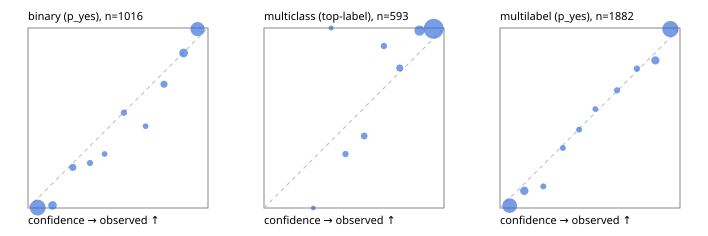

# Evaluation report

- model `caiovicentino1/Eikos-4B` @ `99336c2376` (Eikos letter readout (external open model)), adapter/checkpoint `None`, prompt `letter-v1-semif` (letter-v1-semif)
- data data/eval2.jsonl; splits ['test']; n=1991; calibration `None`
- cuda / bfloat16; 2026-09-24T23:04:21+0000; wall 283.9s

## Overall

question accuracy 92.8%

**binary**: n 1016, positives 435, accuracy 0.949, precision 0.921, recall 0.963, f1 0.942, auroc 0.990, brier 0.040, log_loss 0.162, ece 0.055

**multiclass**: n 593, accuracy 0.958, macro_f1 0.930, log_loss 0.156, brier 0.061, ece_top_label 0.070

**multilabel**: n 382, labels 1882, exact_match 0.825, micro_f1 0.957, macro_f1 0.925, label_auroc 0.987, brier 0.038, log_loss 0.156, ece 0.043

## By family

| family | n | question acc % | details |
|---|---|---|---|
| e2_hard | 673 | 90.8 | bin acc 93.4 F1 91.3 AUROC 0.987 ECE 0.076; mc acc 93.3 mF1 87.0 ECE 0.086; ml EM 80.3 µF1 94.6 ECE 0.049 |
| e2_simple | 664 | 95.9 | bin acc 96.2 F1 96.6 AUROC 0.990 ECE 0.058; mc acc 99.0 mF1 97.8 ECE 0.066; ml EM 90.0 µF1 98.1 ECE 0.064 |
| e2_very_hard | 654 | 91.6 | bin acc 95.1 F1 93.6 AUROC 0.991 ECE 0.058; mc acc 95.0 mF1 93.7 ECE 0.077; ml EM 77.7 µF1 94.5 ECE 0.046 |

## by hard case

| slice | n | question acc % |
|---|---|---|
| (none) | 569 | 95.8 |
| contradiction | 172 | 95.9 |
| distractor | 474 | 92.4 |
| double_negation | 126 | 92.9 |
| evidence_end | 57 | 98.2 |
| evidence_middle | 114 | 98.2 |
| evidence_start | 17 | 94.1 |
| exception | 213 | 91.5 |
| hypothetical | 128 | 93.0 |
| injection | 151 | 92.1 |
| lexical_overlap | 201 | 94.5 |
| long_state | 191 | 96.3 |
| missing_evidence | 141 | 95.0 |
| multi_positive | 322 | 86.6 |
| multi_turn | 149 | 91.3 |
| negation | 257 | 96.1 |
| nota | 118 | 88.1 |
| numeric_reasoning | 224 | 83.9 |
| paraphrase | 218 | 90.4 |
| role_reversal | 187 | 94.7 |
| sarcasm | 149 | 85.9 |
| temporal_reasoning | 203 | 82.3 |
| zero_positive | 73 | 90.4 |
| zero_positive_distractor | 1 | 100.0 |

## by state tokens

| slice | n | question acc % |
|---|---|---|
| 00000-00127 | 666 | 90.4 |
| 00128-00511 | 469 | 91.3 |
| 00512-02047 | 488 | 95.3 |
| 02048-08191 | 329 | 95.1 |
| 08192+ | 39 | 100.0 |

## by candidates

| slice | n | question acc % |
|---|---|---|
| 01 | 1016 | 94.9 |
| 03 | 128 | 95.3 |
| 04 | 515 | 92.2 |
| 05 | 224 | 87.1 |
| 06 | 86 | 83.7 |
| 07 | 18 | 94.4 |
| 08 | 4 | 50.0 |

## Paraphrase groups

76 groups; same prediction 77.6%; all correct 85.5%

## Multiclass abstention (coverage vs error on accepted)

| abstain_below | coverage % | error % |
|---|---|---|
| 0.0 | 100.0 | 4.2 |
| 0.4 | 99.5 | 4.1 |
| 0.5 | 97.8 | 2.9 |
| 0.6 | 95.3 | 1.4 |
| 0.7 | 93.6 | 1.3 |
| 0.8 | 90.6 | 0.6 |
| 0.9 | 78.8 | 0.4 |

## Reliability: binary

| bin | n | mean confidence | observed frequency |
|---|---|---|---|
| [0.0,0.1) | 435 | 0.054 | 0.002 |
| [0.1,0.2) | 69 | 0.136 | 0.014 |
| [0.2,0.3) | 31 | 0.249 | 0.226 |
| [0.3,0.4) | 16 | 0.345 | 0.250 |
| [0.4,0.5) | 10 | 0.426 | 0.300 |
| [0.5,0.6) | 17 | 0.533 | 0.529 |
| [0.6,0.7) | 11 | 0.653 | 0.455 |
| [0.7,0.8) | 32 | 0.756 | 0.688 |
| [0.8,0.9) | 72 | 0.865 | 0.861 |
| [0.9,1.0] | 323 | 0.942 | 0.994 |

## Reliability: multiclass

| bin | n | mean confidence | observed frequency |
|---|---|---|---|
| [0.2,0.3) | 1 | 0.274 | 0.000 |
| [0.3,0.4) | 2 | 0.373 | 1.000 |
| [0.4,0.5) | 10 | 0.453 | 0.300 |
| [0.5,0.6) | 15 | 0.557 | 0.400 |
| [0.6,0.7) | 10 | 0.666 | 0.900 |
| [0.7,0.8) | 18 | 0.754 | 0.778 |
| [0.8,0.9) | 70 | 0.864 | 0.986 |
| [0.9,1.0] | 467 | 0.943 | 0.996 |

## Reliability: multilabel

| bin | n | mean confidence | observed frequency |
|---|---|---|---|
| [0.0,0.1) | 665 | 0.054 | 0.014 |
| [0.1,0.2) | 115 | 0.135 | 0.096 |
| [0.2,0.3) | 25 | 0.241 | 0.120 |
| [0.3,0.4) | 21 | 0.350 | 0.333 |
| [0.4,0.5) | 23 | 0.439 | 0.435 |
| [0.5,0.6) | 20 | 0.529 | 0.550 |
| [0.6,0.7) | 26 | 0.650 | 0.654 |
| [0.7,0.8) | 31 | 0.760 | 0.774 |
| [0.8,0.9) | 100 | 0.863 | 0.820 |
| [0.9,1.0] | 856 | 0.947 | 0.994 |
