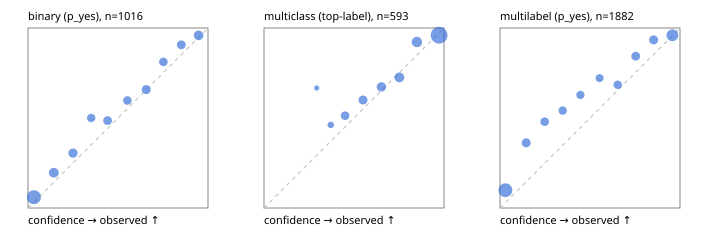

# Evaluation report

- model `jinaai/jina-reranker-v3.5` @ `e8a93f33f0` (jina listwise (jina-v1)), adapter/checkpoint `runs/jina_r2b/adapter`, prompt `jina-v1` (8bf5a0abfcae)
- data data/eval2.jsonl; splits ['test']; n=1991; calibration `None`
- cuda / bfloat16; 2026-09-24T09:01:50+0000; wall 118.6s

## Overall

question accuracy 73.3%

**binary**: n 1016, positives 435, accuracy 0.798, precision 0.799, recall 0.706, f1 0.750, auroc 0.886, brier 0.138, log_loss 0.426, ece 0.042

**multiclass**: n 593, accuracy 0.835, macro_f1 0.739, log_loss 0.495, brier 0.252, ece_top_label 0.032

**multilabel**: n 382, labels 1882, exact_match 0.401, micro_f1 0.785, macro_f1 0.655, label_auroc 0.893, brier 0.147, log_loss 0.457, ece 0.098

## By family

| family | n | question acc % | details |
|---|---|---|---|
| e2_hard | 673 | 70.7 | bin acc 79.9 F1 70.1 AUROC 0.854 ECE 0.057; mc acc 76.2 mF1 64.8 ECE 0.077; ml EM 38.6 µF1 78.1 ECE 0.079 |
| e2_simple | 664 | 80.6 | bin acc 83.7 F1 83.8 AUROC 0.944 ECE 0.100; mc acc 94.5 mF1 89.1 ECE 0.068; ml EM 48.3 µF1 82.6 ECE 0.138 |
| e2_very_hard | 654 | 68.5 | bin acc 75.6 F1 66.9 AUROC 0.845 ECE 0.051; mc acc 79.5 mF1 67.9 ECE 0.069; ml EM 33.8 µF1 75.1 ECE 0.091 |

## by hard case

| slice | n | question acc % |
|---|---|---|
| (none) | 569 | 83.1 |
| contradiction | 172 | 73.3 |
| distractor | 474 | 65.0 |
| double_negation | 126 | 68.3 |
| evidence_end | 57 | 59.6 |
| evidence_middle | 114 | 66.7 |
| evidence_start | 17 | 47.1 |
| exception | 213 | 72.3 |
| hypothetical | 128 | 75.0 |
| injection | 151 | 57.6 |
| lexical_overlap | 201 | 77.6 |
| long_state | 191 | 59.7 |
| missing_evidence | 141 | 80.1 |
| multi_positive | 322 | 43.5 |
| multi_turn | 149 | 73.8 |
| negation | 257 | 75.1 |
| nota | 118 | 63.6 |
| numeric_reasoning | 224 | 59.8 |
| paraphrase | 218 | 74.8 |
| role_reversal | 187 | 69.5 |
| sarcasm | 149 | 67.1 |
| temporal_reasoning | 203 | 59.6 |
| zero_positive | 73 | 75.3 |
| zero_positive_distractor | 1 | 100.0 |

## by state tokens

| slice | n | question acc % |
|---|---|---|
| 00000-00127 | 662 | 77.5 |
| 00128-00511 | 477 | 74.0 |
| 00512-02047 | 484 | 74.0 |
| 02048-08191 | 329 | 65.0 |
| 08192+ | 39 | 53.8 |

## by candidates

| slice | n | question acc % |
|---|---|---|
| 01 | 1016 | 79.8 |
| 03 | 128 | 84.4 |
| 04 | 515 | 77.3 |
| 05 | 224 | 50.4 |
| 06 | 86 | 24.4 |
| 07 | 18 | 33.3 |
| 08 | 4 | 50.0 |

## Paraphrase groups

76 groups; same prediction 75.0%; all correct 61.8%

## Multiclass abstention (coverage vs error on accepted)

| abstain_below | coverage % | error % |
|---|---|---|
| 0.0 | 100.0 | 16.5 |
| 0.4 | 97.3 | 15.6 |
| 0.5 | 90.7 | 13.2 |
| 0.6 | 83.1 | 10.8 |
| 0.7 | 73.9 | 8.0 |
| 0.8 | 63.4 | 4.8 |
| 0.9 | 50.4 | 4.0 |

## Reliability: binary

| bin | n | mean confidence | observed frequency |
|---|---|---|---|
| [0.0,0.1) | 318 | 0.033 | 0.060 |
| [0.1,0.2) | 102 | 0.143 | 0.196 |
| [0.2,0.3) | 82 | 0.250 | 0.305 |
| [0.3,0.4) | 60 | 0.351 | 0.500 |
| [0.4,0.5) | 70 | 0.442 | 0.486 |
| [0.5,0.6) | 67 | 0.552 | 0.597 |
| [0.6,0.7) | 76 | 0.657 | 0.658 |
| [0.7,0.8) | 69 | 0.752 | 0.812 |
| [0.8,0.9) | 75 | 0.852 | 0.907 |
| [0.9,1.0] | 97 | 0.948 | 0.959 |

## Reliability: multiclass

| bin | n | mean confidence | observed frequency |
|---|---|---|---|
| [0.2,0.3) | 3 | 0.293 | 0.667 |
| [0.3,0.4) | 13 | 0.371 | 0.462 |
| [0.4,0.5) | 39 | 0.450 | 0.513 |
| [0.5,0.6) | 45 | 0.550 | 0.600 |
| [0.6,0.7) | 55 | 0.652 | 0.673 |
| [0.7,0.8) | 62 | 0.752 | 0.726 |
| [0.8,0.9) | 77 | 0.850 | 0.922 |
| [0.9,1.0] | 299 | 0.973 | 0.960 |

## Reliability: multilabel

| bin | n | mean confidence | observed frequency |
|---|---|---|---|
| [0.0,0.1) | 557 | 0.030 | 0.099 |
| [0.1,0.2) | 149 | 0.145 | 0.362 |
| [0.2,0.3) | 123 | 0.249 | 0.480 |
| [0.3,0.4) | 109 | 0.348 | 0.541 |
| [0.4,0.5) | 105 | 0.447 | 0.629 |
| [0.5,0.6) | 97 | 0.554 | 0.722 |
| [0.6,0.7) | 111 | 0.654 | 0.685 |
| [0.7,0.8) | 134 | 0.754 | 0.843 |
| [0.8,0.9) | 151 | 0.854 | 0.934 |
| [0.9,1.0] | 346 | 0.958 | 0.960 |
