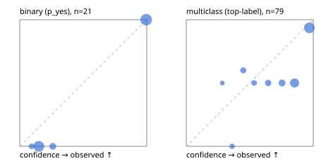

# Evaluation report

- model `Qwen/Qwen3.5-4B` @ `851bf6e806` (shared-prefix tree, forward only: text once per request, each question once, then each candidate), adapter/checkpoint ``, prompt `challenger-state-first-v1` (6c9d8459ac44)
- data data/ova/eval_pets100.jsonl; splits ['test']; n=100; calibration `None`
- cuda / bfloat16; 2026-09-30T01:21:10+0000; wall 325.0s

## Overall

question accuracy 73.0%

**binary**: n 21, positives 10, accuracy 1.000, precision 1.000, recall 1.000, f1 1.000, auroc 1.000, brier 0.016, log_loss 0.098, ece 0.089

**multiclass**: n 79, accuracy 0.658, macro_f1 0.646, log_loss 0.859, brier 0.480, ece_top_label 0.170

## By family

| family | n | question acc % | details |
|---|---|---|---|
| pets_breed37 | 18 | 77.8 | mc acc 77.8 mF1 64.7 ECE 0.186 |
| pets_cat_breed | 61 | 62.3 | mc acc 62.3 mF1 60.9 ECE 0.226 |
| pets_is_cat | 21 | 100.0 | bin acc 100.0 F1 100.0 AUROC 1.000 ECE 0.089 |

## by hard case

| slice | n | question acc % |
|---|---|---|
| (none) | 100 | 73.0 |

## by state tokens

| slice | n | question acc % |
|---|---|---|
| 00000-00127 | 100 | 73.0 |

## by candidates

| slice | n | question acc % |
|---|---|---|
| 01 | 21 | 100.0 |
| 12 | 61 | 62.3 |
| 37 | 18 | 77.8 |

## Paraphrase groups

0 groups; same prediction —%; all correct —%

## Multiclass abstention (coverage vs error on accepted)

| abstain_below | coverage % | error % |
|---|---|---|
| 0.0 | 100.0 | 34.2 |
| 0.4 | 93.7 | 31.1 |
| 0.5 | 87.3 | 30.4 |
| 0.6 | 82.3 | 29.2 |
| 0.7 | 74.7 | 27.1 |
| 0.8 | 64.6 | 23.5 |
| 0.9 | 39.2 | 6.5 |

## Reliability: binary

| bin | n | mean confidence | observed frequency |
|---|---|---|---|
| [0.0,0.1) | 1 | 0.093 | 0.000 |
| [0.1,0.2) | 8 | 0.150 | 0.000 |
| [0.2,0.3) | 2 | 0.260 | 0.000 |
| [0.9,1.0] | 10 | 0.996 | 1.000 |

## Reliability: multiclass

| bin | n | mean confidence | observed frequency |
|---|---|---|---|
| [0.2,0.3) | 2 | 0.283 | 0.500 |
| [0.3,0.4) | 3 | 0.361 | 0.000 |
| [0.4,0.5) | 5 | 0.449 | 0.600 |
| [0.5,0.6) | 4 | 0.535 | 0.500 |
| [0.6,0.7) | 6 | 0.645 | 0.500 |
| [0.7,0.8) | 8 | 0.754 | 0.500 |
| [0.8,0.9) | 20 | 0.853 | 0.500 |
| [0.9,1.0] | 31 | 0.969 | 0.935 |
