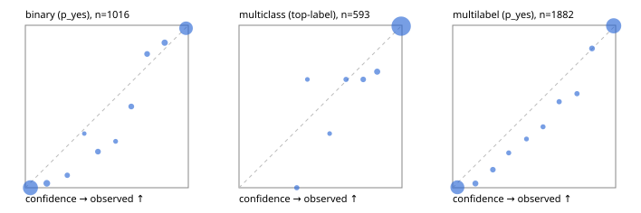

# Evaluation report

- model `Qwen/Qwen3.5-4B` @ `851bf6e806` (shared-prefix tree, forward only: text once per request, each question once, then each candidate), adapter/checkpoint `runs/pets_ft/adapter`, prompt `challenger-state-first-v1` (6c9d8459ac44)
- data data/ova/eval2.jsonl; splits ['test']; n=1991; calibration `None`
- cuda / bfloat16; 2026-09-30T03:27:32+0000; wall 355.9s

## Overall

question accuracy 95.3%

**binary**: n 1016, positives 435, accuracy 0.967, precision 0.941, recall 0.984, f1 0.962, auroc 0.996, brier 0.026, log_loss 0.102, ece 0.034

**multiclass**: n 593, accuracy 0.965, macro_f1 0.939, log_loss 0.091, brier 0.047, ece_top_label 0.011

**multilabel**: n 382, labels 1882, exact_match 0.898, micro_f1 0.978, macro_f1 0.958, label_auroc 0.997, brier 0.018, log_loss 0.073, ece 0.025

## By family

| family | n | question acc % | details |
|---|---|---|---|
| e2_hard | 673 | 94.4 | bin acc 96.8 F1 95.8 AUROC 0.995 ECE 0.039; mc acc 94.8 mF1 88.9 ECE 0.021; ml EM 87.1 µF1 96.6 ECE 0.029 |
| e2_simple | 664 | 98.3 | bin acc 97.1 F1 97.4 AUROC 0.997 ECE 0.032; mc acc 100.0 mF1 100.0 ECE 0.004; ml EM 99.2 µF1 99.9 ECE 0.021 |
| e2_very_hard | 654 | 93.1 | bin acc 96.0 F1 94.8 AUROC 0.996 ECE 0.041; mc acc 94.5 mF1 93.0 ECE 0.023; ml EM 83.8 µF1 96.9 ECE 0.033 |

## by hard case

| slice | n | question acc % |
|---|---|---|
| (none) | 569 | 98.4 |
| contradiction | 172 | 96.5 |
| distractor | 474 | 92.4 |
| double_negation | 126 | 96.8 |
| evidence_end | 57 | 98.2 |
| evidence_middle | 114 | 99.1 |
| evidence_start | 17 | 100.0 |
| exception | 213 | 95.3 |
| hypothetical | 128 | 95.3 |
| injection | 151 | 93.4 |
| lexical_overlap | 201 | 96.5 |
| long_state | 191 | 97.9 |
| missing_evidence | 141 | 96.5 |
| multi_positive | 322 | 90.4 |
| multi_turn | 149 | 92.6 |
| negation | 257 | 97.3 |
| nota | 118 | 94.1 |
| numeric_reasoning | 224 | 84.8 |
| paraphrase | 218 | 91.7 |
| role_reversal | 187 | 94.1 |
| sarcasm | 149 | 95.3 |
| temporal_reasoning | 203 | 84.2 |
| zero_positive | 73 | 93.2 |
| zero_positive_distractor | 1 | 100.0 |

## by state tokens

| slice | n | question acc % |
|---|---|---|
| 00000-00127 | 666 | 94.6 |
| 00128-00511 | 469 | 93.2 |
| 00512-02047 | 488 | 96.1 |
| 02048-08191 | 329 | 98.2 |
| 08192+ | 39 | 97.4 |

## by candidates

| slice | n | question acc % |
|---|---|---|
| 01 | 1016 | 96.7 |
| 03 | 128 | 96.9 |
| 04 | 515 | 94.8 |
| 05 | 224 | 91.5 |
| 06 | 86 | 91.9 |
| 07 | 18 | 88.9 |
| 08 | 4 | 75.0 |

## Paraphrase groups

76 groups; same prediction 82.9%; all correct 85.5%

## Multiclass abstention (coverage vs error on accepted)

| abstain_below | coverage % | error % |
|---|---|---|
| 0.0 | 100.0 | 3.5 |
| 0.4 | 99.0 | 2.6 |
| 0.5 | 98.5 | 2.4 |
| 0.6 | 98.0 | 2.1 |
| 0.7 | 97.0 | 1.7 |
| 0.8 | 95.4 | 1.2 |
| 0.9 | 93.1 | 0.5 |

## Reliability: binary

| bin | n | mean confidence | observed frequency |
|---|---|---|---|
| [0.0,0.1) | 490 | 0.031 | 0.000 |
| [0.1,0.2) | 37 | 0.132 | 0.027 |
| [0.2,0.3) | 13 | 0.257 | 0.077 |
| [0.3,0.4) | 3 | 0.362 | 0.333 |
| [0.4,0.5) | 18 | 0.446 | 0.222 |
| [0.5,0.6) | 7 | 0.554 | 0.286 |
| [0.6,0.7) | 18 | 0.650 | 0.500 |
| [0.7,0.8) | 17 | 0.747 | 0.824 |
| [0.8,0.9) | 28 | 0.855 | 0.893 |
| [0.9,1.0] | 385 | 0.986 | 0.982 |

## Reliability: multiclass

| bin | n | mean confidence | observed frequency |
|---|---|---|---|
| [0.3,0.4) | 6 | 0.354 | 0.000 |
| [0.4,0.5) | 3 | 0.420 | 0.667 |
| [0.5,0.6) | 3 | 0.556 | 0.333 |
| [0.6,0.7) | 6 | 0.657 | 0.667 |
| [0.7,0.8) | 9 | 0.762 | 0.667 |
| [0.8,0.9) | 14 | 0.848 | 0.714 |
| [0.9,1.0] | 552 | 0.995 | 0.995 |

## Reliability: multilabel

| bin | n | mean confidence | observed frequency |
|---|---|---|---|
| [0.0,0.1) | 746 | 0.029 | 0.003 |
| [0.1,0.2) | 38 | 0.140 | 0.026 |
| [0.2,0.3) | 27 | 0.247 | 0.111 |
| [0.3,0.4) | 14 | 0.344 | 0.214 |
| [0.4,0.5) | 10 | 0.453 | 0.300 |
| [0.5,0.6) | 16 | 0.555 | 0.375 |
| [0.6,0.7) | 17 | 0.653 | 0.529 |
| [0.7,0.8) | 19 | 0.763 | 0.579 |
| [0.8,0.9) | 35 | 0.855 | 0.857 |
| [0.9,1.0] | 960 | 0.988 | 0.997 |
