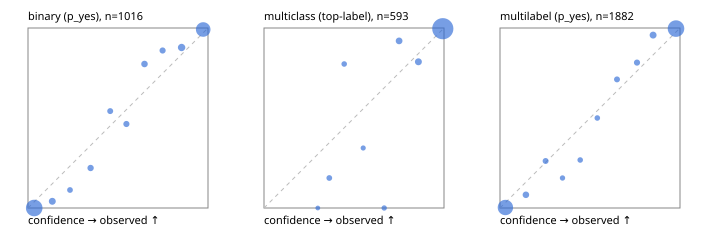

# Evaluation report

- model `Qwen/Qwen3.5-4B` @ `851bf6e806` (shared-prefix tree, forward only: text once per request, each question once, then each candidate), adapter/checkpoint `weights/selfjev_4b`, prompt `challenger-state-first-v1` (6c9d8459ac44)
- data data/ova/eval2.jsonl; splits ['test']; n=1991; calibration `None`
- cuda / bfloat16; 2026-09-29T22:34:02+0000; wall 464.6s

## Overall

question accuracy 95.7%

**binary**: n 1016, positives 435, accuracy 0.967, precision 0.953, recall 0.970, f1 0.961, auroc 0.996, brier 0.025, log_loss 0.104, ece 0.038

**multiclass**: n 593, accuracy 0.968, macro_f1 0.940, log_loss 0.087, brier 0.044, ece_top_label 0.019

**multilabel**: n 382, labels 1882, exact_match 0.914, micro_f1 0.980, macro_f1 0.961, label_auroc 0.997, brier 0.018, log_loss 0.078, ece 0.029

## By family

| family | n | question acc % | details |
|---|---|---|---|
| e2_hard | 673 | 94.4 | bin acc 96.3 F1 94.8 AUROC 0.995 ECE 0.053; mc acc 95.9 mF1 90.6 ECE 0.028; ml EM 87.1 µF1 96.4 ECE 0.027 |
| e2_simple | 664 | 98.5 | bin acc 97.4 F1 97.6 AUROC 0.997 ECE 0.037; mc acc 100.0 mF1 100.0 ECE 0.007; ml EM 99.2 µF1 99.9 ECE 0.028 |
| e2_very_hard | 654 | 94.2 | bin acc 96.3 F1 95.2 AUROC 0.996 ECE 0.049; mc acc 94.5 mF1 91.7 ECE 0.026; ml EM 88.5 µF1 97.7 ECE 0.041 |

## by hard case

| slice | n | question acc % |
|---|---|---|
| (none) | 569 | 98.4 |
| contradiction | 172 | 97.1 |
| distractor | 474 | 93.9 |
| double_negation | 126 | 96.8 |
| evidence_end | 57 | 98.2 |
| evidence_middle | 114 | 99.1 |
| evidence_start | 17 | 100.0 |
| exception | 213 | 96.2 |
| hypothetical | 128 | 96.1 |
| injection | 151 | 95.4 |
| lexical_overlap | 201 | 96.5 |
| long_state | 191 | 98.4 |
| missing_evidence | 141 | 96.5 |
| multi_positive | 322 | 91.0 |
| multi_turn | 149 | 92.6 |
| negation | 257 | 98.1 |
| nota | 118 | 95.8 |
| numeric_reasoning | 224 | 87.5 |
| paraphrase | 218 | 92.7 |
| role_reversal | 187 | 93.6 |
| sarcasm | 149 | 95.3 |
| temporal_reasoning | 203 | 88.2 |
| zero_positive | 73 | 94.5 |
| zero_positive_distractor | 1 | 100.0 |

## by state tokens

| slice | n | question acc % |
|---|---|---|
| 00000-00127 | 666 | 94.7 |
| 00128-00511 | 469 | 94.0 |
| 00512-02047 | 488 | 96.5 |
| 02048-08191 | 329 | 98.2 |
| 08192+ | 39 | 100.0 |

## by candidates

| slice | n | question acc % |
|---|---|---|
| 01 | 1016 | 96.7 |
| 03 | 128 | 97.7 |
| 04 | 515 | 94.6 |
| 05 | 224 | 93.8 |
| 06 | 86 | 94.2 |
| 07 | 18 | 94.4 |
| 08 | 4 | 75.0 |

## Paraphrase groups

76 groups; same prediction 78.9%; all correct 85.5%

## Multiclass abstention (coverage vs error on accepted)

| abstain_below | coverage % | error % |
|---|---|---|
| 0.0 | 100.0 | 3.2 |
| 0.4 | 98.8 | 2.2 |
| 0.5 | 98.0 | 2.1 |
| 0.6 | 97.5 | 1.7 |
| 0.7 | 96.8 | 1.0 |
| 0.8 | 94.4 | 0.9 |
| 0.9 | 91.7 | 0.4 |

## Reliability: binary

| bin | n | mean confidence | observed frequency |
|---|---|---|---|
| [0.0,0.1) | 505 | 0.035 | 0.000 |
| [0.1,0.2) | 27 | 0.135 | 0.037 |
| [0.2,0.3) | 10 | 0.234 | 0.100 |
| [0.3,0.4) | 18 | 0.348 | 0.222 |
| [0.4,0.5) | 13 | 0.456 | 0.538 |
| [0.5,0.6) | 15 | 0.547 | 0.467 |
| [0.6,0.7) | 20 | 0.647 | 0.800 |
| [0.7,0.8) | 16 | 0.748 | 0.875 |
| [0.8,0.9) | 37 | 0.853 | 0.892 |
| [0.9,1.0] | 355 | 0.974 | 0.992 |

## Reliability: multiclass

| bin | n | mean confidence | observed frequency |
|---|---|---|---|
| [0.2,0.3) | 1 | 0.299 | 0.000 |
| [0.3,0.4) | 6 | 0.363 | 0.167 |
| [0.4,0.5) | 5 | 0.446 | 0.800 |
| [0.5,0.6) | 3 | 0.551 | 0.333 |
| [0.6,0.7) | 4 | 0.668 | 0.000 |
| [0.7,0.8) | 14 | 0.750 | 0.929 |
| [0.8,0.9) | 16 | 0.858 | 0.812 |
| [0.9,1.0] | 544 | 0.993 | 0.996 |

## Reliability: multilabel

| bin | n | mean confidence | observed frequency |
|---|---|---|---|
| [0.0,0.1) | 759 | 0.030 | 0.003 |
| [0.1,0.2) | 41 | 0.144 | 0.073 |
| [0.2,0.3) | 23 | 0.254 | 0.261 |
| [0.3,0.4) | 12 | 0.347 | 0.167 |
| [0.4,0.5) | 15 | 0.446 | 0.267 |
| [0.5,0.6) | 16 | 0.541 | 0.500 |
| [0.6,0.7) | 21 | 0.650 | 0.714 |
| [0.7,0.8) | 26 | 0.761 | 0.808 |
| [0.8,0.9) | 51 | 0.851 | 0.961 |
| [0.9,1.0] | 918 | 0.978 | 0.997 |
