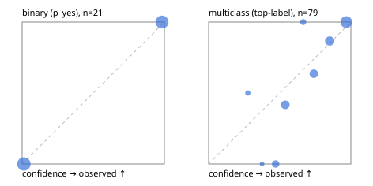

# Evaluation report

- model `Qwen/Qwen3.5-4B` @ `851bf6e806` (shared-prefix tree, forward only: text once per request, each question once, then each candidate), adapter/checkpoint `weights/selfjev_4b`, prompt `challenger-state-first-v1` (6c9d8459ac44)
- data data/ova/eval_pets100.jsonl; splits ['test']; n=100; calibration `None`
- cuda / bfloat16; 2026-09-30T01:15:34+0000; wall 411.1s

## Overall

question accuracy 78.0%

**binary**: n 21, positives 10, accuracy 1.000, precision 1.000, recall 1.000, f1 1.000, auroc 1.000, brier 0.000, log_loss 0.014, ece 0.014

**multiclass**: n 79, accuracy 0.722, macro_f1 0.712, log_loss 0.561, brier 0.312, ece_top_label 0.112

## By family

| family | n | question acc % | details |
|---|---|---|---|
| pets_breed37 | 18 | 83.3 | mc acc 83.3 mF1 75.0 ECE 0.093 |
| pets_cat_breed | 61 | 68.9 | mc acc 68.9 mF1 70.5 ECE 0.150 |
| pets_is_cat | 21 | 100.0 | bin acc 100.0 F1 100.0 AUROC 1.000 ECE 0.014 |

## by hard case

| slice | n | question acc % |
|---|---|---|
| (none) | 100 | 78.0 |

## by state tokens

| slice | n | question acc % |
|---|---|---|
| 00000-00127 | 100 | 78.0 |

## by candidates

| slice | n | question acc % |
|---|---|---|
| 01 | 21 | 100.0 |
| 12 | 61 | 68.9 |
| 37 | 18 | 83.3 |

## Paraphrase groups

0 groups; same prediction —%; all correct —%

## Multiclass abstention (coverage vs error on accepted)

| abstain_below | coverage % | error % |
|---|---|---|
| 0.0 | 100.0 | 27.8 |
| 0.4 | 96.2 | 26.3 |
| 0.5 | 87.3 | 18.8 |
| 0.6 | 72.2 | 10.5 |
| 0.7 | 68.4 | 11.1 |
| 0.8 | 54.4 | 4.7 |
| 0.9 | 35.4 | 0.0 |

## Reliability: binary

| bin | n | mean confidence | observed frequency |
|---|---|---|---|
| [0.0,0.1) | 11 | 0.012 | 0.000 |
| [0.9,1.0] | 10 | 0.983 | 1.000 |

## Reliability: multiclass

| bin | n | mean confidence | observed frequency |
|---|---|---|---|
| [0.2,0.3) | 2 | 0.276 | 0.500 |
| [0.3,0.4) | 1 | 0.376 | 0.000 |
| [0.4,0.5) | 7 | 0.471 | 0.000 |
| [0.5,0.6) | 12 | 0.539 | 0.417 |
| [0.6,0.7) | 3 | 0.665 | 1.000 |
| [0.7,0.8) | 11 | 0.739 | 0.636 |
| [0.8,0.9) | 15 | 0.851 | 0.867 |
| [0.9,1.0] | 28 | 0.968 | 1.000 |
