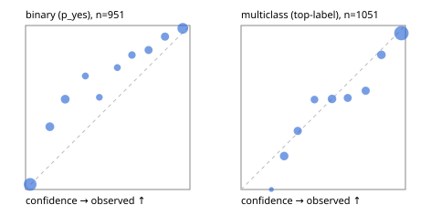

# Evaluation report

- model `Qwen/Qwen3.5-4B` @ `851bf6e806` (shared-prefix tree, forward only: text once per request, each question once, then each candidate), adapter/checkpoint `weights/selfjev_4b`, prompt `challenger-state-first-v1` (6c9d8459ac44)
- data data/ova/eval_images_v1.jsonl; splits ['test']; n=2002; calibration `None`
- cuda / bfloat16; 2026-09-30T05:20:19+0000; wall 219.2s

## Overall

question accuracy 75.5%

**binary**: n 951, positives 508, accuracy 0.815, precision 0.909, recall 0.726, f1 0.807, auroc 0.931, brier 0.128, log_loss 0.384, ece 0.106

**multiclass**: n 1051, accuracy 0.700, macro_f1 0.896, log_loss 0.703, brier 0.372, ece_top_label 0.045

## By family

| family | n | question acc % | details |
|---|---|---|---|
| img_beans | 204 | 72.1 | bin acc 80.4 F1 82.8 AUROC 0.877 ECE 0.072; mc acc 63.7 mF1 59.6 ECE 0.144 |
| img_eurosat | 200 | 56.0 | bin acc 67.0 F1 57.1 AUROC 0.865 ECE 0.199; mc acc 45.0 mF1 39.9 ECE 0.083 |
| img_fashion | 200 | 75.5 | bin acc 83.0 F1 80.9 AUROC 0.939 ECE 0.129; mc acc 68.0 mF1 66.7 ECE 0.081 |
| img_hurricane | 100 | 62.0 | mc acc 62.0 mF1 61.2 ECE 0.180 |
| img_indoor | 268 | 94.8 | bin acc 95.5 F1 95.4 AUROC 0.995 ECE 0.076; mc acc 94.0 mF1 93.8 ECE 0.040 |
| img_painting | 204 | 70.6 | bin acc 78.4 F1 76.1 AUROC 0.909 ECE 0.162; mc acc 62.7 mF1 59.1 ECE 0.088 |
| img_pets | 222 | 94.1 | bin acc 89.2 F1 91.4 AUROC 0.982 ECE 0.111; mc acc 99.1 mF1 99.1 ECE 0.087 |
| img_rice | 200 | 36.5 | bin acc 50.0 F1 0.0 AUROC 0.601 ECE 0.296; mc acc 23.0 mF1 13.8 ECE 0.066 |
| img_snacks | 200 | 92.5 | bin acc 91.0 F1 91.9 AUROC 0.996 ECE 0.099; mc acc 94.0 mF1 94.0 ECE 0.058 |
| img_trash | 204 | 85.3 | bin acc 93.1 F1 93.6 AUROC 0.970 ECE 0.067; mc acc 77.5 mF1 72.8 ECE 0.121 |

## by hard case

| slice | n | question acc % |
|---|---|---|
| (none) | 2002 | 75.5 |

## by state tokens

| slice | n | question acc % |
|---|---|---|
| 00000-00127 | 2002 | 75.5 |

## by candidates

| slice | n | question acc % |
|---|---|---|
| 01 | 951 | 81.5 |
| 02 | 100 | 62.0 |
| 03 | 102 | 63.7 |
| 05 | 100 | 23.0 |
| 06 | 102 | 77.5 |
| 10 | 200 | 56.5 |
| 12 | 447 | 88.1 |

## Paraphrase groups

0 groups; same prediction —%; all correct —%

## Multiclass abstention (coverage vs error on accepted)

| abstain_below | coverage % | error % |
|---|---|---|
| 0.0 | 100.0 | 30.0 |
| 0.4 | 82.0 | 20.4 |
| 0.5 | 76.1 | 18.5 |
| 0.6 | 67.0 | 14.9 |
| 0.7 | 59.7 | 11.3 |
| 0.8 | 51.8 | 7.0 |
| 0.9 | 42.7 | 4.7 |

## Reliability: binary

| bin | n | mean confidence | observed frequency |
|---|---|---|---|
| [0.0,0.1) | 291 | 0.028 | 0.031 |
| [0.1,0.2) | 94 | 0.148 | 0.383 |
| [0.2,0.3) | 89 | 0.241 | 0.551 |
| [0.3,0.4) | 39 | 0.364 | 0.692 |
| [0.4,0.5) | 32 | 0.449 | 0.562 |
| [0.5,0.6) | 39 | 0.558 | 0.744 |
| [0.6,0.7) | 50 | 0.647 | 0.820 |
| [0.7,0.8) | 67 | 0.749 | 0.851 |
| [0.8,0.9) | 74 | 0.848 | 0.932 |
| [0.9,1.0] | 176 | 0.957 | 0.983 |

## Reliability: multiclass

| bin | n | mean confidence | observed frequency |
|---|---|---|---|
| [0.1,0.2) | 7 | 0.184 | 0.000 |
| [0.2,0.3) | 98 | 0.262 | 0.204 |
| [0.3,0.4) | 84 | 0.345 | 0.357 |
| [0.4,0.5) | 62 | 0.447 | 0.548 |
| [0.5,0.6) | 96 | 0.553 | 0.552 |
| [0.6,0.7) | 77 | 0.649 | 0.558 |
| [0.7,0.8) | 83 | 0.758 | 0.602 |
| [0.8,0.9) | 95 | 0.854 | 0.821 |
| [0.9,1.0] | 449 | 0.976 | 0.953 |
