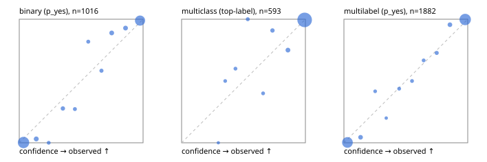

# Evaluation report

- model `Qwen/Qwen3.5-4B` @ `851bf6e806` (shared-prefix tree, forward only: text once per request, each question once, then each candidate), adapter/checkpoint `runs/images_v1/adapter`, prompt `challenger-state-first-v1` (6c9d8459ac44)
- data data/ova/eval2.jsonl; splits ['test']; n=1991; calibration `None`
- cuda / bfloat16; 2026-09-30T08:46:21+0000; wall 329.4s

## Overall

question accuracy 96.1%

**binary**: n 1016, positives 435, accuracy 0.974, precision 0.964, recall 0.977, f1 0.970, auroc 0.996, brier 0.024, log_loss 0.099, ece 0.039

**multiclass**: n 593, accuracy 0.973, macro_f1 0.949, log_loss 0.088, brier 0.045, ece_top_label 0.017

**multilabel**: n 382, labels 1882, exact_match 0.908, micro_f1 0.981, macro_f1 0.963, label_auroc 0.998, brier 0.016, log_loss 0.069, ece 0.027

## By family

| family | n | question acc % | details |
|---|---|---|---|
| e2_hard | 673 | 94.9 | bin acc 97.4 F1 96.4 AUROC 0.996 ECE 0.051; mc acc 96.4 mF1 91.7 ECE 0.028; ml EM 86.4 µF1 96.5 ECE 0.029 |
| e2_simple | 664 | 98.3 | bin acc 98.0 F1 98.1 AUROC 0.997 ECE 0.031; mc acc 99.5 mF1 98.9 ECE 0.007; ml EM 97.5 µF1 99.6 ECE 0.026 |
| e2_very_hard | 654 | 95.1 | bin acc 96.9 F1 96.0 AUROC 0.995 ECE 0.047; mc acc 96.0 mF1 94.3 ECE 0.021; ml EM 89.2 µF1 98.0 ECE 0.037 |

## by hard case

| slice | n | question acc % |
|---|---|---|
| (none) | 569 | 98.2 |
| contradiction | 172 | 97.1 |
| distractor | 474 | 95.1 |
| double_negation | 126 | 96.8 |
| evidence_end | 57 | 98.2 |
| evidence_middle | 114 | 98.2 |
| evidence_start | 17 | 100.0 |
| exception | 213 | 97.2 |
| hypothetical | 128 | 96.1 |
| injection | 151 | 96.0 |
| lexical_overlap | 201 | 98.0 |
| long_state | 191 | 98.4 |
| missing_evidence | 141 | 98.6 |
| multi_positive | 322 | 90.7 |
| multi_turn | 149 | 93.3 |
| negation | 257 | 98.1 |
| nota | 118 | 95.8 |
| numeric_reasoning | 224 | 89.7 |
| paraphrase | 218 | 94.0 |
| role_reversal | 187 | 95.7 |
| sarcasm | 149 | 97.3 |
| temporal_reasoning | 203 | 88.7 |
| zero_positive | 73 | 95.9 |
| zero_positive_distractor | 1 | 100.0 |

## by state tokens

| slice | n | question acc % |
|---|---|---|
| 00000-00127 | 666 | 94.9 |
| 00128-00511 | 469 | 94.7 |
| 00512-02047 | 488 | 97.1 |
| 02048-08191 | 329 | 98.8 |
| 08192+ | 39 | 100.0 |

## by candidates

| slice | n | question acc % |
|---|---|---|
| 01 | 1016 | 97.4 |
| 03 | 128 | 96.9 |
| 04 | 515 | 95.5 |
| 05 | 224 | 92.4 |
| 06 | 86 | 94.2 |
| 07 | 18 | 94.4 |
| 08 | 4 | 75.0 |

## Paraphrase groups

76 groups; same prediction 82.9%; all correct 90.8%

## Multiclass abstention (coverage vs error on accepted)

| abstain_below | coverage % | error % |
|---|---|---|
| 0.0 | 100.0 | 2.7 |
| 0.4 | 99.2 | 2.2 |
| 0.5 | 98.3 | 1.9 |
| 0.6 | 97.3 | 1.9 |
| 0.7 | 96.5 | 1.4 |
| 0.8 | 94.6 | 1.2 |
| 0.9 | 91.9 | 0.6 |

## Reliability: binary

| bin | n | mean confidence | observed frequency |
|---|---|---|---|
| [0.0,0.1) | 505 | 0.034 | 0.002 |
| [0.1,0.2) | 32 | 0.137 | 0.031 |
| [0.2,0.3) | 9 | 0.238 | 0.000 |
| [0.3,0.4) | 18 | 0.352 | 0.278 |
| [0.4,0.5) | 11 | 0.450 | 0.273 |
| [0.5,0.6) | 11 | 0.557 | 0.818 |
| [0.6,0.7) | 12 | 0.664 | 0.583 |
| [0.7,0.8) | 27 | 0.747 | 0.889 |
| [0.8,0.9) | 28 | 0.858 | 0.929 |
| [0.9,1.0] | 363 | 0.976 | 0.989 |

## Reliability: multiclass

| bin | n | mean confidence | observed frequency |
|---|---|---|---|
| [0.2,0.3) | 1 | 0.297 | 0.000 |
| [0.3,0.4) | 4 | 0.352 | 0.500 |
| [0.4,0.5) | 5 | 0.435 | 0.600 |
| [0.5,0.6) | 6 | 0.535 | 1.000 |
| [0.6,0.7) | 5 | 0.658 | 0.400 |
| [0.7,0.8) | 11 | 0.734 | 0.909 |
| [0.8,0.9) | 16 | 0.859 | 0.750 |
| [0.9,1.0] | 545 | 0.994 | 0.994 |

## Reliability: multilabel

| bin | n | mean confidence | observed frequency |
|---|---|---|---|
| [0.0,0.1) | 773 | 0.028 | 0.003 |
| [0.1,0.2) | 45 | 0.134 | 0.044 |
| [0.2,0.3) | 12 | 0.252 | 0.417 |
| [0.3,0.4) | 5 | 0.342 | 0.200 |
| [0.4,0.5) | 16 | 0.446 | 0.438 |
| [0.5,0.6) | 16 | 0.550 | 0.500 |
| [0.6,0.7) | 15 | 0.644 | 0.667 |
| [0.7,0.8) | 22 | 0.749 | 0.727 |
| [0.8,0.9) | 45 | 0.856 | 0.956 |
| [0.9,1.0] | 933 | 0.979 | 0.998 |
