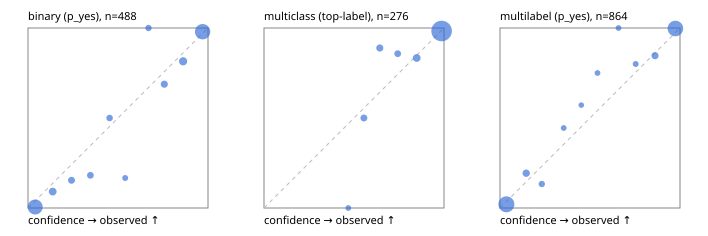

# Evaluation report

- model `Qwen/Qwen3.5-4B` @ `851bf6e806` (shared-prefix tree, forward only: text once per request, each question once, then each candidate), adapter/checkpoint `runs/images_v1/adapter`, prompt `challenger-state-first-v1` (6c9d8459ac44)
- data data/ova/eval_llm.jsonl; splits ['test']; n=946; calibration `None`
- cuda / bfloat16; 2026-09-30T08:48:26+0000; wall 112.2s

## Overall

question accuracy 92.5%

**binary**: n 488, positives 245, accuracy 0.936, precision 0.925, recall 0.951, f1 0.938, auroc 0.984, brier 0.047, log_loss 0.172, ece 0.041

**multiclass**: n 276, accuracy 0.946, macro_f1 0.907, log_loss 0.147, brier 0.078, ece_top_label 0.022

**multilabel**: n 182, labels 864, exact_match 0.863, micro_f1 0.961, macro_f1 0.925, label_auroc 0.991, brier 0.032, log_loss 0.125, ece 0.028

## By family

| family | n | question acc % | details |
|---|---|---|---|
| tllm_guardrail_hard | 60 | 90.0 | bin acc 93.8 F1 93.3 AUROC 1.000 ECE 0.133; mc acc 94.1 mF1 87.5 ECE 0.063; ml EM 72.7 µF1 92.3 ECE 0.067 |
| tllm_guardrail_simple | 67 | 98.5 | bin acc 100.0 F1 100.0 AUROC 1.000 ECE 0.026; mc acc 100.0 mF1 100.0 ECE 0.024; ml EM 92.9 µF1 98.5 ECE 0.046 |
| tllm_guardrail_very_hard | 43 | 97.7 | bin acc 100.0 F1 100.0 AUROC 1.000 ECE 0.091; mc acc 92.9 mF1 83.3 ECE 0.061; ml EM 100.0 µF1 100.0 ECE 0.051 |
| tllm_jailbreak_hard | 59 | 100.0 | bin acc 100.0 F1 100.0 AUROC 1.000 ECE 0.062; mc acc 100.0 mF1 100.0 ECE 0.055; ml EM 100.0 µF1 100.0 ECE 0.047 |
| tllm_jailbreak_simple | 70 | 97.1 | bin acc 100.0 F1 100.0 AUROC 1.000 ECE 0.036; mc acc 95.5 mF1 87.5 ECE 0.056; ml EM 90.9 µF1 98.6 ECE 0.033 |
| tllm_jailbreak_very_hard | 60 | 86.7 | bin acc 84.4 F1 81.5 AUROC 0.972 ECE 0.110; mc acc 94.4 mF1 91.7 ECE 0.048; ml EM 80.0 µF1 96.3 ECE 0.058 |
| tllm_judge_hard | 86 | 96.5 | bin acc 95.0 F1 93.3 AUROC 0.971 ECE 0.092; mc acc 100.0 mF1 100.0 ECE 0.011; ml EM 95.2 µF1 96.2 ECE 0.031 |
| tllm_judge_simple | 72 | 97.2 | bin acc 97.4 F1 97.9 AUROC 0.997 ECE 0.065; mc acc 100.0 mF1 100.0 ECE 0.030; ml EM 92.9 µF1 98.8 ECE 0.050 |
| tllm_judge_very_hard | 64 | 92.2 | bin acc 96.9 F1 97.3 AUROC 1.000 ECE 0.074; mc acc 95.2 mF1 96.7 ECE 0.028; ml EM 72.7 µF1 95.8 ECE 0.063 |
| tllm_score_hard | 62 | 96.8 | bin acc 100.0 F1 100.0 AUROC 1.000 ECE 0.110; mc acc 93.8 mF1 85.7 ECE 0.083; ml EM 91.7 µF1 98.0 ECE 0.092 |
| tllm_score_simple | 62 | 96.8 | bin acc 94.1 F1 95.8 AUROC 0.992 ECE 0.063; mc acc 100.0 mF1 100.0 ECE 0.045; ml EM 100.0 µF1 100.0 ECE 0.041 |
| tllm_score_very_hard | 76 | 80.3 | bin acc 84.2 F1 75.0 AUROC 0.970 ECE 0.142; mc acc 86.4 mF1 75.0 ECE 0.102; ml EM 62.5 µF1 86.2 ECE 0.071 |
| tllm_verify_hard | 50 | 78.0 | bin acc 80.8 F1 80.0 AUROC 0.897 ECE 0.242; mc acc 81.2 mF1 70.6 ECE 0.139; ml EM 62.5 µF1 78.6 ECE 0.163 |
| tllm_verify_simple | 60 | 98.3 | bin acc 97.0 F1 97.6 AUROC 1.000 ECE 0.068; mc acc 100.0 mF1 100.0 ECE 0.005; ml EM 100.0 µF1 100.0 ECE 0.041 |
| tllm_verify_very_hard | 55 | 78.2 | bin acc 80.6 F1 75.0 AUROC 0.868 ECE 0.139; mc acc 80.0 mF1 70.8 ECE 0.198; ml EM 66.7 µF1 84.6 ECE 0.104 |

## by hard case

| slice | n | question acc % |
|---|---|---|
| (none) | 265 | 97.7 |
| answer_trace_mismatch | 45 | 86.7 |
| benign_lookalike | 88 | 87.5 |
| confident_wrong | 39 | 71.8 |
| contradiction | 22 | 95.5 |
| distractor | 117 | 88.9 |
| double_negation | 3 | 100.0 |
| evidence_end | 11 | 90.9 |
| evidence_middle | 20 | 75.0 |
| evidence_start | 2 | 50.0 |
| exception | 20 | 95.0 |
| fake_authority | 1 | 100.0 |
| flawed_step | 44 | 61.4 |
| format_near_miss | 46 | 89.1 |
| gradual_escalation | 1 | 100.0 |
| hypothetical | 7 | 100.0 |
| indirect_injection | 25 | 92.0 |
| injection | 22 | 100.0 |
| judge_injection | 112 | 91.1 |
| length_bias | 7 | 100.0 |
| lexical_overlap | 103 | 92.2 |
| long_state | 74 | 90.5 |
| missing_evidence | 35 | 97.1 |
| multi_positive | 124 | 84.7 |
| multi_turn | 44 | 81.8 |
| negation | 62 | 95.2 |
| nota | 55 | 89.1 |
| numeric_reasoning | 109 | 79.8 |
| obfuscation | 1 | 0.0 |
| over_refusal | 50 | 92.0 |
| paraphrase | 73 | 93.2 |
| partial_compliance | 31 | 74.2 |
| role_reversal | 6 | 66.7 |
| sarcasm | 8 | 87.5 |
| speaker_confusion | 58 | 93.1 |
| subtle_violation | 16 | 93.8 |
| sycophancy | 13 | 92.3 |
| temporal_reasoning | 20 | 90.0 |
| tool_misuse | 6 | 83.3 |
| unsupported_claim | 96 | 89.6 |
| zero_positive | 55 | 94.5 |
| zero_positive_partial | 1 | 100.0 |

## by state tokens

| slice | n | question acc % |
|---|---|---|
| 00000-00127 | 308 | 89.9 |
| 00128-00511 | 284 | 96.5 |
| 00512-02047 | 222 | 93.7 |
| 02048-08191 | 125 | 88.0 |
| 08192+ | 7 | 85.7 |

## by candidates

| slice | n | question acc % |
|---|---|---|
| 01 | 488 | 93.6 |
| 03 | 82 | 93.9 |
| 04 | 239 | 94.1 |
| 05 | 98 | 84.7 |
| 06 | 33 | 87.9 |
| 07 | 3 | 66.7 |
| 08 | 3 | 66.7 |

## Paraphrase groups

29 groups; same prediction 96.6%; all correct 89.7%

## Multiclass abstention (coverage vs error on accepted)

| abstain_below | coverage % | error % |
|---|---|---|
| 0.0 | 100.0 | 5.4 |
| 0.4 | 100.0 | 5.4 |
| 0.5 | 98.9 | 4.4 |
| 0.6 | 96.0 | 3.0 |
| 0.7 | 92.8 | 2.7 |
| 0.8 | 90.2 | 2.4 |
| 0.9 | 85.9 | 1.7 |

## Reliability: binary

| bin | n | mean confidence | observed frequency |
|---|---|---|---|
| [0.0,0.1) | 180 | 0.040 | 0.006 |
| [0.1,0.2) | 22 | 0.137 | 0.091 |
| [0.2,0.3) | 13 | 0.242 | 0.154 |
| [0.3,0.4) | 11 | 0.347 | 0.182 |
| [0.4,0.5) | 10 | 0.453 | 0.500 |
| [0.5,0.6) | 6 | 0.540 | 0.167 |
| [0.6,0.7) | 8 | 0.669 | 1.000 |
| [0.7,0.8) | 16 | 0.757 | 0.688 |
| [0.8,0.9) | 27 | 0.862 | 0.815 |
| [0.9,1.0] | 195 | 0.970 | 0.979 |

## Reliability: multiclass

| bin | n | mean confidence | observed frequency |
|---|---|---|---|
| [0.4,0.5) | 3 | 0.469 | 0.000 |
| [0.5,0.6) | 8 | 0.555 | 0.500 |
| [0.6,0.7) | 9 | 0.643 | 0.889 |
| [0.7,0.8) | 7 | 0.743 | 0.857 |
| [0.8,0.9) | 12 | 0.848 | 0.833 |
| [0.9,1.0] | 237 | 0.987 | 0.983 |

## Reliability: multilabel

| bin | n | mean confidence | observed frequency |
|---|---|---|---|
| [0.0,0.1) | 389 | 0.036 | 0.021 |
| [0.1,0.2) | 31 | 0.146 | 0.194 |
| [0.2,0.3) | 15 | 0.232 | 0.133 |
| [0.3,0.4) | 9 | 0.354 | 0.444 |
| [0.4,0.5) | 7 | 0.451 | 0.571 |
| [0.5,0.6) | 8 | 0.542 | 0.750 |
| [0.6,0.7) | 8 | 0.658 | 1.000 |
| [0.7,0.8) | 10 | 0.754 | 0.800 |
| [0.8,0.9) | 26 | 0.861 | 0.846 |
| [0.9,1.0] | 361 | 0.974 | 0.997 |
