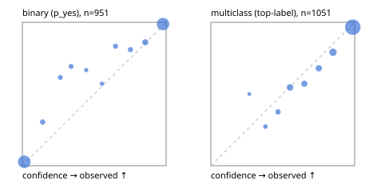

# Evaluation report

- model `Qwen/Qwen3.5-4B` @ `851bf6e806` (shared-prefix tree, forward only: text once per request, each question once, then each candidate), adapter/checkpoint `runs/images_v1/adapter`, prompt `challenger-state-first-v1` (6c9d8459ac44)
- data data/ova/eval_images_v1.jsonl; splits ['test']; n=2002; calibration `None`
- cuda / bfloat16; 2026-09-30T08:40:11+0000; wall 95.6s

## Overall

question accuracy 90.4%

**binary**: n 951, positives 508, accuracy 0.937, precision 0.957, recall 0.923, f1 0.940, auroc 0.986, brier 0.047, log_loss 0.162, ece 0.030

**multiclass**: n 1051, accuracy 0.874, macro_f1 0.931, log_loss 0.332, brier 0.177, ece_top_label 0.032

## By family

| family | n | question acc % | details |
|---|---|---|---|
| img_beans | 204 | 97.1 | bin acc 96.1 F1 96.2 AUROC 0.998 ECE 0.037; mc acc 98.0 mF1 98.0 ECE 0.031 |
| img_eurosat | 200 | 93.5 | bin acc 95.0 F1 95.0 AUROC 0.986 ECE 0.045; mc acc 92.0 mF1 91.9 ECE 0.060 |
| img_fashion | 200 | 89.0 | bin acc 97.0 F1 97.0 AUROC 0.981 ECE 0.042; mc acc 81.0 mF1 81.0 ECE 0.072 |
| img_hurricane | 100 | 60.0 | mc acc 60.0 mF1 59.2 ECE 0.250 |
| img_indoor | 268 | 95.5 | bin acc 95.5 F1 95.4 AUROC 0.997 ECE 0.040; mc acc 95.5 mF1 95.3 ECE 0.020 |
| img_painting | 204 | 70.6 | bin acc 79.4 F1 77.4 AUROC 0.924 ECE 0.150; mc acc 61.8 mF1 58.2 ECE 0.170 |
| img_pets | 222 | 97.3 | bin acc 96.4 F1 97.3 AUROC 0.999 ECE 0.031; mc acc 98.2 mF1 98.1 ECE 0.029 |
| img_rice | 200 | 92.5 | bin acc 91.0 F1 90.9 AUROC 0.972 ECE 0.052; mc acc 94.0 mF1 94.0 ECE 0.032 |
| img_snacks | 200 | 95.5 | bin acc 95.0 F1 95.7 AUROC 0.995 ECE 0.064; mc acc 96.0 mF1 96.0 ECE 0.051 |
| img_trash | 204 | 95.6 | bin acc 97.1 F1 97.1 AUROC 0.999 ECE 0.048; mc acc 94.1 mF1 94.1 ECE 0.017 |

## by hard case

| slice | n | question acc % |
|---|---|---|
| (none) | 2002 | 90.4 |

## by state tokens

| slice | n | question acc % |
|---|---|---|
| 00000-00127 | 2002 | 90.4 |

## by candidates

| slice | n | question acc % |
|---|---|---|
| 01 | 951 | 93.7 |
| 02 | 100 | 60.0 |
| 03 | 102 | 98.0 |
| 05 | 100 | 94.0 |
| 06 | 102 | 94.1 |
| 10 | 200 | 86.5 |
| 12 | 447 | 88.6 |

## Paraphrase groups

0 groups; same prediction —%; all correct —%

## Multiclass abstention (coverage vs error on accepted)

| abstain_below | coverage % | error % |
|---|---|---|
| 0.0 | 100.0 | 12.6 |
| 0.4 | 98.8 | 11.8 |
| 0.5 | 96.5 | 10.7 |
| 0.6 | 91.2 | 8.7 |
| 0.7 | 86.6 | 6.8 |
| 0.8 | 81.5 | 5.3 |
| 0.9 | 72.9 | 3.4 |

## Reliability: binary

| bin | n | mean confidence | observed frequency |
|---|---|---|---|
| [0.0,0.1) | 406 | 0.013 | 0.027 |
| [0.1,0.2) | 23 | 0.141 | 0.304 |
| [0.2,0.3) | 13 | 0.264 | 0.615 |
| [0.3,0.4) | 13 | 0.339 | 0.692 |
| [0.4,0.5) | 6 | 0.444 | 0.667 |
| [0.5,0.6) | 7 | 0.553 | 0.571 |
| [0.6,0.7) | 18 | 0.648 | 0.833 |
| [0.7,0.8) | 21 | 0.752 | 0.810 |
| [0.8,0.9) | 43 | 0.855 | 0.860 |
| [0.9,1.0] | 401 | 0.978 | 0.988 |

## Reliability: multiclass

| bin | n | mean confidence | observed frequency |
|---|---|---|---|
| [0.2,0.3) | 2 | 0.267 | 0.500 |
| [0.3,0.4) | 11 | 0.380 | 0.273 |
| [0.4,0.5) | 24 | 0.467 | 0.375 |
| [0.5,0.6) | 55 | 0.550 | 0.545 |
| [0.6,0.7) | 49 | 0.650 | 0.571 |
| [0.7,0.8) | 53 | 0.750 | 0.679 |
| [0.8,0.9) | 91 | 0.850 | 0.791 |
| [0.9,1.0] | 766 | 0.987 | 0.966 |
