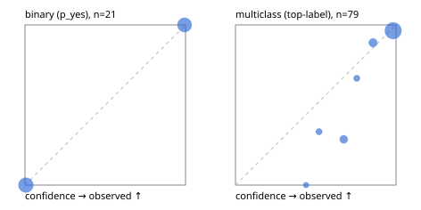

# Evaluation report

- model `Qwen/Qwen3.5-4B` @ `851bf6e806` (shared-prefix tree, forward only: text once per request, each question once, then each candidate), adapter/checkpoint `runs/images_v1/adapter`, prompt `challenger-state-first-v1` (6c9d8459ac44)
- data data/ova/eval_pets100.jsonl; splits ['test']; n=100; calibration `None`
- cuda / bfloat16; 2026-09-30T08:40:39+0000; wall 15.0s

## Overall

question accuracy 87.0%

**binary**: n 21, positives 10, accuracy 1.000, precision 1.000, recall 1.000, f1 1.000, auroc 1.000, brier 0.000, log_loss 0.006, ece 0.006

**multiclass**: n 79, accuracy 0.835, macro_f1 0.695, log_loss 0.430, brier 0.208, ece_top_label 0.073

## By family

| family | n | question acc % | details |
|---|---|---|---|
| pets_breed37 | 18 | 83.3 | mc acc 83.3 mF1 68.6 ECE 0.142 |
| pets_cat_breed | 61 | 83.6 | mc acc 83.6 mF1 82.9 ECE 0.092 |
| pets_is_cat | 21 | 100.0 | bin acc 100.0 F1 100.0 AUROC 1.000 ECE 0.006 |

## by hard case

| slice | n | question acc % |
|---|---|---|
| (none) | 100 | 87.0 |

## by state tokens

| slice | n | question acc % |
|---|---|---|
| 00000-00127 | 100 | 87.0 |

## by candidates

| slice | n | question acc % |
|---|---|---|
| 01 | 21 | 100.0 |
| 12 | 61 | 83.6 |
| 37 | 18 | 83.3 |

## Paraphrase groups

0 groups; same prediction —%; all correct —%

## Multiclass abstention (coverage vs error on accepted)

| abstain_below | coverage % | error % |
|---|---|---|
| 0.0 | 100.0 | 16.5 |
| 0.4 | 100.0 | 16.5 |
| 0.5 | 97.5 | 14.3 |
| 0.6 | 93.7 | 12.2 |
| 0.7 | 84.8 | 6.0 |
| 0.8 | 81.0 | 4.7 |
| 0.9 | 69.6 | 3.6 |

## Reliability: binary

| bin | n | mean confidence | observed frequency |
|---|---|---|---|
| [0.0,0.1) | 11 | 0.005 | 0.000 |
| [0.9,1.0] | 10 | 0.994 | 1.000 |

## Reliability: multiclass

| bin | n | mean confidence | observed frequency |
|---|---|---|---|
| [0.4,0.5) | 2 | 0.440 | 0.000 |
| [0.5,0.6) | 3 | 0.521 | 0.333 |
| [0.6,0.7) | 7 | 0.675 | 0.286 |
| [0.7,0.8) | 3 | 0.756 | 0.667 |
| [0.8,0.9) | 9 | 0.857 | 0.889 |
| [0.9,1.0] | 55 | 0.982 | 0.964 |
