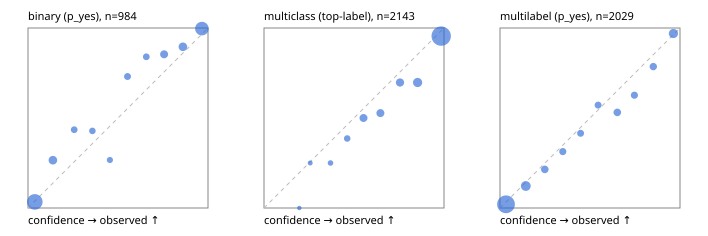

# Evaluation report

- model `Qwen/Qwen3.5-4B` @ `851bf6e806` (shared-prefix tree, forward only: text once per request, each question once, then each candidate), adapter/checkpoint `runs/images_v1/adapter`, prompt `challenger-state-first-v1` (6c9d8459ac44)
- data data/ova/hf.jsonl, data/ova/eval.jsonl; splits ['test']; n=3471; calibration `None`
- cuda / bfloat16; 2026-09-30T08:50:38+0000; wall 119.1s

## Overall

question accuracy 84.1%

**binary**: n 984, positives 475, accuracy 0.919, precision 0.942, recall 0.886, f1 0.913, auroc 0.973, brier 0.067, log_loss 0.226, ece 0.044

**multiclass**: n 2143, accuracy 0.854, macro_f1 0.937, log_loss 0.439, brier 0.216, ece_top_label 0.049

**multilabel**: n 344, labels 2029, exact_match 0.535, micro_f1 0.753, macro_f1 0.845, label_auroc 0.943, brier 0.076, log_loss 0.248, ece 0.026

## By family

| family | n | question acc % | details |
|---|---|---|---|
| eval_adversarial | 27 | 96.3 | bin acc 93.3 F1 90.9 AUROC 0.944 ECE 0.052; mc acc 100.0 mF1 100.0 ECE 0.001; ml EM 100.0 µF1 100.0 ECE 0.033 |
| eval_agent_output | 26 | 88.5 | bin acc 92.9 F1 92.3 AUROC 1.000 ECE 0.083; mc acc 85.7 mF1 86.7 ECE 0.158; ml EM 80.0 µF1 94.1 ECE 0.091 |
| eval_evidence | 17 | 94.1 | bin acc 100.0 F1 100.0 AUROC 1.000 ECE 0.025; ml EM 50.0 µF1 66.7 ECE 0.184 |
| eval_multilabel | 32 | 93.8 | bin acc 100.0 F1 100.0 AUROC 1.000 ECE 0.082; mc acc 100.0 mF1 100.0 ECE 0.010; ml EM 91.7 µF1 97.0 ECE 0.039 |
| eval_policy | 22 | 72.7 | bin acc 76.9 F1 80.0 AUROC 0.929 ECE 0.156; mc acc 60.0 mF1 42.9 ECE 0.393; ml EM 75.0 µF1 94.1 ECE 0.180 |
| eval_routing | 25 | 96.0 | bin acc 100.0 F1 100.0 AUROC 1.000 ECE 0.022; mc acc 100.0 mF1 100.0 ECE 0.078; ml EM 50.0 µF1 80.0 ECE 0.087 |
| eval_urgency_sentiment | 22 | 95.5 | bin acc 90.0 F1 92.3 AUROC 1.000 ECE 0.118; mc acc 100.0 mF1 100.0 ECE 0.056; ml EM 100.0 µF1 100.0 ECE 0.024 |
| heldout_boolq | 300 | 88.0 | bin acc 88.0 F1 89.6 AUROC 0.952 ECE 0.070 |
| heldout_emotion_multiclass | 300 | 56.7 | mc acc 56.7 mF1 44.1 ECE 0.198 |
| heldout_intent_clinc | 300 | 96.7 | mc acc 96.7 mF1 97.0 ECE 0.013 |
| heldout_question_type_trec | 300 | 91.0 | mc acc 91.0 mF1 89.3 ECE 0.040 |
| heldout_sentiment_sst2 | 300 | 92.7 | bin acc 92.7 F1 92.3 AUROC 0.982 ECE 0.075 |
| heldout_topic_dbpedia | 300 | 98.0 | mc acc 98.0 mF1 97.8 ECE 0.010 |
| hf_emotions_multilabel | 300 | 48.7 | ml EM 48.7 µF1 70.4 ECE 0.027 |
| hf_intent_banking77 | 300 | 96.3 | mc acc 96.3 mF1 96.4 ECE 0.018 |
| hf_nli | 300 | 94.7 | bin acc 94.7 F1 92.5 AUROC 0.983 ECE 0.045 |
| hf_sentiment_tweets | 300 | 68.0 | mc acc 68.0 mF1 69.1 ECE 0.116 |
| hf_topic_agnews | 300 | 90.0 | mc acc 90.0 mF1 90.0 ECE 0.057 |

## by hard case

| slice | n | question acc % |
|---|---|---|
| (none) | 3042 | 83.5 |
| contradiction | 107 | 99.1 |
| distractor | 33 | 84.8 |
| double_negation | 6 | 83.3 |
| evidence_end | 13 | 92.3 |
| evidence_middle | 11 | 81.8 |
| evidence_start | 9 | 100.0 |
| exception | 7 | 57.1 |
| hypothetical | 7 | 100.0 |
| injection | 10 | 100.0 |
| lexical_overlap | 20 | 100.0 |
| long_state | 50 | 90.0 |
| missing_evidence | 104 | 94.2 |
| multi_positive | 81 | 51.9 |
| multi_turn | 9 | 88.9 |
| negation | 30 | 96.7 |
| new_label_names | 3 | 100.0 |
| nota | 46 | 100.0 |
| numeric_reasoning | 16 | 87.5 |
| paraphrase | 22 | 90.9 |
| role_reversal | 15 | 93.3 |
| sarcasm | 12 | 100.0 |
| temporal_reasoning | 29 | 75.9 |
| zero_positive | 6 | 100.0 |

## by state tokens

| slice | n | question acc % |
|---|---|---|
| 00000-00127 | 3213 | 83.7 |
| 00128-00511 | 206 | 87.9 |
| 00512-02047 | 52 | 90.4 |

## by candidates

| slice | n | question acc % |
|---|---|---|
| 01 | 984 | 91.9 |
| 03 | 310 | 69.0 |
| 04 | 333 | 89.5 |
| 05 | 22 | 95.5 |
| 06 | 1218 | 73.7 |
| 07 | 49 | 100.0 |
| 08 | 555 | 96.2 |

## Paraphrase groups

11 groups; same prediction 63.6%; all correct 81.8%

## Multiclass abstention (coverage vs error on accepted)

| abstain_below | coverage % | error % |
|---|---|---|
| 0.0 | 100.0 | 14.6 |
| 0.4 | 98.8 | 13.9 |
| 0.5 | 96.8 | 12.9 |
| 0.6 | 91.8 | 10.9 |
| 0.7 | 86.7 | 8.7 |
| 0.8 | 81.1 | 7.2 |
| 0.9 | 72.5 | 4.5 |

## Reliability: binary

| bin | n | mean confidence | observed frequency |
|---|---|---|---|
| [0.0,0.1) | 414 | 0.038 | 0.034 |
| [0.1,0.2) | 64 | 0.138 | 0.266 |
| [0.2,0.3) | 23 | 0.257 | 0.435 |
| [0.3,0.4) | 21 | 0.358 | 0.429 |
| [0.4,0.5) | 15 | 0.455 | 0.267 |
| [0.5,0.6) | 26 | 0.553 | 0.731 |
| [0.6,0.7) | 25 | 0.657 | 0.840 |
| [0.7,0.8) | 48 | 0.756 | 0.854 |
| [0.8,0.9) | 67 | 0.860 | 0.896 |
| [0.9,1.0] | 281 | 0.966 | 0.996 |

## Reliability: multiclass

| bin | n | mean confidence | observed frequency |
|---|---|---|---|
| [0.1,0.2) | 1 | 0.196 | 0.000 |
| [0.2,0.3) | 8 | 0.256 | 0.250 |
| [0.3,0.4) | 16 | 0.370 | 0.250 |
| [0.4,0.5) | 44 | 0.462 | 0.386 |
| [0.5,0.6) | 106 | 0.553 | 0.500 |
| [0.6,0.7) | 110 | 0.646 | 0.527 |
| [0.7,0.8) | 119 | 0.756 | 0.697 |
| [0.8,0.9) | 185 | 0.853 | 0.697 |
| [0.9,1.0] | 1554 | 0.984 | 0.955 |

## Reliability: multilabel

| bin | n | mean confidence | observed frequency |
|---|---|---|---|
| [0.0,0.1) | 1183 | 0.034 | 0.020 |
| [0.1,0.2) | 205 | 0.143 | 0.122 |
| [0.2,0.3) | 84 | 0.249 | 0.214 |
| [0.3,0.4) | 67 | 0.349 | 0.313 |
| [0.4,0.5) | 53 | 0.448 | 0.415 |
| [0.5,0.6) | 56 | 0.545 | 0.571 |
| [0.6,0.7) | 81 | 0.652 | 0.531 |
| [0.7,0.8) | 67 | 0.746 | 0.627 |
| [0.8,0.9) | 70 | 0.852 | 0.786 |
| [0.9,1.0] | 163 | 0.963 | 0.969 |
